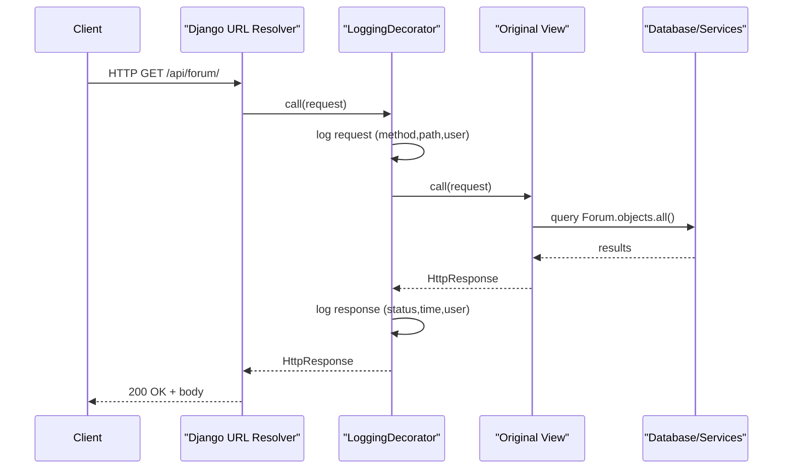

Diagrams for the LoggingDecorator (Decorator pattern)

This folder contains PlantUML files and Mermaid snippets to visualize the
Decorator implementation used in the project.

Files:
- decorator_class_diagram.puml  : PlantUML class diagram (ViewDecorator + LoggingDecorator)
- decorator_sequence_diagram.puml : PlantUML sequence diagram (request flow)

How to render (local):
1) Install PlantUML (requires Java) or use Docker image:
   - With Java: https://plantuml.com/starting
   - With Docker: docker run --rm -v $(pwd):/workspace plantuml/plantuml -tpng /workspace/decorator_class_diagram.puml

2) Render class diagram (PNG):
   docker run --rm -v $(pwd):/workspace plantuml/plantuml -tpng /workspace/decorator_class_diagram.puml

3) Render sequence diagram (PNG):
   docker run --rm -v $(pwd):/workspace plantuml/plantuml -tpng /workspace/decorator_sequence_diagram.puml

Alternatively (quick):
- Copy the contents of the .puml files into https://www.planttext.com/ or https://www.plantuml.com/plantuml

Mermaid alternative (paste into Mermaid live editor or supported README renderers):

Class diagram (Mermaid):
```mermaid
classDiagram
    interface IView {
        +__call(request)
    }
    class FunctionView {
        +__call(request)
    }
    class ViewDecorator {
        -view_func: IView
        +__init__(view_func)
        +__call(request)
    }
    class LoggingDecorator {
        +__call(request)
    }
    IView <|-- FunctionView
    IView <|-- ViewDecorator
    ViewDecorator <|-- LoggingDecorator
    ViewDecorator o-- IView : wraps
    class ForumViewSet {
      +list()
      +retrieve()
      +create()
    }
    class ComentarioForumViewSet {
      +list()
      +create()
      +respostas()
    }
    ForumViewSet ..> IView : uses / decorated-methods
    ComentarioForumViewSet ..> IView : uses / decorated-methods
```

Sequence diagram (Mermaid):


Notes:
- The PlantUML diagrams are canonical and can be directly rendered with PlantUML.
- Mermaid is an alternative if you prefer embedding in Markdown or using live editors.

Interpretation hints:
- Class diagram shows the structural relationship: Decorator wraps a Function view
- Sequence diagram shows the runtime flow for a single HTTP request through the decorator
