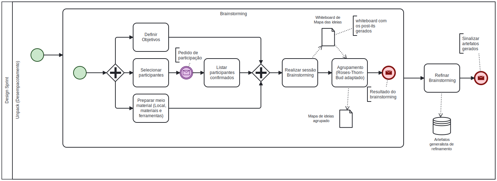
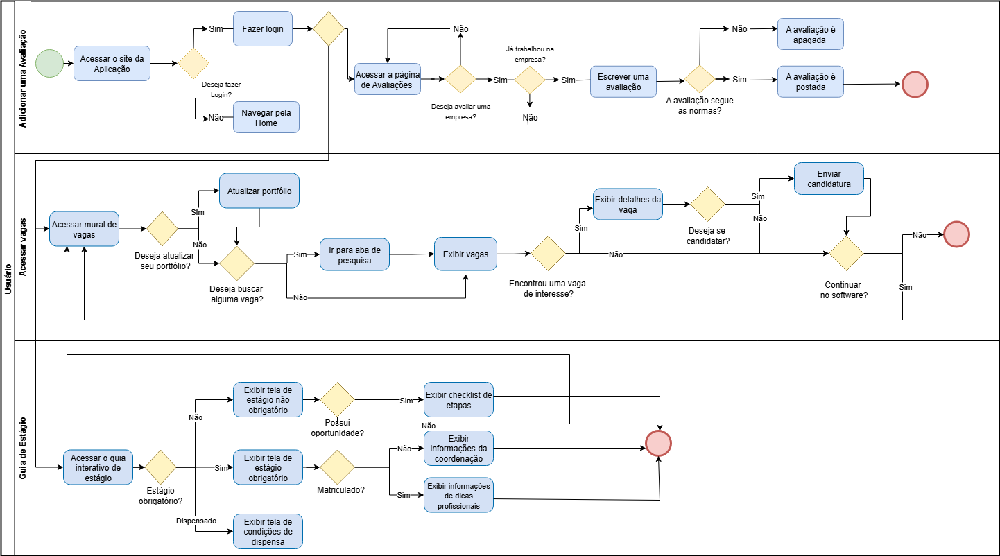
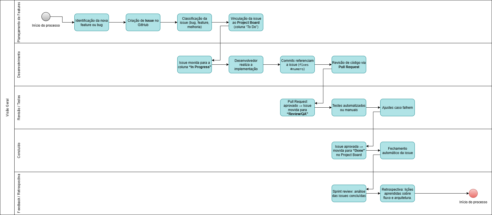

# **1.3. Módulo Modelagem BPMN**

## **O que é BPMN**

Business Process Management Notation (BPMN), ou então Notação de Gerenciamente de Processos de Negócio, é uma notação padronizada para diagramação de fluxos de trabalho e processos de negócio de forma clara, concisa e universalmente compreendida. Ela serve como uma linguagem comum que preenche a lacuna entre as áreas de negócio e a tecnologia da informação, facilitando a análise o desenho, a automação e a melhoria contínua dos processos organizacionais.

Seu principal objetivo, é fornecer uma notação que seja intuitiva para todos os stakeholders do negócio, desde analistas e gestores até desenvolvedores e equipes de operação. A notação é suficientemente rica e precisa para permitir a modelação de processos complexos que permitam guiar a implementação dos mesmos.

## **Principais Elementos**

### **Objetos de Fluxo**

* **Eventos:** Indicam algo que acontece durante o processo, podendo ser de início, intermediários e de fim, sendo representados por círculos.
*  **Atividades:** Representam a ação a ser executada, podendo representar tarefas e subprocessos. São representados por retângulos com cantos arredondados.
*  **Gateways:** Controlam a divergência e convergência do fluxo do processo. São representados pro losangos e determinam os possíveis caminhos que o processo pode seguir.

### **Objetos de Conexão**

* **Fluxo de Sequência:** Uma linha sólida com uma seta que indica a ordem das atividades que serão executadas.
* **Fluxo de Mensagem:** Uma linha tracejada com um círculo no início e uma seta no final que representa a comunicação entre diferentes pools.
* **Associação:** Uma linha pontilhada utilizada para associar artefatos ou texto a um objeto de fluxo.

### **Piscinas e Raias**

* **Pools:** Representam os participantes principais num processo, podendo ser uma empresa, um departamento ou um cliente.
* **Lanes:** Subdivisões dentro de uma piscina que organizam as atividades por função ou papel específico.

### **Artefatos**

* **Objeto de Dados:** Representa os dados que são necessários ou produzidos por uma atividade.
* **Grupo:** Utilizado para agrupar elementos visualmente.
* **Anotação:** Permite que o modelador adicione comentários ao diagrama.

## **BPMNs Desenvolvidos**

### **Design Sprint**

Este diagrama representa as tarefas realizadas durante a etapa de design sprint.

Fonte: [Mateus Villela](https://github.com/MVConsorte.png?size=100), 2025.

### **Unified Process**

Este diagrama representa como a equipe se organizará utilizando o framework Unified Process.

Fonte: [Eduardo Ferreira de Aquino](https://github.com/fxred), [Daniel Ferreira Nunes](https://github.com/Mach1r0) e [Paulo Henrique Virgilio Cerqueira](https://github.com/paulocerqr), 2025.

### **Software**

Este diagrama representa o fluxo principal da aplicação, incluindo suas principais funções, como acessar o guia de estágio, candidatar a uma vaga e avaliar empresas.

Fonte: [Letícia da Silva Monteiro](https://github.com/leticiamonteiroo), [Luiz Henrique Guimarães Soares](https://github.com/luizh-gsoares) e [Henrique Martins](https://github.com/henryqma.png?size=100), 2025.

### **Fases do (GitHub Projects + Kanban)**

Este diagrama representa o fluxo principal do Kanban feito pelo grupo no Projects do Github.

## **Conclusão**

A notação BPMN se mostrou uma ferramenta muito útil na diagramação de fluxos, trazendo uma linguagem visual padrão e intuitiva que facilita o entendimento dos processos de negócio entre diferentes áreas e também fornece uma base sólida para análise e otimização de qualquer projeto. A adoção dessa notação ajuda a alcançar a excelência operacional, promover a melhoria contínua e garantir que os processos estejam devidamente alinhados.

## **Bibliografia**

> 1. SERRANO, Milene. Arquitetura e Desenho de Software - Aula Notação BPMN. Disponível em: [https://aprender3.unb.br/pluginfile.php/3178527/mod_page/content/2/Arquitetura%20e%20Desenho%20de%20software%20-%20Aula%20BPMN%20Exemplos%20-%20Profa.%20Milene.pdf](https://aprender3.unb.br/pluginfile.php/3178527/mod_page/content/2/Arquitetura%20e%20Desenho%20de%20software%20-%20Aula%20BPMN%20Exemplos%20-%20Profa.%20Milene.pdf). Acesso em: 04/09/2025
> 2. OBJECT MANAGEMENT GROUP. BPMN 2.0 Specification. Needham, MA, 2011. Disponível em: [https://www.omg.org/spec/BPMN/2.0](https://www.omg.org/spec/BPMN/2.0). Acesso em: 04/09/2025

## **Histórico de Versão**

| Versão | Descrição | Autor | Revisor | Data |
|--------|-------------------------------------------------------------|------------------------------------------|------------|------------------------------------------|
| 1.0    | Criação do documento e organização de todo o conteúdo       | [Henrique Martins Alencar](https://github.com/henryqma) | 04/09/2025 | [Letícia da Silva Monteiro](https://github.com/leticiamonteiroo) |
| 1.1    | Adição de imagens dos diagramas       | [Henrique Martins Alencar](https://github.com/henryqma) | 05/09/2025 | [Letícia da Silva Monteiro](https://github.com/leticiamonteiroo) |
| 1.2   | Adicionando fontes e outros diagramas  |[Letícia da Silva Monteiro](https://github.com/leticiamonteiroo)| [Henrique Martins Alencar](https://github.com/henryqma) | 05/09/2025 |  |
| 1.3    | Adição de imagens dos diagramas       | [Breno Alexandre](https://github.com/brenoalexandre0) | 05/09/2025 | [Mateus Villela](https://github.com/MVConsorte) |