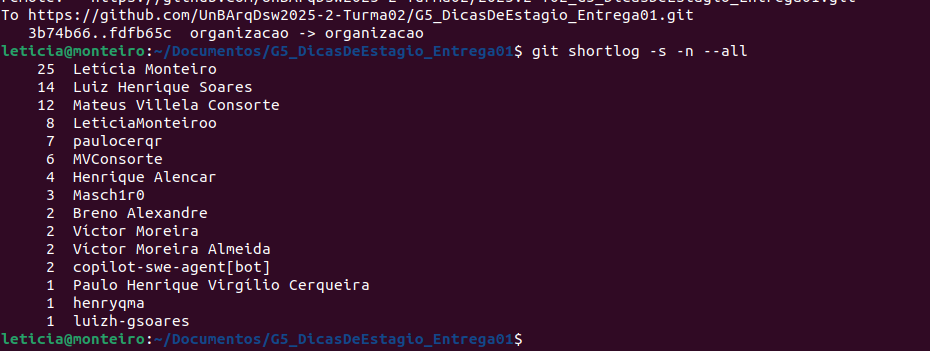

# 1.4. Participações (Base)

Este documento apresenta o **relato sobre as participações e contribuições de cada integrante do Grupo 5 (G5)** na **primeira entrega da disciplina Arquitetura e Desenho de Software (FGA0208)**, ministrada pela professora **Milene Serrano** na Universidade de Brasília (FCTE/UnB-Gama).  

A entrega contempla três frentes principais de trabalho: **Design Sprint - Foco 1**, **Artefato Generalista - Foco 2** e **Modelagem BPMN - Foco 3**.   

---

## Módulo Design Sprint - Foco 1 

| Nome do Membro | Contribuição | Comprobatórios |
|----------------|--------------|----------------------------------|
| Breno Alexandre Soares Garcia | Elaboração de artefatos e insights da Design Sprint | [Miro](https://miro.com/app/board/uXjVJNoiQ50=/) |
| Daniel Ferreira Nunes | Elaboração de artefatos e insights da Design Sprint | [Miro](https://miro.com/app/board/uXjVJNoiQ50=/) |
| Eduardo Ferreira de Aquino | Elaboração de artefatos e insights da Design Sprint | [Miro](https://miro.com/app/board/uXjVJNoiQ50=/) |
| Felipe Nunes de Mello | Elaboração de artefatos e insights da Design Sprint | [Miro](https://miro.com/app/board/uXjVJNoiQ50=/) |
| Luiz Henrique Guimarães Soares | Elaboração de artefatos e insights da Design Sprint | [Miro](https://miro.com/app/board/uXjVJNoiQ50=/) |
| Henrique Martins Alencar | Elaboração de artefatos e insights da Design Sprint | [Miro](https://miro.com/app/board/uXjVJNoiQ50=/) |
| Letícia da Silva Monteiro | Elaboração de artefatos e insights da Design Sprint | [Miro](https://miro.com/app/board/uXjVJNoiQ50=/) |
| Mateus Villela Consorte | Elaboração de artefatos e insights da Design Sprint | [Miro](https://miro.com/app/board/uXjVJNoiQ50=/) |
| Paulo Henrique Virgilio Cerqueira | Elaboração de artefatos e insights da Design Sprint | [Miro](https://miro.com/app/board/uXjVJNoiQ50=/) |
| Víctor Moreira Almeida | Elaboração de artefatos e insights da Design Sprint | [Miro](https://miro.com/app/board/uXjVJNoiQ50=/) |

---

## Módulo Artefato Generalista - Foco 2 

| Nome do Membro | Contribuição | Comprobatórios Claros (com link) |
|----------------|--------------|----------------------------------|
| Breno Alexandre Soares Garcia | Rich Picture  | [Miro](https://miro.com/app/board/uXjVJNoiQ50=/) |
| Daniel Ferreira Nunes | Elaboração do Diagrama Ishikawa | [Miro](https://miro.com/app/board/uXjVJNoiQ50=/)  |
| Eduardo Ferreira de Aquino | Elaboração do Diagrama Ishikawa | [Miro](https://miro.com/app/board/uXjVJNoiQ50=/)  |
| Felipe Nunes de Mello | 5W2H | [Miro](https://miro.com/app/board/uXjVJNoiQ50=/)  |
| Luiz Henrique Guimarães Soares | Rich Picture | [Arquivo](/Base/BPMN/ModelagemBPMN/) |
| Henrique Martins Alencar | Mapa Mental e Rich Picture  | [Miro](https://miro.com/app/board/uXjVJNoiQ50=/)  |
| Letícia da Silva Monteiro | Rich Picture | [Miro](https://miro.com/app/board/uXjVJNoiQ50=/)  |
| Mateus Villela Consorte | Rich Picture  | [Miro](https://miro.com/app/board/uXjVJNoiQ50=/)  |
| Paulo Henrique Virgilio Cerqueira | Elaboração do Diagrama Ishikawa | [Miro](https://miro.com/app/board/uXjVJNoiQ50=/)  |
| Víctor Moreira Almeida | Rich Picture  | [Miro](https://miro.com/app/board/uXjVJNoiQ50=/)  |

---

## Módulo Modelagem BPMN - Foco 3 

| Nome do Membro | Contribuição | Comprobatórios Claros (com link) |
|----------------|--------------|----------------------------------|
| Breno Alexandre Soares Garcia |  |  |
| Daniel Ferreira Nunes | Modelagem no Grupo 1 - Unified Process | [Arquivo](/Base/BPMN/ModelagemBPMN/) |
| Eduardo Ferreira de Aquino | Modelagem no Grupo 1 - Unified Process | [Arquivo](/Base/BPMN/ModelagemBPMN/) |
| Felipe Nunes de Mello |  | [Arquivo](/Base/BPMN/ModelagemBPMN/) |
| Luiz Henrique Guimarães Soares | BPMN - Produto  | [Arquivo](/Base/BPMN/ModelagemBPMN/) |
| Henrique Martins Alencar | BPMN - Produto  | [Arquivo](/Base/BPMN/ModelagemBPMN/) |
| Letícia da Silva Monteiro | BPMN - Produto | [Arquivo](/Base/BPMN/ModelagemBPMN/) |
| Mateus Villela Consorte |  | |
| Paulo Henrique Virgilio Cerqueira | BPMN - Unified Process | [Arquivo](/Base/BPMN/ModelagemBPMN/) |
| Víctor Moreira Almeida |  |  |

---

## Tabela de Commits 

## Gravações 

| Atividade | Integrantes | Link para gravação |
|-----------|-------------|---------------------|
| Reunião Geral | Mateus Villela, Leticia Monteiro, Paulo Cerqueira, Henrique Alencar, Eduardo Ferreira, Felipe Nunes, Breno Alexandre, Vitor Moreira | [Gravação](https://www.youtube.com/watch?v=qDyLrtiNPg0) |
| Diagrama Causa e Efeito | Paulo, Daniel, Eduardo | [Gravação](https://www.youtube.com/watch?v=BU-a_H5QKrI) |
| Modelo BPMN | Paulo, Daniel, Eduardo | [Gravação](https://www.youtube.com/watch?v=xG1DtxOBY7k) |
| Organização da Pages | Letícia e Luiz | [Gravação](https://teams.microsoft.com/l/meetingrecap?driveId=b%21r43zeCV010aCsbaXiViCRecaKoreqsZLhpooNW-LAmonr_DLRwMpS7TgWb3F1R6B&driveItemId=01LOXXYG4VRBVWMJPCSNC3SLSGJXTJSVRC&sitePath=https%3A%2F%2Funbbr-my.sharepoint.com%2F%3Av%3A%2Fg%2Fpersonal%2F222022144_aluno_unb_br%2FEZWIa2Yl4pNFuS5GTeaZViIBPeWe6U0RK6DXdRzLKnsyjQ&fileUrl=https%3A%2F%2Funbbr-my.sharepoint.com%2Fpersonal%2F222022144_aluno_unb_br%2FDocuments%2FGrava%25C3%25A7%25C3%25B5es%2FChamada%2520com%2520Leticia%2520Da%2520Silva%2520Monteiro-20250905_165033-Grava%25C3%25A7%25C3%25A3o%2520de%2520Reuni%25C3%25A3o.mp4%3Fweb%3D1&threadId=19%3A2e61c5c4-6a89-4758-a3be-7077f289e452_7bc551e4-7c28-4e27-9686-03e8a945c0ee%40unq.gbl.spaces&callId=b3e78f50-b1d0-4204-b3f8-34f2d3161e5e&threadType=OneOnOneChat&meetingType=Unknown&subType=RecapSharingLink_RecapCore) |
| Organização dos Artefatos | Letícia e Luiz | [Gravação](https://unbbr-my.sharepoint.com/personal/231026859_aluno_unb_br/_layouts/15/stream.aspx?id=%2Fpersonal%2F231026859%5Faluno%5Funb%5Fbr%2FDocuments%2FGrava%C3%A7%C3%B5es%2FReuni%C3%A3o%20com%20Leticia%20Da%20Silva%20Monteiro%2D20250905%5F185611%2DGrava%C3%A7%C3%A3o%20de%20Reuni%C3%A3o%2Emp4&ga=1&referrer=StreamWebApp%2EWeb&referrerScenario=AddressBarCopied%2Eview%2E86b089e1%2Dd155%2D4207%2Da1f9%2D4624950ddd6a) |

## Histórico de versões  

Tabela 1: Histórico de versões

| Versão | Descrição                           | Autor                                                                 | Data       | Revisor                                                                 |
|:--:|:-----------------------------------:|:----------------------------------------------------------------------:|:----------:|:----------------------------------------------------------------------:|
| 1.0 | Criação da Tabela de Disponibilidade | [Letícia da Silva Monteiro](https://github.com/leticiamonteiroo)       | [Luiz Henrique Guimarães Soares](https://github.com/luizh-gsoares)  | 05/09/2025   |

Fonte: [Letícia da Silva Monteiro](https://github.com/leticiamonteiroo) e [Luiz Henrique Guimarães Soares](https://github.com/luizh-gsoares) 2025.
