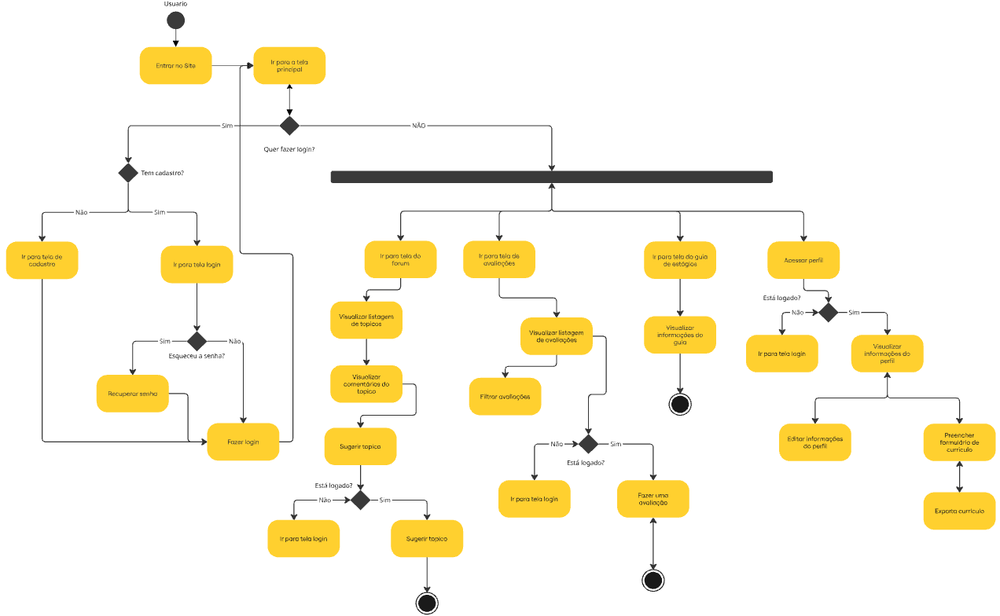

## Introdução

Um diagrama de atividades é uma ferramenta essencial da Linguagem de Modelagem Unificada (UML) utilizada para representar visualmente os fluxos de trabalho de um sistema ou processo. Ele descreve a dinâmica do sistema, mostrando a sequência de atividades, os pontos de decisão e os fluxos paralelos, desde um ponto de partida até um ponto de conclusão.

No contexto do projeto **Dicas de Estágio**, este diagrama é fundamental para visualizar e validar os principais fluxos de interação do usuário com a plataforma. Ele mapeia a jornada do usuário desde o primeiro acesso ao site, passando pelos processos de cadastro e login, até a interação com funcionalidades essenciais como consulta a fóruns, submissão de avaliações e gerenciamento do perfil e currículo.

O objetivo deste documento é apresentar e detalhar este fluxo, servindo como referência clara para as equipes de desenvolvimento, design e testes, garantindo que a implementação do sistema esteja alinhada com a experiência do usuário planejada.

## Metodologia

A elaboração do diagrama de atividades para o sistema **Dicas de Estágio** seguiu um processo estruturado, combinando ferramentas de modelagem visual com a análise de artefatos de projeto e fundamentos teóricos da engenharia de software.

As etapas da metodologia foram:

1. **Levantamento de Requisitos e Análise de Artefatos:**  
    O ponto de partida foi a análise dos requisitos funcionais do sistema. Foram utilizados diagramas de pacotes para entender a arquitetura geral, além dos fluxos de usuário e protótipos de alta fidelidade criados no Figma, que serviram como guia para mapear a jornada de interação do usuário de forma precisa.

2. **Ferramenta de Modelagem:**  
    Para a criação e edição do diagrama, foi utilizada a plataforma de colaboração visual [Miro](https://miro.com). A ferramenta foi escolhida por sua flexibilidade para criar diagramas UML de forma colaborativa e permitir o refinamento iterativo do modelo.

3. **Padrão de Notação (UML):**  
    Toda a simbologia e as convenções do diagrama seguem o padrão da Linguagem de Modelagem Unificada (UML). Foram empregados elementos como estados de início e fim, atividades, nós de decisão e barras de fork/join para representar o fluxo de controle de maneira clara e padronizada.

4. **Fundamentação Teórica:**  
    O desenvolvimento do diagrama foi embasado em conceitos e boas práticas de análise e projeto de sistemas, consolidados na literatura técnica da área.

## Resultados

O diagrama de atividades resultante ilustra de forma clara e detalhada o fluxo de interação do usuário com a plataforma **Dicas de Estágio**. A seguir, são destacados os principais componentes e fluxos representados no diagrama:

### Diagrama de Atividades

*Figura 1: Fluxo de interação do usuário com a plataforma Dicas de Estágio.*

## Referências Bibliográficas

Para garantir a correta aplicação da notação UML e dos princípios de modelagem de processos, foram utilizadas como referência as seguintes obras:

- BOOCH, Grady; RUMBAUGH, James; JACOBSON, Ivar. *UML: Guia do Usuário*. 2ª ed. Rio de Janeiro: Elsevier, 2006.
- FOWLER, Martin. *UML Gota a Gota: Um Guia Breve para a Linguagem de Modelagem de Objetos Padrão*. 3ª ed. Porto Alegre: Bookman, 2004.
- GUEDES, Gilleanes T. A. *UML 2: Uma Abordagem Prática*. 2ª ed. São Paulo: Novatec Editora, 2011.

## **Histórico de Versão**

| ID | Descrição | Autor | Revisor | Data |
|:--:|:---------|:------|:--------|:----:|
| 1.0 | Criação do documento | [Daniel Ferreira Nunes](https://github.com/mach1r0) | [Eduardo Ferreira](https://github.com/fxred) | 21/09/2025 |