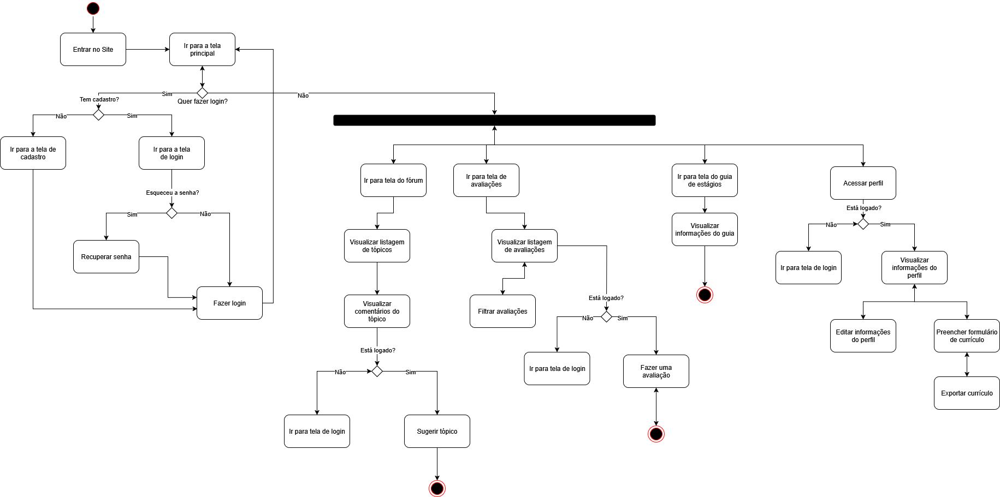
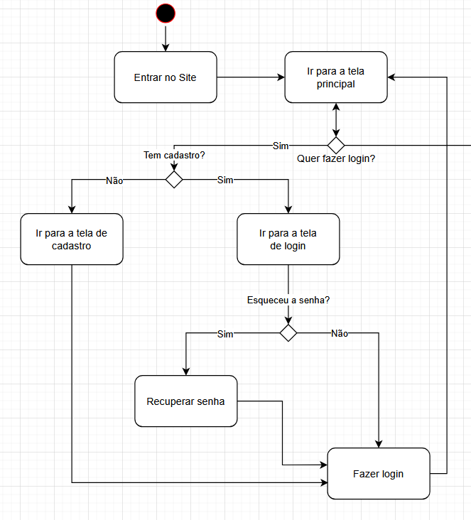
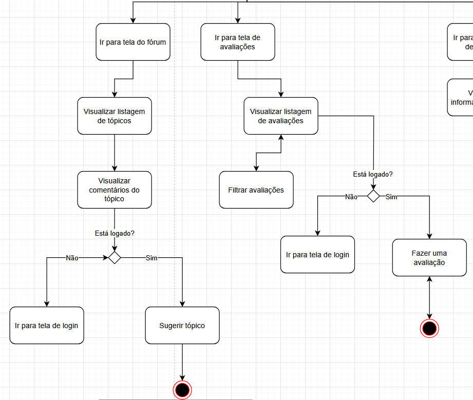
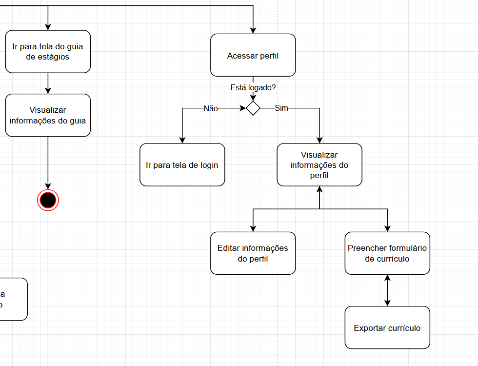

## Introdução

Um diagrama de atividades é uma ferramenta essencial da Linguagem de Modelagem Unificada (UML) utilizada para representar visualmente os fluxos de trabalho. Conforme definem Booch, Rumbaugh e Jacobson, ele é projetado para "modelar a dinâmica de um sistema, enfatizando o fluxo de controle de uma atividade para outra". Em sua essência, o diagrama descreve a sequência de atividades, os pontos de decisão e os fluxos paralelos, desde um ponto de partida até um ponto de conclusão.

No contexto do projeto Dicas de Estágio, o diagrama é fundamental para visualizar e validar a jornada do usuário. Como destaca Gilleanes Guedes, o diagrama de atividades serve para "detalhar os passos a serem percorridos para a realização de uma determinada tarefa", o que, no nosso caso, se traduz nos processos de cadastro, login, consulta a fóruns, submissão de avaliações e gerenciamento de perfil e currículo.

O objetivo deste documento é apresentar este fluxo detalhado, servindo como referência clara para as equipes de desenvolvimento, design e testes, garantindo que a implementação do sistema esteja alinhada com a experiência do usuário planejada.

## Metodologia

A elaboração do diagrama de atividades para o sistema **Dicas de Estágio** seguiu um processo estruturado, combinando ferramentas de modelagem visual com a análise de artefatos de projeto e fundamentos teóricos da engenharia de software.

As etapas da metodologia foram:

1. **Levantamento de Requisitos e Análise de Artefatos:**  
    O ponto de partida foi a análise dos requisitos funcionais do sistema. Foram utilizados diagramas de pacotes para entender a arquitetura geral, além dos fluxos de usuário e protótipos de alta fidelidade criados no Figma, que serviram como guia para mapear a jornada de interação do usuário de forma precisa.

2. **Ferramenta de Modelagem:**  
    Para a criação e edição do diagrama, foi utilizada a plataforma de colaboração visual [Miro](https://miro.com) e [Draw.io](https://draw.io). As ferramentas foram escolhidas por suas flexibilidades para criar diagramas UML de forma colaborativa e permitir o refinamento iterativo do modelo.

3. **Padrão de Notação (UML):**  
    Toda a simbologia e as convenções do diagrama seguem o padrão da Linguagem de Modelagem Unificada (UML). Foram empregados elementos como estados de início e fim, atividades, nós de decisão e barras de fork/join para representar o fluxo de controle de maneira clara e padronizada.

4. **Fundamentação Teórica:**  
    O desenvolvimento do diagrama foi embasado em conceitos e boas práticas de análise e projeto de sistemas, consolidados na literatura técnica da área.

## __Tabela de Participação na Produção do Artefato__

<label><input type="checkbox" checked abled> Paulo Henrique Virgilio Cerqueira</label> 
<label><input type="checkbox" checked abled> Daniel Ferreira Nunes</label> 
<label><input type="checkbox" checked abled> Eduardo Ferreira de Aquino</label> 

## Resultados

### __Visão Geral do Sistema:__

### __Tela inicial, login e cadastro:__

### __Listagem de tópicos e avaliações:__

### __Guia de estágios, perfil do usuário e currículo:__

## Referências Bibliográficas

Para garantir a correta aplicação da notação UML e dos princípios de modelagem de processos, foram utilizadas como referência as seguintes obras:

- BOOCH, Grady; RUMBAUGH, James; JACOBSON, Ivar. *UML: Guia do Usuário*. 2ª ed. Rio de Janeiro: Elsevier, 2006.
- FOWLER, Martin. *UML Gota a Gota: Um Guia Breve para a Linguagem de Modelagem de Objetos Padrão*. 3ª ed. Porto Alegre: Bookman, 2004.
- GUEDES, Gilleanes T. A. *UML 2: Uma Abordagem Prática*. 2ª ed. São Paulo: Novatec Editora, 2011.

## Gravação da Produção do Artefato

A gravação do processo de elaboração do diagrama de atividades pode ser visualizada no vídeo abaixo:

<iframe width="1065" height="608" src="https://www.youtube.com/embed/0H_18S5ejIo" title="Diagrama de Atividades" frameborder="0" allow="accelerometer; autoplay; clipboard-write; encrypted-media; gyroscope; picture-in-picture; web-share" referrerpolicy="strict-origin-when-cross-origin" allowfullscreen></iframe>

## **Histórico de Versão**

| ID | Descrição | Autor | Revisor | Data |
|:--:|:---------|:------|:--------|:----:|
| 1.0 | Criação do documento | [Daniel Ferreira Nunes](https://github.com/mach1r0) | [Eduardo Ferreira](https://github.com/fxred) | 21/09/2025 |
| 1.1 | Edição do documento e adição do draw.io | [Eduardo Ferreira](https://github.com/fxred) | [Daniel Ferreira Nunes](https://github.com/mach1r0) | 21/09/2025 |
| 1.2 | Refatoração da introdução| [Daniel Ferreira](https://github.com/mach1r0) | | 22/09/2025 |