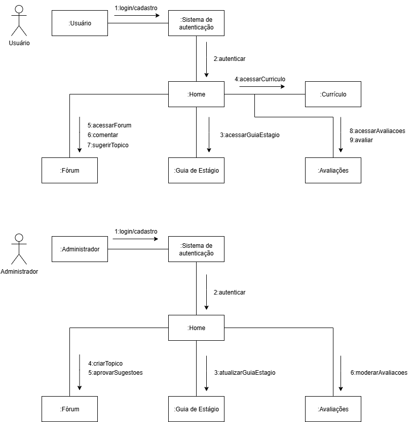

# **Diagrama de Comunicação**

## **Introdução**

Um diagrama de comunicação é um tipo de diagrama que enfatiza as relações entre os objetos e a troca de mensagens entre eles, destacando a organização e as conexões de um determinado cenário. Seu principal objetivo é fornecer uma visão abrangente da comunicação entre objetos, ajudando a identificar as dependências e a compreender a estrutura de comunicação do sistema.

## **Metodologia**

A criação de um diagrama de comunicação segue uma metodologia estruturada. Os principais componentes são:

- Objetos: Representados por retângulos, simbolizam as intâncias de classes que participam da interação.
- Vínculos: São as linhas que conectam os objetos, indicando que existe um relacionamento e a possibilidade de troca de mensagens entre eles.
- Mensagens: Representadas por setas ao longo dos vínculos, indicam a comunicação entre objetos.

A modelagem deste diagrama foi realizada individualmente, utilizando a plataforma draw.io.

## **Tabela de Participação na Produção do Artefato**

<label><input type="checkbox" checked abled>[ Henrique Martins Alencar ](https://github.com/henryqma)</label> 

## **Diagrama**

 **Figura 1** - Diagrama de Comunicação 

 **Autor**: [Henrique](https://github.com/henryqma) 

## **Conclusão**

O diagrama de comunicação é uma ferramenta poderosa para a análise e design de sistemas. Sua principal vantagem reside na capacidade de fornecer uma visão clara e concisa da estrutura de colaboração entre os objetos, facilitando a compreensão das dependências e do fluxo de controle.

## **Bibliografia**

> 1. FOWLER, Martin. UML essencial. 3. ed. Porto Alegre: Bookman, 2011. E-book. p.52. ISBN 9788560031382. Disponível em: [https://integrada.minhabiblioteca.com.br/reader/books/9788560031382/](https://integrada.minhabiblioteca.com.br/reader/books/9788560031382/). Acesso em: 21/09/2025.

## **Histórico de versões**

| Versão | Data | Descrição | Autor | Revisor |
|--------|------|-----------|-------|---------|
| 1.0  | 21/09/2025 | Criação do documento | [Henrique Alencar](https://github.com/henryqma)| [Revisor]() 