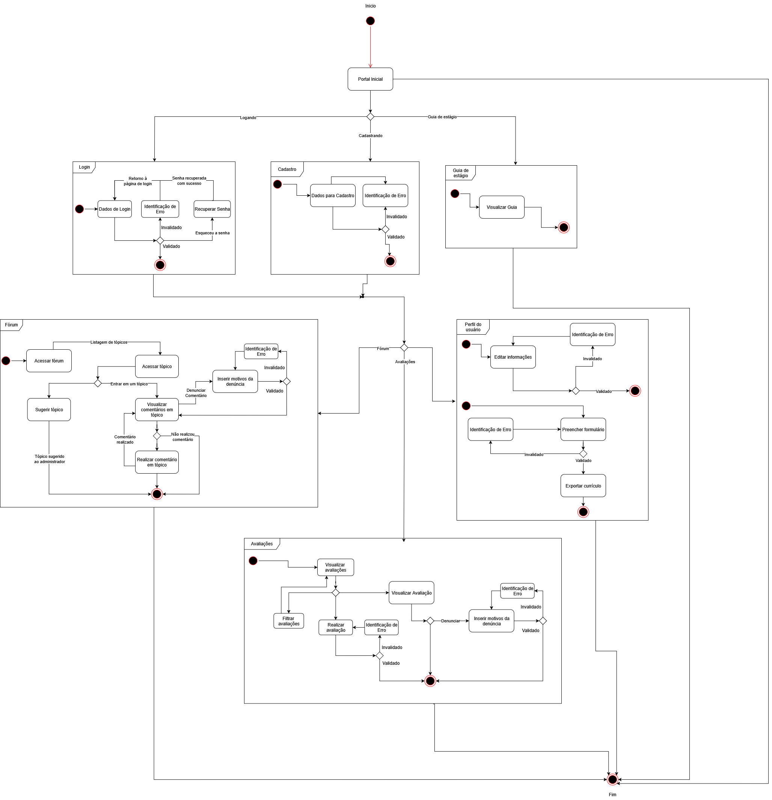
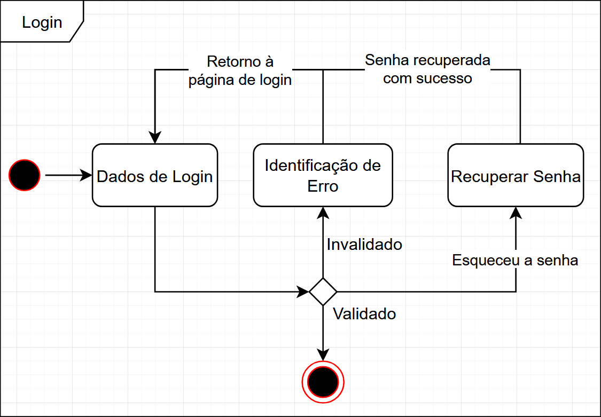
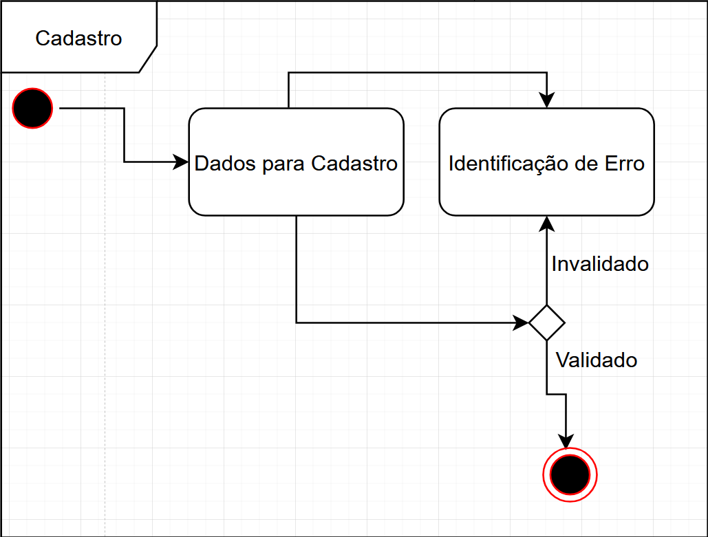
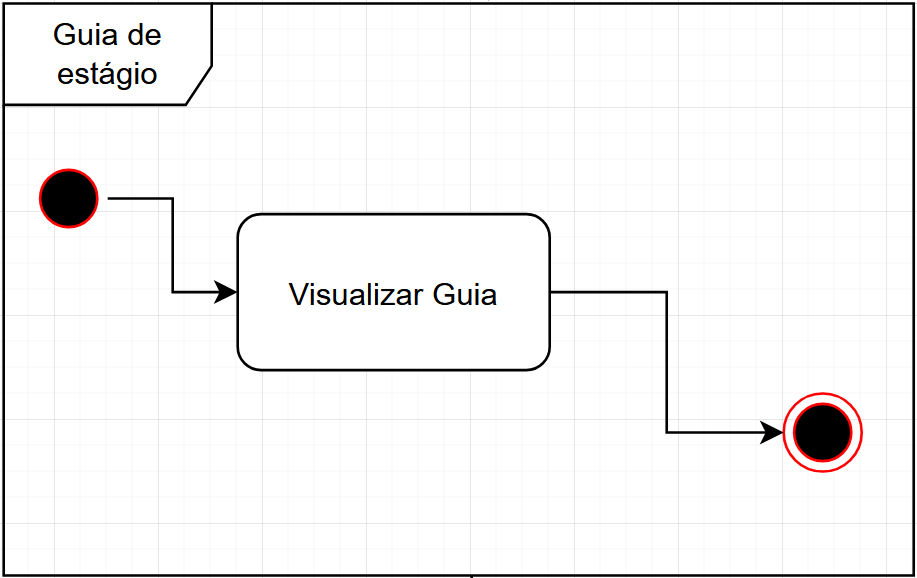
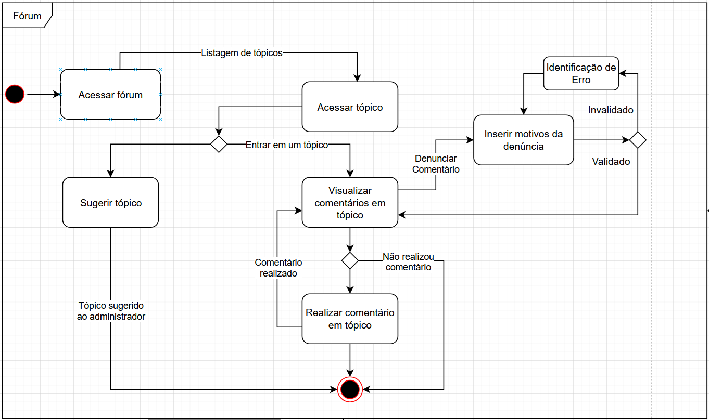
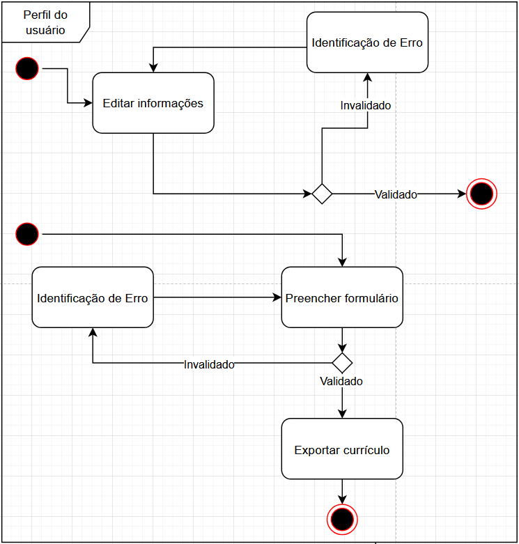
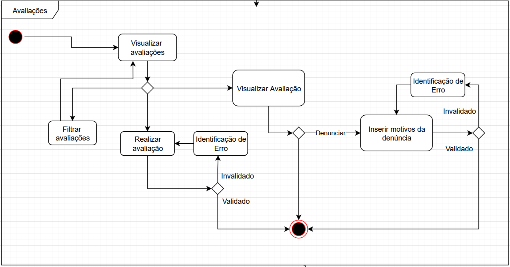

# __Diagrama de estados__

## __Introdução__

O diagrama de estados, também conhecido como diagrama de máquina de estados, é uma ferramenta da engenharia de software usada para modelar o comportamento dinâmico de um sistema ou objeto ao longo do tempo. Ele descreve os diferentes estados que um objeto pode assumir, os eventos que causam mudanças entre esses estados (transições) e as ações associadas a essas mudanças. É especialmente útil para representar sistemas que reagem a eventos externos, como botões pressionados, mudanças de condição ou mensagens recebidas.

## __Metodologia__

Para a criação do diagrama de estados, nosso grupo utilizou a notação UML (Unified Modeling Language) como base para representar os diferentes estados e transições do sistema. Utilizamos o **Draw.io** como ferramenta de apoio, aproveitando seus recursos específicos para modelagem UML, o que facilitou a construção de diagramas claros e organizados. Essa metodologia permitiu representar de forma precisa o comportamento do sistema, destacando os eventos que provocam mudanças de estado e contribuindo para uma melhor compreensão de sua lógica de funcionamento.

## __Tabela de Participação na Produção do Artefato__

*Conforme documentado na [Ata 5](../../iniciativas_extras/Planejamento/atas/ata5.md) da reunião de 19/09/2025.*

<label><input type="checkbox" checked abled>[ Mateus Villela Consorte ](https://github.com/MVConsorte)</label> 
<label><input type="checkbox" checked abled>[ Paulo Henrique Virgilio Cerqueira ](https://github.com/paulocerqr)</label> 
<label><input type="checkbox" checked abled>[ Daniel Ferreira Nunes ](https://github.com/Mach1r0)</label> 
<label><input type="checkbox" checked abled>[ Breno Alexandre Soares Garcia ](https://github.com/brenoalexandre0)</label> 
<label><input type="checkbox" checked abled>[ Henrique Martins Alencar ](https://github.com/henryqma)</label> 
<label><input type="checkbox" checked abled>[ Eduardo Ferreira de Aquino ](https://github.com/fxred)</label> 
<label><input type="checkbox" checked abled>[ Felipe Nunes de Mello ](https://github.com/FelipeNunesdM)</label> 
<label><input type="checkbox" checked abled>[ Víctor Moreira Almeida ](https://github.com/aqela-batata-alt)</label> 

## __Resultados__

### __Visão Geral do Sistema:__

### __Login:__

### __Cadastro:__

### __Guia de Estágio:__

### __Fórum:__

### __Perfil do Usuário:__

### __Avaliações:__

## __Gravação da Produção do Artefato__

<iframe width="560" height="315" src="https://www.youtube.com/embed/4v3O1thznyw" title="YouTube video player" frameborder="0" allow="accelerometer; autoplay; clipboard-write; encrypted-media; gyroscope; picture-in-picture; web-share" referrerpolicy="strict-origin-when-cross-origin" allowfullscreen></iframe>

## __Referências Bibliográficas__

> DRAW.IO. Diagramas UML – State Diagram. 2025. Disponível em: https://www.diagrams.net/. Acesso em: 21 set. 2025.

## __Histórico de versões__

| Versão | Data | Descrição | Autor | Revisor |
|--------|------|-----------|-------|---------|
| 1.0  | 21/09/2025 | Criação e adaptação do documento para os novos diagramas de estados | [Paulo Cerqueira](https://github.com/paulocerqr)| [Revisor]() |
