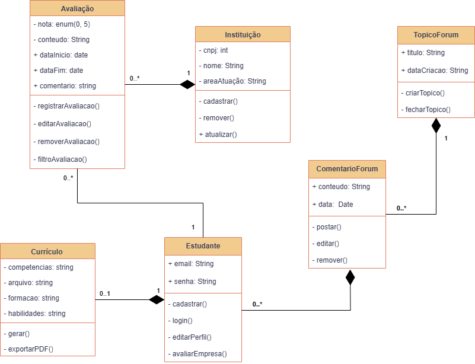

# Diagrama de Classes

## **Introdução**

Este artefato apresenta o **Diagrama de Classes** do software, modelando as principais entidades, atributos, métodos e relacionamentos que estruturam as funcionalidades de realizar cadastro, realizar login, acessar currículo, entrar no fórum, acessar guia de estágio, acessar avaliações, realizar avaliação, sugerir tópico, realizar comentário, excluir avaliação e aceitar sugestão. O diagrama serve de base para a implementação orientada a objetos, garantindo coerência entre requisitos e código.

## **Metodologia**

Para a construção do diagrama de classes, adotamos a notação UML conforme especificado pelo OMG (Object Management Group) e boas práticas de modelagem orientada a objetos:

1. **Levantamento de requisitos** – extração das funcionalidades a partir do Diagrama de Colaboração e documentos de requisitos () .
2. **Identificação de entidades** – definição de classes principais (por exemplo, `Usuario`, `Aluno`, `Especialista`), interfaces e enumerações.
3. **Definição de atributos e métodos** – para cada classe, listagem de atributos e operações que façam sentido no domínio.
4. **Modelagem de relacionamentos** – associação, generalização/especialização e dependências entre classes, visando baixo acoplamento e alta coesão.
5. **Validação** – revisão crítica em grupo e conferência contra critérios de consistência e completude.

## **Tabela de Participação na Produção do Artefato**

*Conforme documentado na [Ata 3](../../iniciativas_extras/Planejamento/atas/ata3.md) da reunião de 17/09/2025.*

<label><input type="checkbox" checked abled>[ Mateus Villela Consorte ](https://github.com/MVConsorte)</label> 
<label><input type="checkbox" checked abled>[ Paulo Henrique Virgilio Cerqueira ](https://github.com/paulocerqr)</label> 
<label><input type="checkbox" checked abled>[ Daniel Ferreira Nunes ](https://github.com/Mach1r0)</label> 
<label><input type="checkbox" checked abled>[ Breno Alexandre Soares Garcia ](https://github.com/brenoalexandre0)</label> 
<label><input type="checkbox" checked abled>[ Henrique Martins Alencar ](https://github.com/henryqma)</label> 
<label><input type="checkbox" checked abled>[ Eduardo Ferreira de Aquino ](https://github.com/fxred)</label> 
<label><input type="checkbox" checked abled>[ Felipe Nunes de Mello ](https://github.com/FelipeNunesdM)</label> 
<label><input type="checkbox" checked abled>[ Víctor Moreira Almeida ](https://github.com/aqela-batata-alt)</label> 

## **Resultados**

No diagrama de classes foram definidos:

| Classe / Elemento | Atributos principais | Métodos principais | Relacionamentos e Cardinalidades |
|-------------------|----------------------|-------------------|----------------------------------|
| Estudante | + email: String   + senha: String | + cadastrar()   + login()   + editarPerfil()   + avaliarEmpresa() | 1 Estudante ──◯── 0..* Avaliação (agregação)   1 Estudante ──♦── 0..1 Currículo (composição)   1 Estudante ──◯── 0..* ComentarioForum (agregação) |
| Currículo | - competencias: String   - arquivo: String   - formacao: String   - habilidades: String | + gerar()   + exportarPDF() | 1 Currículo ──♦── 1 Estudante (composição) |
| Instituição | - cnpj: int   - nome: String   - areaAtuacao: String | + cadastrar()   + remover()   + atualizar() | 1 Instituição ──♦── 0..* Avaliação (composição) |
| Avaliação | - nota: enum(0,5)   - conteudo: String   + dataInicio: Date   + dataFim: Date   + comentario: String | + registrarAvaliacao()   + editarAvaliacao()   + removerAvaliacao()   + filtroAvaliacao() | 0..* Avaliação ──♦── 1 Instituição (composição)   0..* Avaliação ──◯── 1 Estudante (agregação) |
| TópicoForum | + titulo: String   + dataCriacao: String | + criarTopico()   + fecharTopico() | 1 TópicoForum ──♦── 0..* ComentarioForum (composição) |
| ComentarioForum | + conteudo: String   + data: Date | + postar()   + editar()   + remover() | 0..* ComentarioForum ──♦── 1 TópicoForum (composição)   0..* ComentarioForum ──◯── 1 Estudante (agregação) |

## **Análise de Agregação vs Composição**

Instituição ♦── Avaliação: composição.
Isso significa que as Avaliações estão diretamente ligadas à Instituição.
Se a Instituição for removida, suas avaliações não fazem sentido por si só e deixam de existir.

Estudante ♦── Currículo: composição.
Um Currículo existe apenas associado a um Estudante.
Se o Estudante for removido, o Currículo perde sentido.

Estudante ◇── Avaliação: agregação.
O Estudante pode criar Avaliações, mas elas não deixam de existir caso o Estudante seja apagado (por exemplo, o sistema pode manter o histórico de avaliações mesmo se o usuário excluir a conta).

TópicoFórum ♦── ComentárioFórum: composição.
Um Comentário só existe dentro de um Tópico específico. Se o Tópico for apagado, todos os comentários desaparecem.

Estudante ◇── ComentárioFórum: agregação.
O Estudante escreve Comentários, mas se ele sair do sistema, os comentários podem permanecer.

**Diagrama de Classes:**

## **Gravação da Produção do Artefato**

<iframe width="560" height="315" src="https://www.youtube.com/embed/JWmqjNTjG2A" title="YouTube video player" frameborder="0" allow="accelerometer; autoplay; clipboard-write; encrypted-media; gyroscope; picture-in-picture; web-share" referrerpolicy="strict-origin-when-cross-origin" allowfullscreen></iframe>

## **Referências Bibliográficas**

- BOOCH, G.; RUMBAUGH, J.; JACOBSON, I. _The Unified Modeling Language User Guide_. 2. ed. Addison-Wesley, 2005.
- FOWLER, M. _UML Distilled: A Brief Guide to the Standard Object Modeling Language_. 3. ed. Addison-Wesley, 2003.
- OMG. _Unified Modeling Language (UML) Specification_, v2.5.1, 2017.
- SERRANO, M.; MILER, A. _Introdução ao UML e modelagem de software_. Plataforma Aprender, 2024.

## **Histórico de versões**

| Versão | Data       | Descrição                      | Autor        | Revisor     |
| ------ | ---------- | ------------------------------ | ------------ | ----------- |
| 1.0    | 20/09/2025 | Criação do diagrama de classes | Felipe Nunes |             |
