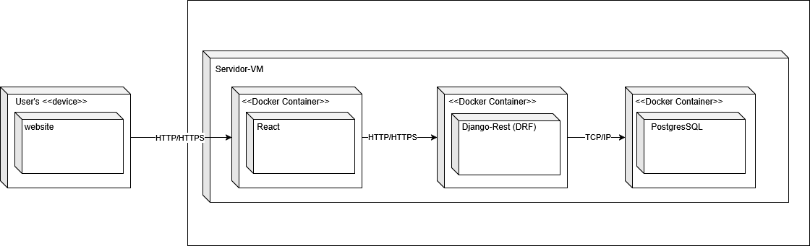

# Diagrama de implementação

## Introdução

O diagrama de implementação é um componente crucial da Linguagem de Modelagem Unificada (UML), projetado para ilustrar a arquitetura física de um sistema. Conforme definem os criadores da UML, Booch, Rumbaugh e Jacobson, seu propósito central é "modelar a topologia de hardware na qual o sistema é executado". De forma prática, ele detalha como os artefatos de software — como componentes executáveis, bibliotecas e arquivos — são organizados e distribuídos nos nós de hardware.

Na visão pragmática de Martin Fowler, o diagrama "mostra a disposição física de artefatos em nós", servindo como uma ponte essencial entre o desenvolvimento lógico e a infraestrutura física. Ao representar a estrutura estática da implantação, ele oferece um mapa claro da configuração necessária para a execução do sistema, mostrando não apenas onde cada peça de software reside, mas também como os diferentes componentes de hardware são interconectados.

## Metodologia

O diagrama foi elaborado colaborativamente utilizando a ferramenta Draw.io ([https://app.diagrams.net/](https://app.diagrams.net/)) em uma reunião síncrona entre os membros do grupo durante a aula e por mensagens no Discord, onde foram discutidos e definidos os principais componentes e suas interações. A modelagem seguiu as convenções e a notação padrão da UML, conforme estabelecido pela literatura técnica da área de engenharia de software.

## Tabela de Participação na Produção do Artefato

<label><input type="checkbox" checked disabled> [ Paulo Henrique Virgilio Cerqueira ](https://github.com/paulocerqr)</label> 
<label><input type="checkbox" checked disabled> [ Daniel Ferreira Nunes ](https://github.com/Mach1r0)</label> 
<label><input type="checkbox" checked disabled> [ Eduardo Ferreira de Aquino ](https://github.com/fxred)</label> 

## Diagrama geral

Autor(es): [Daniel Ferreira](https://github.com/Mach1r0), [Eduardo Ferreira](https://github.com/fxred), [Paulo Henrique Virgilio Cerqueira](https://github.com/paulocerqr).

## __Gravação da Produção do Artefato__

<iframe width="560" height="315" src="https://www.youtube.com/embed/bvLe6AGrgVk" title="YouTube video player" frameborder="0" allow="accelerometer; autoplay; clipboard-write; encrypted-media; gyroscope; picture-in-picture; web-share" referrerpolicy="strict-origin-when-cross-origin" allowfullscreen></iframe>

## Referências Bibliográficas

  * BOOCH, Grady; RUMBAUGH, James; JACOBSON, Ivar. **UML: Guia do Usuário**. 2ª ed. Rio de Janeiro: Elsevier, 2006.
  * FOWLER, Martin. **UML Gota a Gota: Um Guia Breve para a Linguagem de Modelagem de Objetos Padrão**. 3ª ed. Porto Alegre: Bookman, 2004.
  * GUEDES, Gilleanes T. A. **UML 2: Uma Abordagem Prática**. 2ª ed. São Paulo: Novatec Editora, 2011.

## __Histórico de versões__

| Versão | Data | Descrição | Autor | Revisor |
|--------|------|-----------|-------|---------|
| 1.0  | 21/09/2025 | Criação e adaptação do documento para os novos diagramas de implementação | [Daniel Ferreira Nunes](https://github.com/mach1r0), [Eduardo Ferreira](https://github.com/fxred)| [Eduardo Ferreira](https://github.com/fxred) |