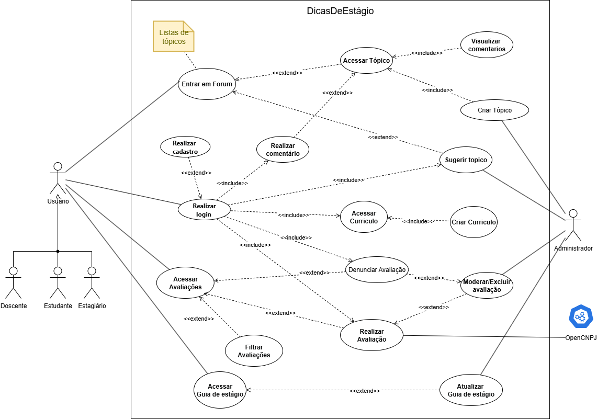

# **2.4.2. Diagrama de Casos de Uso**

## **Introdução**

O diagrama de casos de uso representa as interações entre os usuários da plataforma e as funcionalidades disponíveis no sistema. Ele ajuda a entender os requisitos  e com quais usuários eles interagem dentro da aplicação, servindo como um apoio para o desenvolvimento da plataforma. 

No diagrama do Guia de Estágio, foram representados alguns atores como Estudante, Estagiário, Docente e Administrador, e algumas funcionalidades como login, fórum, avaliação e currículo.

## **Metodologia**

A elaboração do Diagrama de Caso de Uso foi realizada de forma colaborativa pela equipe, composta por oito integrantes. O diagrama foi realizado em uma reunião utilizando a plataforma draw.io. O diagrama foi modelado de acordo com os requisitos já identificados nas etapas anteriores, seguindo os padrões da UML. Após a realização do diagrama, foi criado um documento para especificar cada caso de uso encontrado.

## __Tabela de Participação na Produção do Artefato__

*Conforme documentado na [Ata 4](../../iniciativas_extras/Planejamento/atas/ata4.md) da reunião de 19/09/2025.*

<label><input type="checkbox" checked abled>[ Mateus Villela Consorte ](https://github.com/MVConsorte)</label> 
<label><input type="checkbox" checked abled>[ Paulo Henrique Virgilio Cerqueira ](https://github.com/paulocerqr)</label> 
<label><input type="checkbox" checked abled>[ Daniel Ferreira Nunes ](https://github.com/Mach1r0)</label> 
<label><input type="checkbox" checked abled>[ Breno Alexandre Soares Garcia ](https://github.com/brenoalexandre0)</label> 
<label><input type="checkbox" checked abled>[ Henrique Martins Alencar ](https://github.com/henryqma)</label> 
<label><input type="checkbox" checked abled>[ Eduardo Ferreira de Aquino ](https://github.com/fxred)</label> 
<label><input type="checkbox" checked abled>[ Felipe Nunes de Mello ](https://github.com/FelipeNunesdM)</label> 
<label><input type="checkbox" checked abled>[ Víctor Moreira Almeida ](https://github.com/aqela-batata-alt)</label> 

## **Diagrama**

 **Figura 1** - Diagrama de Casos de Uso 

 **Autores**: [Breno](https://github.com/brenoalexandre0), [Daniel](https://github.com/Mach1r0), [Eduardo](https://github.com/fxred), [Felipe](https://github.com/FelipeNunesdM), [Henrique](https://github.com/henryqma), [Mateus](https://github.com/MVConsorte), [Paulo](https://github.com/paulocerqr), [Victor](https://github.com/aqela-batata-alt) 

## **Especificações**

??? abstract "UC01 - REALIZAR CADASTRO"
    | Tópico | Detalhes |
    | :--- | :--- |
    | **Descrição** | Permite que um novo usuário crie uma conta no sistema do Guia de Estágio para acessar suas funcionalidades. |
    | **Atores** | Estudante, Docente, Estagiário. |
    | **Pré-condição** | O usuário não deve possuir cadastro no sistema. |
    | **Pós-condição** | Uma nova conta de usuário é criada que poderá ser utilizada para o login. |
    | **Fluxo Principal** | 1. O usuário acessa a tela de cadastro. 2. O sistema exibe o formulário de cadastro. 3. O usuário preenche os campos obrigatórios e submete o formulário. 4. O sistema valida os dados inseridos. 5. O sistema cria o registro do novo usuário no banco de dados. 6. O sistema exibe uma mensagem de "cadastro realizado com sucesso" e redireciona o usuário para a página de login. |
    | **Fluxos de Exceções**| 1. Se os dados inseridos forem inválidos (ex: e-mail já cadastrado), o sistema exibe uma mensagem informando os campos com erro. 2. Se algum campo obrigatório não for preenchido, o sistema exibe uma mensagem de erro indicando os campos em branco. |

??? abstract "UC02 - REALIZAR LOGIN"
    | Tópico | Detalhes |
    | :--- | :--- |
    | **Descrição** | Permite que o usuário já cadastrado se autentique no sistema. |
    | **Atores** | Estudante, Docente, Estagiário. |
    | **Pré-condição** | O usuário deve possuir um cadastro ativo no sistema. |
    | **Pós-condição** | O autor é autenticado com sucesso e tem sua sessão iniciada. |
    | **Fluxo Principal** | 1. O usuário acessa a tela de login. 2. O sistema exibe o formulário de login. 3. O usuário preenche suas credenciais e submete o formulário. 4. O sistema valida as credenciais no banco de dados. 5. O sistema inicia a sessão do usuário e o redireciona. |
    | **Fluxos Alternativos**| 1. Se o usuário não lembrar da senha, ele pode clicar em "Esqueci minha senha". O sistema iniciará o fluxo de recuperação de senha. |
    | **Fluxos de Exceções**| 1. Se as credenciais estiverem incorretas, o sistema exibe a mensagem "Usuário ou senha inválidos". |

??? abstract "UC03 - ACESSAR CURRÍCULO"
    | Tópico | Detalhes |
    | :--- | :--- |
    | **Descrição** | Permite que o usuário acesse a área do sistema para visualizar e editar seu currículo online. |
    | **Atores** | Estudante, Estagiário. |
    | **Pré-condição** | O usuário deve estar autenticado no sistema. |
    | **Pós-condição** | O currículo do usuário é salvo/atualizado com as informações fornecidas. |
    | **Fluxo Principal** | 1. O usuário acessa a área do seu currículo. 2. O sistema recupera e exibe as informações do currículo do usuário. 3. O usuário preenche ou altera os campos desejados. 4. O usuário clica no botão "salvar". 5. O sistema valida e armazena as informações no banco de dados. 6. O sistema exibe uma mensagem de "Currículo atualizado com sucesso". |
    | **Fluxos Alternativos**| 1. Se o usuário acessa a seção pela primeira vez, o sistema exibe um formulário em branco para preenchimento. |
    | **Fluxos de Exceções**| 1. Se ocorrer um problema de comunicação com o banco de dados, o sistema exibe uma mensagem de erro. |

??? abstract "UC04 - ENTRAR NO FÓRUM"
    | Tópico | Detalhes |
    | :--- | :--- |
    | **Descrição** | Permite que os usuários acessem o fórum da comunidade para discutir tópicos relacionados a estágios. |
    | **Atores** | Estudante, Docente, Estagiário. |
    | **Pré-condição** | O usuário deve estar autenticado no sistema. |
    | **Pós-condição** | O ator visualiza a lista de tópicos do fórum e pode interagir. |
    | **Fluxo Principal** | 1. O usuário acessa o fórum. 2. O sistema exibe a página principal do fórum, com a lista de categorias e tópicos recentes. 3. O usuário seleciona o tópico desejado para interagir. |

??? abstract "UC05 - ACESSAR GUIA DE ESTÁGIO"
    | Tópico | Detalhes |
    | :--- | :--- |
    | **Descrição** | Permite que qualquer usuário acesse a seção de conteúdo informativo sobre estágios. |
    | **Atores** | Estudante, Docente, Estagiário. |
    | **Pré-condição** | O usuário deve estar acessando o portal. O login não é obrigatório para esse caso de uso. |
    | **Pós-condição** | O conteúdo do guia de estágio é exibido. |
    | **Fluxo Principal** | 1. O usuário acessa o guia de estágio. 2. O sistema exibe a página principal do guia. |

??? abstract "UC06 - ACESSAR AVALIAÇÕES"
    | Tópico | Detalhes |
    | :--- | :--- |
    | **Descrição** | Permite que um usuário navegue, pesquise e visualize as avaliações que outros estudantes fizeram sobre as empresas onde estagiaram. |
    | **Atores** | Estudante, Docente, Estagiário. |
    | **Pré-condição** | O usuário deve estar autenticado no sistema. |
    | **Pós-condição** | O usuário visualiza uma lista de avaliações. |
    | **Fluxo Principal** | 1. O usuário acessa a aba de avaliações. 2. O sistema exibe uma lista de empresas cadastradas com suas respectivas notas médias. 3. O usuário seleciona uma empresa da lista. 4. O sistema exibe uma página com todas as avaliações detalhadas (notas, comentários, etc.) para aquela empresa. |
    | **Fluxos Alternativos**| 1. Se o usuário quiser procurar uma empresa específica, ele utilizará a barra de busca e digitará o nome da empresa desejada. |
    | **Fluxos de Exceções**| 1. Se a empresa selecionada não possui avaliações, o sistema exibe uma mensagem avisando que a empresa ainda não foi avaliada. |

??? abstract "UC07 - REALIZAR AVALIAÇÃO"
    | Tópico | Detalhes |
    | :--- | :--- |
    | **Descrição** | Permite que o usuário submeta uma avaliação sobre sua experiência de estágio em uma empresa. |
    | **Atores** | Estagiário. |
    | **Pré-condição** | O usuário deve estar autenticado e ter feito estágio em alguma empresa cadastrada. |
    | **Pós-condição** | A avaliação do usuário é submetida e armazenada no sistema, ficando visível para outros usuários. |
    | **Fluxo Principal** | 1. O usuário acessa a página de avaliações. 2. O sistema exibe a lista de empresas cadastradas. 3. O usuário seleciona a empresa que deseja avaliar. 4. O sistema exibe um formulário com critérios para dar notas e um campo para comentários. 5. O usuário preenche os dados e clica em "Enviar avaliação". 6. O sistema valida os dados, salva a avaliação e exibe uma mensagem de sucesso. |
    | **Fluxos Alternativos**| 1. Se o usuário já avaliou aquela empresa, ele pode editar a avaliação. |
    | **Fluxos de Exceções**| 1. Se o usuário não preencher os campos obrigatórios, o sistema exibirá uma mensagem de erro indicando os campos faltantes. |

??? abstract "UC08 - SUGERIR TÓPICO"
    | Tópico | Detalhes |
    | :--- | :--- |
    | **Descrição** | Permite que um usuário sugira a criação de um novo tópico de discussão no fórum. |
    | **Atores** | Estudante, Docente, Estagiário. |
    | **Pré-condição** | O usuário precisa estar autenticado no sistema e ter acessado o fórum. |
    | **Pós-condição** | A sugestão de tópico é registrada no sistema para moderação. |
    | **Fluxo Principal** | 1. O usuário clica no botão "Sugerir tópico". 2. O sistema exibe um formulário para o usuário preencher. 3. O usuário preenche o formulário e clica em "Enviar sugestão". 4. O sistema salva a sugestão e envia para aprovação de um moderador. |
    | **Fluxos de Exceções**| 1. Se o sistema detectar palavras-chave inadequadas ele pode impedir o envio e exibir uma mensagem de aviso sobre regras da comunidade. |

??? abstract "UC09 - REALIZAR COMENTÁRIO"
    | Tópico | Detalhes |
    | :--- | :--- |
    | **Descrição** | Permite que um usuário autenticado participe de uma discussão publicando um comentário em um tópico existente no fórum. |
    | **Atores** | Estudante, Docente, Estagiário. |
    | **Pré-condição** | O usuário deve estar autenticado e visualizando um tópico no fórum. |
    | **Pós-condição** | O comentário do usuário é publicado e se torna visível para outros usuários no tópico. |
    | **Fluxo Principal** | 1. O usuário acessa um tópico de interesse no fórum. 2. O usuário escreve sua mensagem na caixa de texto ao final do tópico. 3. O usuário clica no botão "Comentar". 4. O sistema anexa o comentário ao tópico e o torna visível para outros usuários. |
    | **Fluxos Alternativos**| 1. O usuário pode editar um comentário que já tenha realizado. |

??? abstract "UC10 - EXCLUIR AVALIAÇÃO"
    | Tópico | Detalhes |
    | :--- | :--- |
    | **Descrição** | Permite que um administrador remova uma avaliação publicada. |
    | **Atores** | Administrador. |
    | **Pré-condição** | O administrador deve estar autenticado e acessando a área de avaliações. |
    | **Pós-condição** | A avaliação selecionada é removida do sistema. |
    | **Fluxo Principal** | 1. O administrador acessa a lista de avaliações. 2. O administrador localiza e seleciona a avaliação que deseja remover. 3. O administrador clica no botão "Excluir". 4. O sistema solicita uma confirmação de exclusão. 5. O administrador confirma a exclusão. 6. O sistema remove a avaliação do banco de dados e exibe uma mensagem de sucesso. |

??? abstract "UC11 - ACEITAR SUGESTÃO"
    | Tópico | Detalhes |
    | :--- | :--- |
    | **Descrição** | Permite que o administrador aprove uma sugestão de tópico feita por um usuário. |
    | **Atores** | Administrador. |
    | **Pré-condição** | O administrador autenticado acessa a área de moderação e existem sugestões pendentes. |
    | **Pós-condição** | A sugestão é convertida em um novo tópico no fórum. |
    | **Fluxo Principal** | 1. O sistema exibe a lista de sugestões pendentes. 2. O administrador analisa a sugestão selecionada. 3. O administrador clica em "Aprovar". 4. O sistema automaticamente cria um novo tópico no fórum com a sugestão. 5. A sugestão é removida da lista de pendentes. 6. O sistema exibe uma mensagem de sucesso. |
    | **Fluxos Alternativos**| 1. O administrador pode rejeitar uma sugestão, o que remove da lista de pendentes e notifica o usuário sobre o motivo da rejeição. |

??? abstract "UC12 - DENUNCIAR AVALIAÇÃO"
    | Tópico | Detalhes |
    | :--- | :--- |
    | **Descrição** | Permite que um usuário alerte os administrador sobre uma avaliação que seja viole as regras da comunidade. |
    | **Atores** | Estudante, Docente, Estagiário. |
    | **Pré-condição** | O usuário deve estar autenticado no sistema e estar visualizando a página de avaliações. |
    | **Pós-condição** | Uma denúncia é registrada no sistema e sinalizada para revisão pela administração. |
    | **Fluxo Principal** | 1. O usuário clica na opção de denunciar. 2. O sistema exibe uma janela com as possíveis razões para denúncia. 3. O usuário seleciona um dos motivos e, opcionalmente, descreve em um campo de texto. 4. O usuário clica em enviar. 5. O sistema valida a submissão e cria um registro da denúncia. 6. O sistema exibe uma mensagem de confirmação ao usuário. |
    | **Fluxos Alternativos**| 1. O usuário pode cancelar uma denúncia em andamento, fechando a janela. |
    | **Fluxos de Exceções**| 1. Se o estudante já realizou uma denúncia daquela mesma avaliação, o sistema exibirá uma mensagem avisando que ele já realizou uma denúncia. |

??? abstract "UC13 - CRIAR TÓPICO"
    | Tópico | Detalhes |
    | :--- | :--- |
    | **Descrição** | Permite que um administrador crie e publique um tópico de discussão diretamente no fórum. |
    | **Atores** | Administrador. |
    | **Pré-condição** | O administrador deve estar autenticado no sistema. |
    | **Pós-condição** | Um novo tópico é criado e publicado no fórum, tornando-se visível para todos os usuários. |
    | **Fluxo Principal** | 1. O administrador acessa o sistema e navega para a seção fórum. 2. O administrador acessa a opção "Criar novo tópico". 3. O sistema exibe um formulário de criação de tópico. 4. O administrador preenche os campos necessários. 5. O administrador clica no botão "Publicar". 6. O sistema valida os dados e cria o novo tópico no banco de dados. 7. O sistema exibe uma mensagem de sucesso. |
    | **Fluxos de Exceções**| 1. Se o administrador tentar publicar com campos obrigatórios em branco, o sistema exibirá uma mensagem de erro. |

??? abstract "UC14 - ATUALIZAR GUIA DE ESTÁGIO"
    | Tópico | Detalhes |
    | :--- | :--- |
    | **Descrição** | Permite que o administrador gerencie o conteúdo do "Guia de estágio", podendo adicionar, editar ou remover conteúdo. |
    | **Atores** | Administrador. |
    | **Pré-condição** | O administrador deve estar autenticado no sistema. |
    | **Pós-condição** | O conteúdo do guia de estágio é modificado de acordo com as alterações realizadas. |
    | **Fluxo Principal** | 1. O administrador acessa o painel de gerenciamento do guia de estágio. 2. O sistema exibe as informações do guia. 3. O administrador clica em "Editar". 4. O sistema exibe uma página de edição. 5. O administrador realiza as alterações desejadas. 6. O administrador clica em "Salvar". 7. O sistema armazena o conteúdo atualizado e exibe uma mensagem de sucesso. |

## **Conclusão**

O diagrama de casos de uso fornece uma visão funcional do sistema Dicas de Estágio, mostrando as principais interações possíveis para os diferentes perfis de usuário. A estrutura revela que a plataforma foi projetada para ser centrada na qualidade e transparência da experiência de estágio, com funcionalidades que apoiam estudantes desde a busca por vagas qualificadas até a avaliação de suas experiências. Detalhar cada funcionalidade em fluxos principais evita ambiguidades durante a fase de desenvolvimento e facilita a evolução do sistema, facilitando a integração de novas funcionalidades.

## **Bibliografia**

> 1. LUCIDCHART. O que é diagrama de sequência UML. Disponível em: [https://www.lucidchart.com/pages/pt/o-que-e-diagrama-de-sequencia-uml](https://www.lucidchart.com/pages/pt/o-que-e-diagrama-de-sequencia-uml). Acesso em: 21/09/2025.
> 2. Booch, G., Rumbaugh, J., & Jacobson, I. (2005). Unified Modeling Language User Guide. Addison-Wesley Professional.

## **Histórico de Versão**

| ID | Descrição | Autor | Revisor | Data |
|:--:|:---------|:------|:--------|:----:|
| 1.0 | Criação do documento | [Henrique Alencar](https://github.com/henryqma) | | 21/09/2025 |