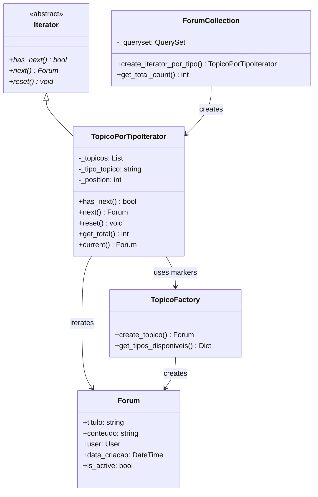

<style>
    .markdown-section table {
        justify-items: center;
    }

    img{
        max-height: 300px;
        justify-items: center;
    }

</style>

# 3.2. Iterator - Fórum de Tópicos

## 1. Introdução

O padrão _Iterator_ é um dos padrões de projeto comportamentais propostos pela _Gang of Four_ (GoF). Seu principal objetivo é fornecer uma maneira de acessar sequencialmente os elementos de uma coleção sem expor sua representação subjacente, promovendo baixo acoplamento e maior flexibilidade na navegação através de dados.

## 2. Metodologia

Neste projeto, o padrão _Iterator_ foi implementado com o objetivo de gerenciar a navegação através de diferentes tipos de tópicos no fórum da plataforma Dicas de Estágio. O sistema permite navegar eficientemente pelos cinco tipos distintos de tópicos: **Vagas**, **Dúvidas**, **Experiências**, **Dicas** e **Discussões**. A implementação se integra perfeitamente com o padrão Factory Method já existente, utilizando os marcadores criados pelo Factory para filtrar e navegar pelos tópicos.

A aplicação do padrão foi conduzida a partir do estudo teórico do conceito e da análise das necessidades de navegação através de diferentes tipos de conteúdo no fórum. A partir disso, foi elaborada uma estrutura que permite a navegação padronizada e extensível através de tópicos com características específicas para cada tipo.

Após a definição da arquitetura, a implementação foi realizada em três etapas:

1. Definição da interface Iterator e implementação concreta em `backend/Forum/iterators/forum_iterators.py`;
2. Integração com o modelo existente `Forum` e Factory Method em `backend/Forum/models.py`;
3. Criação de testes automatizados para validação das regras e consistência do padrão em `backend/Forum/iterators/test_iterators.py`.

## 3. Participantes

Os participantes da implementação deste Padrão de Projeto estão descritos na tabela abaixo:

<p style="text-align: center;">Tabela 1: Participantes da implementação do Iterator</p>

| Nome do Integrante | Artefato | Link Comprobatório |
|---|---|---|
| Daniel Ferreira Nunes | Iterator | [PR #4](https://github.com/UnBArqDsw2025-2-Turma02/2025.2-T02_G5_DicasDeEstagio_Entrega03/pull/4) |
| Paulo Cerqueira | Iterator | [PR #4](https://github.com/UnBArqDsw2025-2-Turma02/2025.2-T02_G5_DicasDeEstagio_Entrega03/pull/4) |
| Eduardo Ferreira de Aquino | Iterator | [PR #4](https://github.com/UnBArqDsw2025-2-Turma02/2025.2-T02_G5_DicasDeEstagio_Entrega03/pull/4) |

## 4. Aplicação do _Iterator_

### 4.1. Modelagem UML

<p style="text-align: center;">Figura 1: Diagrama de Classes do Iterator para Tópicos do Fórum</p>



<p style="text-align: center;">Fonte: Elaboração própria</p>

A estrutura implementada demonstra a relação entre as classes, destacando a dependência da implementação concreta (`TopicoPorTipoIterator`) em relação à interface abstrata `Iterator`, bem como a associação entre o iterator e a coleção (`ForumCollection`) e sua integração com o Factory Method existente.

### 4.2. Implementação

A estrutura implementada pode ser resumida da seguinte forma:

```python
class Iterator(ABC):
    @abstractmethod
    def has_next(self) -> bool:
        pass
    
    @abstractmethod
    def next(self) -> Any:
        pass
    
    @abstractmethod
    def reset(self) -> None:
        pass
```

A interface `Iterator` define os métodos essenciais para navegação (`has_next`, `next`, `reset`), que serão obrigatoriamente implementados nas classes concretas. O iterator concreto é responsável por navegar através de tópicos de um tipo específico utilizando os marcadores criados pelo Factory Method:

```python
class TopicoPorTipoIterator(Iterator):
    def __init__(self, topicos: QuerySet, tipo_topico: str = None):
        self._topicos = list(topicos)
        self._tipo_topico = tipo_topico
        self._position = 0
        
        if tipo_topico:
            self._filtrar_por_tipo()
    
    def _filtrar_por_tipo(self):
        marcadores = {
            'vaga': '[VAGA',
            'duvida': '[DÚVIDA',
            'experiencia': '[EXPERIÊNCIA',
            'dica': '[DICA',
            'discussao': '[DISCUSSÃO'
        }
        # Filtrar tópicos pelos marcadores do Factory Method
        ...
```

```python
class ForumCollection:
    def __init__(self, queryset: QuerySet = None):
        self._queryset = queryset if queryset is not None else Forum.objects.all()
    
    def create_iterator_por_tipo(self, tipo_topico: str) -> TopicoPorTipoIterator:
        return TopicoPorTipoIterator(self._queryset, tipo_topico)
```

Através dessa estrutura, o código cliente não precisa conhecer diretamente a estrutura interna da coleção de tópicos. Ele apenas interage com o iterator:

```python
collection = ForumCollection()
iterator = collection.create_iterator_por_tipo('vaga')

while iterator.has_next():
    topico = iterator.next()
    # Processar apenas tópicos de vaga
```

Dessa forma, a navegação é encapsulada dentro do iterator, permitindo diferentes estratégias de travessia sem alterar o código cliente.

### 4.3. Integração com o Sistema

A integração do padrão _Iterator_ com o sistema existente foi realizada de forma a complementar perfeitamente o padrão Factory Method já implementado. O Iterator utiliza os marcadores criados pelo Factory Method (`[VAGA]`, `[DÚVIDA]`, etc.) para filtrar e navegar através dos tópicos de forma eficiente.

O sistema utiliza a classe `ForumCollection` como aggregate que encapsula a criação de diferentes tipos de iterators. Isso garante que a navegação através dos dados seja eficiente e que novas estratégias de iteração possam ser adicionadas facilmente, respeitando o princípio Aberto/Fechado (OCP) do SOLID.

### 4.4. Códigos na Íntegra

A seguir, estão apresentados os códigos que implementam as classes relacionadas ao _Iterator_ para navegação através de tópicos do fórum.

*`Forum/iterators/forum_iterators.py`*

<details>
    <summary>Clique aqui para ver o código inteiro</summary>

```python
from abc import ABC, abstractmethod
from typing import Any, Optional
from django.db.models import QuerySet
from ..models import Forum


class Iterator(ABC):
    
    @abstractmethod
    def has_next(self) -> bool:
        pass
    
    @abstractmethod
    def next(self) -> Any:
        pass
    
    @abstractmethod
    def reset(self) -> None:
        pass


class TopicoPorTipoIterator(Iterator):
    
    def __init__(self, topicos: QuerySet, tipo_topico: str = None):
        self._topicos = list(topicos)
        self._tipo_topico = tipo_topico
        self._position = 0
        
        if tipo_topico:
            self._filtrar_por_tipo()
    
    def _filtrar_por_tipo(self):
        marcadores = {
            'vaga': '[VAGA',
            'duvida': '[DÚVIDA',
            'experiencia': '[EXPERIÊNCIA',
            'dica': '[DICA',
            'discussao': '[DISCUSSÃO'
        }
        
        marcador = marcadores.get(self._tipo_topico.lower())
        if marcador:
            self._topicos = [
                topico for topico in self._topicos 
                if marcador in topico.titulo
            ]
    
    def has_next(self) -> bool:
        return self._position < len(self._topicos)
    
    def next(self) -> Forum:
        if not self.has_next():
            raise StopIteration("Não há mais tópicos")
        
        topico = self._topicos[self._position]
        self._position += 1
        return topico
    
    def reset(self) -> None:
        self._position = 0
    
    def get_total(self) -> int:
        return len(self._topicos)

    def current(self) -> Optional[Forum]:
        if 0 <= self._position - 1 < len(self._topicos):
            return self._topicos[self._position - 1]
        return None


class ForumCollection:
    
    def __init__(self, queryset: QuerySet = None):
        self._queryset = queryset if queryset is not None else Forum.objects.all()
    
    def create_iterator_por_tipo(self, tipo_topico: str) -> TopicoPorTipoIterator:
        return TopicoPorTipoIterator(self._queryset, tipo_topico)
    
    def get_total_count(self) -> int:
        return self._queryset.count()


def exemplo_basico():
    collection = ForumCollection()
    iterator_vagas = collection.create_iterator_por_tipo('vaga')
    
    print(f"Vagas encontradas: {iterator_vagas.get_total()}")
    
    while iterator_vagas.has_next():
        vaga = iterator_vagas.next()
        print(f"• {vaga.titulo}")


if __name__ == "__main__":
    exemplo_basico()
```
</details>

## 5. Testes e Validação

### 5.1. Passo-a-passo de execução dos testes

**Navegar para o diretório do projeto**

```bash
cd backend
```

**Ativar o ambiente virtual (se necessário)**

```bash
source ../.venv/bin/activate
```

**Executar os testes do Iterator**

```bash
python manage.py test Forum.iterators.test_iterators -v 2
```

**Executar comando de demonstração**

```bash
python manage.py shell -c "from Forum.iterators.forum_iterators import exemplo_basico; exemplo_basico()"
```

Ao executar os testes, o Django cria um banco de dados temporário e verifica se os iterators e navegação funcionam conforme o esperado, garantindo que o padrão _Iterator_ foi corretamente aplicado para a navegação através dos tópicos do fórum.

### 5.2. Resultados Esperados

Os testes validam os seguintes aspectos:

- **Navegação correta através de diferentes tipos de tópicos**: Verifica se cada iterator navega corretamente pelos tópicos do tipo especificado
- **Filtragem por marcadores**: Testa se a integração com Factory Method funciona através dos marcadores nos títulos
- **Controle de posição**: Confirma se os métodos `has_next()`, `next()` e `reset()` funcionam adequadamente
- **Integridade da navegação**: Garante que todos os tópicos são visitados sem duplicação ou omissão
- **Extensibilidade**: Verifica se novos tipos de iterators podem ser adicionados sem quebrar funcionalidades existentes

## 6. Conclusão

A implementação do padrão _Iterator_ para o sistema de navegação através de tópicos do fórum garantiu uma estrutura organizacional robusta e eficiente para a plataforma Dicas de Estágio. O padrão possibilitou a navegação padronizada através de diferentes tipos de conteúdo, cada um filtrado e acessado de forma eficiente, mantendo a consistência e facilitando futuras expansões.

A aplicação do padrão foi acompanhada de implementação completa em Python/Django, integração perfeita com o padrão Factory Method existente, integração com API REST, testes automatizados abrangentes e documentação detalhada, assegurando sua correta funcionalidade e aderência aos princípios da engenharia de software orientada a objetos.

O sistema resultante oferece uma base sólida para a navegação eficiente através do fórum, permitindo a adição de novas estratégias de iteração de forma organizada e mantendo a performance e consistência na navegação através do conteúdo publicado.

## 7. Vídeo comprobatório 

<iframe width="640" height="360" src="https://www.youtube.com/embed/bNH9EGVVyjA" title="GOFS Criacional" frameborder="0" allow="accelerometer; autoplay; clipboard-write; encrypted-media; gyroscope; picture-in-picture; web-share" referrerpolicy="strict-origin-when-cross-origin" allowfullscreen></iframe>

## 8. Referências

- Gamma, E., Helm, R., Johnson, R., & Vlissides, J. (1995). *Design Patterns: Elements of Reusable Object-Oriented Software*. Addison-Wesley.
- Django Documentation — [https://docs.djangoproject.com](https://docs.djangoproject.com)
- Refactoring Guru: Iterator Pattern — [https://refactoring.guru/design-patterns/iterator](https://refactoring.guru/design-patterns/iterator)
- Martin, R. C. (2017). *Clean Architecture: A Craftsman's Guide to Software Structure and Design*. Prentice Hall.
