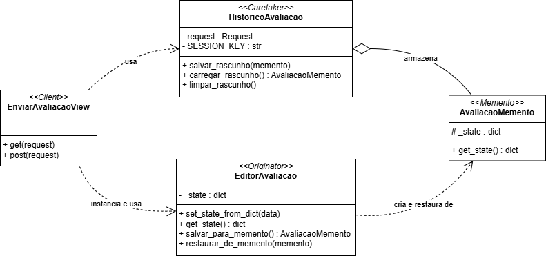

# Memento - Avaliação

## Padrão GoF Comportamental: Memento

O padrão comportamental Memento permite capturar e externalizar o estado interno de um objeto (originator) para que ele possa ser restaurado posteriormente, sem violar o encapsulamento [[1][2][3]](#ref-bib). Em termos práticos, isso viabiliza funcionalidades como desfazer/refazer (undo/redo), rascunhos e checkpoints transientes, mantendo o cliente desacoplado dos detalhes de persistência desse estado [[1][3]](#ref-bib). Em uma perspectiva mais ampla, o objetivo central é oferecer uma forma segura de snapshot do estado, preservando a integridade do objeto original e controlando quem pode gravar ou restaurar o estado salvo [[1][2]](#ref-bib). 

Em síntese, o problema clássico que o Memento visa resolver: ao implementar “desfazer” em um editor (texto, formatação, imagens), a solução ingênua é tirar um retrato do estado antes de cada operação e restaurá‑lo quando necessário. Porém, capturar esse retrato exige acesso a campos internos; expô‑los quebra encapsulamento e torna o sistema frágil, enquanto copiá‑los por fora acopla clientes à representação interna e exige ajustes a cada refatoração [[1]](#ref-bib). O Memento introduz um snapshot controlado pelo próprio originator (que sabe o que salvar), um caretaker que apenas armazena a sequência de snapshots e uma interface estreita que impede vazamento de detalhes internos—permitindo restaurar estados sem abrir a “caixa‑preta” do objeto [[1][2]](#ref-bib).

### Problemática: Memento no contexto da Funcionalidade de Avaliação 

Na funcionalidade de avaliação, o usuário pode iniciar o preenchimento de um formulário relativamente extenso (título, prós, contras, nota, cargo, anonimato, empresa) e desejar salvar um rascunho para concluir depois. Sem um mecanismo adequado, haveria alto risco de perda de dados parciais (por expiração de sessão, navegação acidental, falhas de rede) ou acoplamento direto entre a View e a forma de persistência (por exemplo, manipulação ad hoc do dicionário de sessão). Nesse aspecto, o "Memento" resolve esse problema ao encapsular o estado do formulário em um objeto de snapshot, enquanto um “histórico/cuidador” (caretaker) controla onde e como o snapshot é guardado [[1][2]](#ref-bib). Essa abordagem reduz o acoplamento, preserva o encapsulamento do editor (originator) e facilita restaurar o estado previamente salvo de forma previsível [[1][3]](#ref-bib).

---

## Modelagem

<font size="3"><p style="text-align: center"> **Figura 1** - Memento Method </p>

 

<font size="3"><p style="text-align: center"> **Autores**: [Henrique Alencar](https://github.com/henryqma) e [Mateus Consorte](https://github.com/MVConsorte) </p>

## Implementação

```python
class AvaliacaoMemento:
    def __init__(self, state: Dict[str, Any]):
        self._state = state.copy()

    def get_state(self) -> Dict[str, Any]:
        return self._state

class EditorAvaliacao:
    _state: Dict[str, Any]

    def __init__(self, state: Dict[str, Any] = None):
        self._state = state or self.get_empty_state()

    def get_empty_state(self) -> Dict[str, Any]:
        return {
            'titulo': '', 'pros': '', 'contras': '',
            'nota_geral': None, 'cargo': '', 'anonima': False,
            'empresa': None 
        }
    
    def set_state_from_dict(self, data: Dict[str, Any]):
        self._state = {
            'titulo': data.get('titulo', ''),
            'pros': data.get('pros', ''),
            'contras': data.get('contras', ''),
            'nota_geral': data.get('nota_geral'),
            'cargo': data.get('cargo', ''),
            'anonima': bool(data.get('anonima')),
            'empresa': data.get('empresa')
        }

    def get_state(self) -> Dict[str, Any]:
        return self._state

    def salvar_para_memento(self) -> AvaliacaoMemento:
        return AvaliacaoMemento(self._state)

    def restaurar_de_memento(self, memento: AvaliacaoMemento):
        self._state = memento.get_state()

class HistoricoAvaliacao:
    SESSION_KEY = 'avaliacao_draft'

    def __init__(self, request):
        self.request = request

    def salvar_rascunho(self, memento: AvaliacaoMemento):
        self.request.session[self.SESSION_KEY] = memento.get_state()
        self.request.session.modified = True
        print(f"RASCUNHO SALVO: {memento.get_state()}")

    def carregar_rascunho(self) -> Optional[AvaliacaoMemento]:
        state = self.request.session.get(self.SESSION_KEY)
        if state:
            print(f"RASCUNHO CARREGADO: {state}")
            return AvaliacaoMemento(state)
        return None

    def limpar_rascunho(self):
        if self.SESSION_KEY in self.request.session:
            del self.request.session[self.SESSION_KEY]
            print("RASCUNHO LIMPO.")
```

Participantes mapeados no repositório:

- Originator: `EditorAvaliacao` em `backend/avaliacao/memento_avaliacao.py` — mantém o estado atual do formulário e sabe criar/restaurar snapshots.
- Memento: `AvaliacaoMemento` em `backend/avaliacao/memento_avaliacao.py` — armazena o snapshot do estado do editor sem expor detalhes internos.
- Caretaker: `HistoricoAvaliacao` em `backend/avaliacao/memento_avaliacao.py` — decide quando e onde salvar o memento (sessão do usuário) e quando restaurá-lo/limpá-lo.

Relação direta com o código:

- `EditorAvaliacao.salvar_para_memento()` → cria `AvaliacaoMemento` com o estado atual.
- `EditorAvaliacao.restaurar_de_memento(m)` → restaura o estado previamente salvo.
- `HistoricoAvaliacao.salvar_rascunho(m)` → persiste o estado do memento na sessão e marca `session.modified = True`.
- `HistoricoAvaliacao.carregar_rascunho()` → retorna `AvaliacaoMemento` se houver estado salvo na sessão; `limpar_rascunho()` remove o rascunho.
- `EnviarAvaliacaoView` (em `backend/avaliacao/views.py`) integra o fluxo: carrega rascunho no GET; no POST, salva rascunho (`action == 'save_draft'`) ou envia a avaliação e limpa o rascunho (`action == 'submit'`).

Fluxo resumido:

1) GET: cria `EditorAvaliacao` e `HistoricoAvaliacao`; se houver rascunho na sessão, restaura o estado e popula o formulário com `initial`.
 
2) POST salvar: `editor.set_state_from_dict(request.POST)` → `m = editor.salvar_para_memento()` → `historico.salvar_rascunho(m)`.

3) POST enviar: valida `form`, constrói a avaliação com o Builder e salva; em seguida, `historico.limpar_rascunho()` para descartar o snapshot.

---

## Senso Crítico

Benefícios:

- Encapsulamento preservado: o originator controla como o estado é capturado/restaurado; o caretaker não depende dos detalhes internos [[1][2]](#ref-bib).
- Experiência do usuário: rascunhos evitam perda de trabalho e permitem retomada fluida do preenchimento.
- Testabilidade: é simples simular snapshots e checar restauração sem dependências externas (apenas sessão).
- Extensibilidade: a mesma abordagem pode evoluir para múltiplas versões de rascunho (histórico) ou undo/redo.

Trade-offs e cuidados:

- Overhead de memória: snapshots podem ficar grandes; é necessário definir limites ou TTL ("tempo de vida" da informação) na sessão.
- Serialização/compatibilidade: mudanças de esquema do estado exigem migração ou tolerância a chaves ausentes.
- Segurança e privacidade: dados sensíveis no snapshot precisam de cuidado (criptografia/mascaramento) e política de retenção.
- Concorrência/dispositivos: sessões em múltiplos dispositivos podem conflitar; estabeleça regras (último vence, merge, múltiplas versões).

---

## Conclusão

O Memento aplicado à Avaliação fornece um mecanismo claro e desacoplado para rascunhos persistidos em sessão, preservando o encapsulamento do editor e melhorando a UX. Com pequenos incrementos (limite/expiração de rascunhos, múltiplas versões e testes automatizados de restauração), a solução evolui para cenários mais robustos, incluindo suporte a undo/redo quando fizer sentido ao produto.

---

## Referência Bibliográfica {#ref-bib}

- [1] Memento – Padrões de Projeto. Refactoring Guru, 2014–2025. Disponível em: https://refactoring.guru/pt-br/design-patterns/memento. Acesso em: 23 out. 2025.
- [2] SERRANO, Milene. Arquitetura e Desenho de Software – Aula GoFs Comportamentais. Universidade de Brasília, [s.d.]. Disponível em: https://aprender3.unb.br/pluginfile.php/3178544/mod_page/content/1/Arquitetura%20e%20Desenho%20de%20Software%20-%20Aula%20GoFs%20Estruturais%20-%20Profa.%20Milene.pdf. Acesso em: 23 out. 2025.
- [3] Wikipedia. Memento pattern. Disponível em: https://en.wikipedia.org/wiki/Memento_pattern. Acesso em: 23 out. 2025.

## Bibliografias

SourceMaking. Memento. Disponível em: https://sourcemaking.com/design_patterns/memento.

## Histórico de Versões

| Versão | Data       | Descrição                                | Autor(es)                             | Revisor(es) | Detalhes da Revisão                                                |
| ------ | ---------- | ---------------------------------------- | ------------------------------------- | ----------- | ------------------------------------------------------------------ |
| 1.0    | 23/10/2025 |    Abertura do arquivo     | [Consorte](https://github.com/MVConsorte) | -    | - |
| 1.1    | 23/10/2025 | Seção com explicação teórica (com citações numéricas), problemática, mapeamento ao código e trade-offs | [Consorte](https://github.com/MVConsorte) | - | - |
| 1.2    | 23/10/2025 |    Adicionando modelagem     | [Henrique](https://github.com/henryqma) | -    | - |
