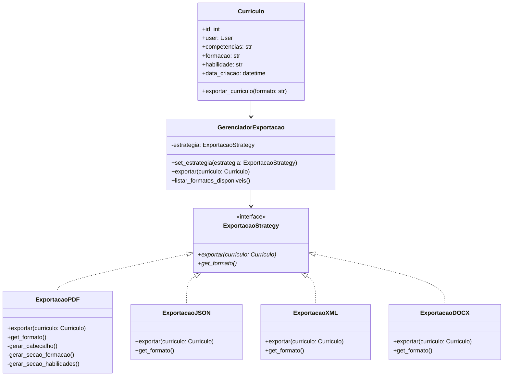

# Padrão Strategy - Currículo (Exportação)
## 1. Introdução

Este documento descreve a implementação do padrão de projeto Strategy para o sistema de exportação de currículos no DicasDeEstagio. O Strategy é um padrão comportamental que permite definir uma família de algoritmos, encapsulá-los e torná-los intercambiáveis.

## 2. Objetivo

O padrão Strategy foi escolhido para a exportação de currículos devido à:

- Múltiplos formatos: Necessidade de exportar currículos em PDF, JSON, XML, DOCX
- Flexibilidade: Adicionar novos formatos sem modificar código existente
- Separação de concerns: Isolar a lógica de exportação do modelo de currículo

## 3. Estrutura do Padrão

### 3.1 Diagrama de Classes

<details>
  <summary>Diagrama</summary>



</details>

## 4. Implementação em Django

### 4.1 Interface Strategy (exportacao/strategies.py)

<details>
  <summary>Código</summary>

```Python
import json
from datetime import datetime
from reportlab.pdfgen import canvas
from reportlab.lib.pagesizes import A4
from reportlab.lib.styles import getSampleStyleSheet, ParagraphStyle
from reportlab.platypus import SimpleDocTemplate, Paragraph, Spacer
from reportlab.lib.units import inch
from django.http import HttpResponse
import xml.etree.ElementTree as ET
from docx import Document
from io import BytesIO
from abc import ABC, abstractmethod
from curriculos.models import Curriculo

class ExportacaoStrategy(ABC):
    """
    Interface Strategy para exportação de currículos.
    Define o contrato que todas as estratégias concretas devem seguir.
    """
    
    @abstractmethod
    def exportar(self, curriculo: Curriculo) -> HttpResponse:
        """
        Exporta o currículo no formato específico.
        
        Args:
            curriculo: Instância do currículo a ser exportado
            
        Returns:
            HttpResponse com o arquivo para download
        """
        pass
    
    @abstractmethod
    def get_formato(self) -> str:
        """
        Retorna o identificador do formato.
        
        Returns:
            String identificando o formato (ex: 'pdf', 'json')
        """
        pass
    
    @abstractmethod
    def get_content_type(self) -> str:
        """
        Retorna o content type HTTP.
        
        Returns:
            String com o content type
        """
        pass
    
    @abstractmethod
    def get_extensao(self) -> str:
        """
        Retorna a extensão do arquivo.
        
        Returns:
            String com a extensão (ex: '.pdf', '.json')
        """
        pass

class ExportacaoPDF(ExportacaoStrategy):
    """Estratégia para exportação em formato PDF."""
    
    def exportar(self, curriculo: Curriculo) -> HttpResponse:
        """Gera currículo em formato PDF"""
        response = HttpResponse(content_type='application/pdf')
        filename = f"curriculo_{curriculo.user.name}_{datetime.now().strftime('%Y%m%d')}.pdf"
        response['Content-Disposition'] = f'attachment; filename="{filename}"'
        
        buffer = BytesIO()
        doc = SimpleDocTemplate(buffer, pagesize=A4)
        styles = getSampleStyleSheet()
        story = []
        
        # Título
        titulo_style = ParagraphStyle(
            'CustomTitle',
            parent=styles['Heading1'],
            fontSize=16,
            spaceAfter=30,
            alignment=1  # Center
        )
        story.append(Paragraph(f"Currículo - {curriculo.user.name}", titulo_style))
        story.append(Spacer(1, 0.2*inch))
        
        # Formação
        if curriculo.formacao:
            story.append(Paragraph("Formação Acadêmica", styles['Heading2']))
            story.append(Paragraph(curriculo.formacao, styles['Normal']))
            story.append(Spacer(1, 0.1*inch))
        
        # Habilidades
        if curriculo.habilidade:
            story.append(Paragraph("Habilidades", styles['Heading2']))
            story.append(Paragraph(curriculo.habilidade, styles['Normal']))
            story.append(Spacer(1, 0.1*inch))
        
        # Competências
        if curriculo.competencias:
            story.append(Paragraph("Competências", styles['Heading2']))
            story.append(Paragraph(curriculo.competencias, styles['Normal']))
        
        doc.build(story)
        pdf = buffer.getvalue()
        buffer.close()
        response.write(pdf)
        
        return response
    
    def get_formato(self) -> str:
        return 'pdf'
    
    def get_content_type(self) -> str:
        return 'application/pdf'
    
    def get_extensao(self) -> str:
        return '.pdf'

class ExportacaoJSON(ExportacaoStrategy):
    """Estratégia para exportação em formato JSON."""
    
    def exportar(self, curriculo: Curriculo) -> HttpResponse:
        """Gera currículo em formato JSON"""
        dados = {
            'curriculo': {
                'id': curriculo.id,
                'usuario': {
                    'nome': curriculo.user.name,
                    'email': curriculo.user.email
                },
                'formacao': curriculo.formacao,
                'habilidades': curriculo.habilidade,
                'competencias': curriculo.competencias
            }
        }
        
        response = HttpResponse(
            json.dumps(dados, indent=2, ensure_ascii=False),
            content_type='application/json'
        )
        filename = f"curriculo_{curriculo.user.name}_{datetime.now().strftime('%Y%m%d')}.json"
        response['Content-Disposition'] = f'attachment; filename="{filename}"'
        
        return response
    
    def get_formato(self) -> str:
        return 'json'
    
    def get_content_type(self) -> str:
        return 'application/json'
    
    def get_extensao(self) -> str:
        return '.json'

class ExportacaoXML(ExportacaoStrategy):
    """Estratégia para exportação em formato XML."""
    
    def exportar(self, curriculo: Curriculo) -> HttpResponse:
        """Gera currículo em formato XML"""
        root = ET.Element('curriculo')
        
        ET.SubElement(root, 'id').text = str(curriculo.id)
        usuario = ET.SubElement(root, 'usuario')
        ET.SubElement(usuario, 'nome').text = curriculo.user.name
        ET.SubElement(usuario, 'email').text = curriculo.user.email
        
        ET.SubElement(root, 'formacao').text = curriculo.formacao or ''
        ET.SubElement(root, 'habilidades').text = curriculo.habilidade or ''
        ET.SubElement(root, 'competencias').text = curriculo.competencias or ''
        
        xml_str = ET.tostring(root, encoding='utf-8', method='xml')
        
        response = HttpResponse(xml_str, content_type='application/xml')
        filename = f"curriculo_{curriculo.user.name}_{datetime.now().strftime('%Y%m%d')}.xml"
        response['Content-Disposition'] = f'attachment; filename="{filename}"'
        
        return response
    
    def get_formato(self) -> str:
        return 'xml'
    
    def get_content_type(self) -> str:
        return 'application/xml'
    
    def get_extensao(self) -> str:
        return '.xml'

class ExportacaoDOCX(ExportacaoStrategy):
    """Estratégia para exportação em formato DOCX."""
    
    def exportar(self, curriculo: Curriculo) -> HttpResponse:
        """Gera currículo em formato DOCX"""
        document = Document()
        
        # Título
        title = document.add_heading(f'Currículo - {curriculo.user.name}', 0)
        
        # Formação
        if curriculo.formacao:
            document.add_heading('Formação Acadêmica', level=1)
            document.add_paragraph(curriculo.formacao)
        
        # Habilidades
        if curriculo.habilidade:
            document.add_heading('Habilidades', level=1)
            document.add_paragraph(curriculo.habilidade)
        
        # Competências
        if curriculo.competencias:
            document.add_heading('Competências', level=1)
            document.add_paragraph(curriculo.competencias)
        
        buffer = BytesIO()
        document.save(buffer)
        buffer.seek(0)
        
        response = HttpResponse(
            buffer.getvalue(),
            content_type='application/vnd.openxmlformats-officedocument.wordprocessingml.document'
        )
        filename = f"curriculo_{curriculo.user.name}_{datetime.now().strftime('%Y%m%d')}.docx"
        response['Content-Disposition'] = f'attachment; filename="{filename}"'
        
        return response
    
    def get_formato(self) -> str:
        return 'docx'
    
    def get_content_type(self) -> str:
        return 'application/vnd.openxmlformats-officedocument.wordprocessingml.document'
    
    def get_extensao(self) -> str:
        return '.docx'
```

</details>

### 4.2 Estratégias Concretas (exportacao/strategies.py)

<details>
  <summary>Código</summary>

```Python
import json
from datetime import datetime
from reportlab.pdfgen import canvas
from reportlab.lib.pagesizes import A4
from reportlab.lib.styles import getSampleStyleSheet, ParagraphStyle
from reportlab.platypus import SimpleDocTemplate, Paragraph, Spacer
from reportlab.lib.units import inch
from django.http import HttpResponse
import xml.etree.ElementTree as ET
from docx import Document
from io import BytesIO

class ExportacaoPDF(ExportacaoStrategy):
    """Estratégia para exportação em formato PDF."""
    
    def exportar(self, curriculo: Curriculo) -> HttpResponse:
        """Gera currículo em formato PDF"""
        response = HttpResponse(content_type='application/pdf')
        filename = f"curriculo_{curriculo.user.name}_{datetime.now().strftime('%Y%m%d')}.pdf"
        response['Content-Disposition'] = f'attachment; filename="{filename}"'
        
        buffer = BytesIO()
        doc = SimpleDocTemplate(buffer, pagesize=A4)
        styles = getSampleStyleSheet()
        story = []
        
        # Título
        titulo_style = ParagraphStyle(
            'CustomTitle',
            parent=styles['Heading1'],
            fontSize=16,
            spaceAfter=30,
            alignment=1  # Center
        )
        story.append(Paragraph(f"Currículo - {curriculo.user.name}", titulo_style))
        story.append(Spacer(1, 0.2*inch))
        
        # Formação
        if curriculo.formacao:
            story.append(Paragraph("Formação Acadêmica", styles['Heading2']))
            story.append(Paragraph(curriculo.formacao, styles['Normal']))
            story.append(Spacer(1, 0.1*inch))
        
        # Habilidades
        if curriculo.habilidade:
            story.append(Paragraph("Habilidades", styles['Heading2']))
            story.append(Paragraph(curriculo.habilidade, styles['Normal']))
            story.append(Spacer(1, 0.1*inch))
        
        # Competências
        if curriculo.competencias:
            story.append(Paragraph("Competências", styles['Heading2']))
            story.append(Paragraph(curriculo.competencias, styles['Normal']))
        
        doc.build(story)
        pdf = buffer.getvalue()
        buffer.close()
        response.write(pdf)
        
        return response
    
    def get_formato(self) -> str:
        return 'pdf'
    
    def get_content_type(self) -> str:
        return 'application/pdf'
    
    def get_extensao(self) -> str:
        return '.pdf'


class ExportacaoJSON(ExportacaoStrategy):
    """Estratégia para exportação em formato JSON."""
    
    def exportar(self, curriculo: Curriculo) -> HttpResponse:
        """Gera currículo em formato JSON"""
        dados = {
            'curriculo': {
                'id': curriculo.id,
                'usuario': {
                    'nome': curriculo.user.name,
                    'email': curriculo.user.email
                },
                'formacao': curriculo.formacao,
                'habilidades': curriculo.habilidade,
                'competencias': curriculo.competencias,
                'data_criacao': curriculo.data_criacao.isoformat(),
                'data_atualizacao': curriculo.data_atualizacao.isoformat()
            }
        }
        
        response = HttpResponse(
            json.dumps(dados, indent=2, ensure_ascii=False),
            content_type='application/json'
        )
        filename = f"curriculo_{curriculo.user.name}_{datetime.now().strftime('%Y%m%d')}.json"
        response['Content-Disposition'] = f'attachment; filename="{filename}"'
        
        return response
    
    def get_formato(self) -> str:
        return 'json'
    
    def get_content_type(self) -> str:
        return 'application/json'
    
    def get_extensao(self) -> str:
        return '.json'


class ExportacaoXML(ExportacaoStrategy):
    """Estratégia para exportação em formato XML."""
    
    def exportar(self, curriculo: Curriculo) -> HttpResponse:
        """Gera currículo em formato XML"""
        root = ET.Element('curriculo')
        
        ET.SubElement(root, 'id').text = str(curriculo.id)
        usuario = ET.SubElement(root, 'usuario')
        ET.SubElement(usuario, 'nome').text = curriculo.user.name
        ET.SubElement(usuario, 'email').text = curriculo.user.email
        
        ET.SubElement(root, 'formacao').text = curriculo.formacao or ''
        ET.SubElement(root, 'habilidades').text = curriculo.habilidade or ''
        ET.SubElement(root, 'competencias').text = curriculo.competencias or ''
        ET.SubElement(root, 'data_criacao').text = curriculo.data_criacao.isoformat()
        ET.SubElement(root, 'data_atualizacao').text = curriculo.data_atualizacao.isoformat()
        
        xml_str = ET.tostring(root, encoding='utf-8', method='xml')
        
        response = HttpResponse(xml_str, content_type='application/xml')
        filename = f"curriculo_{curriculo.user.name}_{datetime.now().strftime('%Y%m%d')}.xml"
        response['Content-Disposition'] = f'attachment; filename="{filename}"'
        
        return response
    
    def get_formato(self) -> str:
        return 'xml'
    
    def get_content_type(self) -> str:
        return 'application/xml'
    
    def get_extensao(self) -> str:
        return '.xml'


class ExportacaoDOCX(ExportacaoStrategy):
    """Estratégia para exportação em formato DOCX."""
    
    def exportar(self, curriculo: Curriculo) -> HttpResponse:
        """Gera currículo em formato DOCX"""
        document = Document()
        
        # Título
        title = document.add_heading(f'Currículo - {curriculo.user.name}', 0)
        
        # Formação
        if curriculo.formacao:
            document.add_heading('Formação Acadêmica', level=1)
            document.add_paragraph(curriculo.formacao)
        
        # Habilidades
        if curriculo.habilidade:
            document.add_heading('Habilidades', level=1)
            document.add_paragraph(curriculo.habilidade)
        
        # Competências
        if curriculo.competencias:
            document.add_heading('Competências', level=1)
            document.add_paragraph(curriculo.competencias)
        
        buffer = BytesIO()
        document.save(buffer)
        buffer.seek(0)
        
        response = HttpResponse(
            buffer.getvalue(),
            content_type='application/vnd.openxmlformats-officedocument.wordprocessingml.document'
        )
        filename = f"curriculo_{curriculo.user.name}_{datetime.now().strftime('%Y%m%d')}.docx"
        response['Content-Disposition'] = f'attachment; filename="{filename}"'
        
        return response
    
    def get_formato(self) -> str:
        return 'docx'
    
    def get_content_type(self) -> str:
        return 'application/vnd.openxmlformats-officedocument.wordprocessingml.document'
    
    def get_extensao(self) -> str:
        return '.docx'
```

</details>

### 4.3 Gerenciador de Exportação (exportacao/manager.py)

<details>
  <summary>Código</summary>

```Python
from typing import Dict, List
from django.http import HttpResponse
from .strategies import ExportacaoStrategy, ExportacaoPDF, ExportacaoJSON, ExportacaoXML, ExportacaoDOCX
from curriculos.models import Curriculo

class GerenciadorExportacao:
    """
    Gerenciador que orquestra as estratégias de exportação.
    Implementa o padrão Strategy para troca dinâmica de algoritmos.
    """
    
    def __init__(self):
        self._estrategias: Dict[str, ExportacaoStrategy] = {}
        self._registrar_estrategias_padrao()
    
    def _registrar_estrategias_padrao(self):
        """Registra as estratégias de exportação disponíveis"""
        self.registrar_estrategia(ExportacaoPDF())
        self.registrar_estrategia(ExportacaoJSON())
        self.registrar_estrategia(ExportacaoXML())
        self.registrar_estrategia(ExportacaoDOCX())
    
    def registrar_estrategia(self, estrategia: ExportacaoStrategy):
        """
        Registra uma nova estratégia de exportação.
        
        Args:
            estrategia: Instância da estratégia a ser registrada
        """
        self._estrategias[estrategia.get_formato()] = estrategia
    
    def obter_estrategia(self, formato: str) -> ExportacaoStrategy:
        """
        Obtém uma estratégia pelo formato.
        
        Args:
            formato: Identificador do formato ('pdf', 'json', etc.)
            
        Returns:
            Instância da estratégia
            
        Raises:
            ValueError: Se o formato não for suportado
        """
        if formato not in self._estrategias:
            raise ValueError(f"Formato '{formato}' não é suportado")
        
        return self._estrategias[formato]
    
    def exportar(self, curriculo: Curriculo, formato: str) -> HttpResponse:
        """
        Exporta um currículo usando o formato especificado.
        
        Args:
            curriculo: Currículo a ser exportado
            formato: Formato de exportação
            
        Returns:
            HttpResponse com o arquivo para download
        """
        estrategia = self.obter_estrategia(formato)
        return estrategia.exportar(curriculo)
    
    def listar_formatos_disponiveis(self) -> List[Dict[str, str]]:
        """
        Lista todos os formatos de exportação disponíveis.
        
        Returns:
            Lista de dicionários com informações dos formatos
        """
        return [
            {
                'formato': estrategia.get_formato(),
                'content_type': estrategia.get_content_type(),
                'extensao': estrategia.get_extensao()
            }
            for estrategia in self._estrategias.values()
        ]
    
    def is_formato_suportado(self, formato: str) -> bool:
        """
        Verifica se um formato é suportado.
        
        Args:
            formato: Formato a verificar
            
        Returns:
            True se o formato é suportado, False caso contrário
        """
        return formato in self._estrategias
```

</details>

### 4.4 Integração com o Modelo Currículo (models.py)

<details>
  <summary>Código</summary>

```Python
from django.db import models
from users.models import User
from exportacao.manager import GerenciadorExportacao

class Curriculo(models.Model):
    competencias = models.TextField()
    arquivo = models.FileField(upload_to='curriculos/')
    formacao = models.TextField()
    habilidade = models.TextField()
    user = models.ForeignKey('users.User', on_delete=models.CASCADE)

    def __str__(self):
        return f'Currículo de {self.user.email}'
    
    def exportar_curriculo(self, formato: str = 'pdf'):
        """
        Exporta o currículo no formato especificado.
        Usa o padrão Strategy para delegar a exportação.
        
        Args:
            formato: Formato de exportação ('pdf', 'json', 'xml', 'docx')
            
        Returns:
            HttpResponse com o arquivo para download
            
        Raises:
            ValueError: Se o formato não for suportado
        """
        gerenciador = GerenciadorExportacao()
        return gerenciador.exportar(self, formato)
    
    def get_formatos_exportacao_disponiveis(self):
        """
        Retorna lista de formatos de exportação disponíveis.
        
        Returns:
            Lista de formatos suportados
        """
        gerenciador = GerenciadorExportacao()
        return gerenciador.listar_formatos_disponiveis()
```

</details>

### 4.5 Views (views.py)

<details>
  <summary>Código</summary>

```Python
from rest_framework import viewsets, status
from rest_framework.decorators import action
from rest_framework.response import Response
from rest_framework.permissions import IsAuthenticated
from django.http import HttpResponse
from .models import Curriculo
from .serializers import CurriculoSerializer
from exportacao.manager import GerenciadorExportacao

class CurriculoViewSet(viewsets.ModelViewSet):
    """
    ViewSet para gerenciar currículos.
    Implementa endpoints para exportação usando Strategy Pattern.
    """
    queryset = Curriculo.objects.all()
    serializer_class = CurriculoSerializer
    permission_classes = [IsAuthenticated]
    
    def get_queryset(self):
        return Curriculo.objects.filter(user=self.request.user)
    
    @action(detail=True, methods=['get'], url_path='exportar')
    def exportar_curriculo(self, request, pk=None):
        """
        Exporta currículo em diferentes formatos usando Strategy Pattern.
        
        GET /api/curriculos/{id}/exportar/?formato=pdf
        
        Parâmetros:
            formato: pdf, json, xml, docx (padrão: pdf)
        """
        curriculo = self.get_object()
        formato = request.query_params.get('formato', 'pdf').lower()
        
        gerenciador = GerenciadorExportacao()
        
        if not gerenciador.is_formato_suportado(formato):
            return Response(
                {
                    'error': f'Formato {formato} não suportado',
                    'formatos_disponiveis': [fmt['formato'] for fmt in gerenciador.listar_formatos_disponiveis()]
                },
                status=status.HTTP_400_BAD_REQUEST
            )
        
        try:
            response = gerenciador.exportar(curriculo, formato)
            return response
        except Exception as e:
            return Response(
                {'error': f'Erro na exportação: {str(e)}'},
                status=status.HTTP_500_INTERNAL_SERVER_ERROR
            )
    
    @action(detail=False, methods=['get'], url_path='formatos-exportacao')
    def listar_formatos_exportacao(self, request):
        """
        Lista formatos de exportação disponíveis.
        
        GET /api/curriculos/formatos-exportacao/
        """
        gerenciador = GerenciadorExportacao()
        formatos = gerenciador.listar_formatos_disponiveis()
        
        return Response({
            'formatos_disponiveis': formatos,
            'total_formatos': len(formatos)
        })
    
    @action(detail=True, methods=['post'], url_path='exportar-multiplos')
    def exportar_multiplos_formatos(self, request, pk=None):
        """
        Exporta currículo em múltiplos formatos de uma vez.
        
        POST /api/curriculos/{id}/exportar-multiplos/
        Body: {
            "formatos": ["pdf", "json", "docx"]
        }
        """
        curriculo = self.get_object()
        formatos = request.data.get('formatos', ['pdf'])
        
        if not isinstance(formatos, list):
            return Response(
                {'error': 'O parâmetro "formatos" deve ser uma lista'},
                status=status.HTTP_400_BAD_REQUEST
            )
        
        gerenciador = GerenciadorExportacao()
        
        # Verificar se todos os formatos são suportados
        formatos_nao_suportados = [
            fmt for fmt in formatos 
            if not gerenciador.is_formato_suportado(fmt)
        ]
        
        if formatos_nao_suportados:
            return Response(
                {
                    'error': f'Formatos não suportados: {", ".join(formatos_nao_suportados)}',
                    'formatos_disponiveis': [fmt['formato'] for fmt in gerenciador.listar_formatos_disponiveis()]
                },
                status=status.HTTP_400_BAD_REQUEST
            )
        
        # Em produção, isso poderia ser processado assincronamente
        # e enviado por email, por exemplo
        resultados = []
        for formato in formatos:
            try:
                response = gerenciador.exportar(curriculo, formato)
                # Em um cenário real, salvaríamos os arquivos e retornaríamos links
                resultados.append({
                    'formato': formato,
                    'status': 'sucesso',
                    'content_type': response['Content-Type']
                })
            except Exception as e:
                resultados.append({
                    'formato': formato,
                    'status': 'erro',
                    'error': str(e)
                })
        
        return Response({
            'curriculo_id': curriculo.id,
            'resultados': resultados
        })
```

</details>

### 4.6 Serializers (serializers.py)

<details>
  <summary>Código</summary>

```Python
from rest_framework import serializers
from .models import Curriculo

class CurriculoExportacaoSerializer(serializers.Serializer):
    """
    Serializer para parâmetros de exportação.
    """
    formato = serializers.ChoiceField(
        choices=['pdf', 'json', 'xml', 'docx'],
        default='pdf'
    )
    
    class Meta:
        fields = ['formato']

class CurriculoMultiploExportacaoSerializer(serializers.Serializer):
    """
    Serializer para exportação em múltiplos formatos.
    """
    formatos = serializers.ListField(
        child=serializers.ChoiceField(choices=['pdf', 'json', 'xml', 'docx']),
        min_length=1,
        max_length=4
    )
    
    class Meta:
        fields = ['formatos']
```

</details>

## 5. Exemplo de Uso

### 5.1 Uso Direto do Strategy

<details>
  <summary>Código</summary>

```Python
from exportacao.manager import GerenciadorExportacao
from curriculos.models import Curriculo

# Exportar currículo em PDF
curriculo = Curriculo.objects.get(id=1)
gerenciador = GerenciadorExportacao()

# Exportar em PDF
response_pdf = gerenciador.exportar(curriculo, 'pdf')

# Exportar em JSON
response_json = gerenciador.exportar(curriculo, 'json')

# Listar formatos disponíveis
formatos = gerenciador.listar_formatos_disponiveis()
```

</details>

### 5.2 Uso via Modelo

<details>
  <summary>Código</summary>

```Python
from curriculos.models import Curriculo

curriculo = Curriculo.objects.get(id=1)

# Exportar usando método do modelo
response = curriculo.exportar_curriculo('pdf')

# Ver formatos disponíveis
formatos = curriculo.get_formatos_exportacao_disponiveis()
```

</details>

### 5.3 Requisições API

<details>
  <summary>Terminal</summary>

```bash
# Exportar currículo em PDF
GET /api/curriculos/1/exportar/?formato=pdf

# Exportar currículo em JSON
GET /api/curriculos/1/exportar/?formato=json

# Listar formatos disponíveis
GET /api/curriculos/formatos-exportacao/

# Exportar em múltiplos formatos
POST /api/curriculos/1/exportar-multiplos/
Content-Type: application/json

{
    "formatos": ["pdf", "json", "docx"]
}
```

</details>

## 6. Vantagens da Implementação

- Extensibilidade: Fácil adicionar novos formatos de exportação
- Manutenibilidade: Cada estratégia é isolada e independente
- Testabilidade: Estratégias podem ser testadas individualmente
- Flexibilidade: Troca dinâmica de algoritmos em tempo de execução
- Reusabilidade: Estratégias podem ser reutilizadas em outros contextos

## 7. Testes

<details>
  <summary>Código de testes</summary>

```Python
from django.test import TestCase
from django.contrib.auth import get_user_model
from django.core.files.uploadedfile import SimpleUploadedFile
from curriculos.models import Curriculo
from exportacao.manager import GerenciadorExportacao
from exportacao.strategies import ExportacaoJSON

User = get_user_model()

class StrategyExportacaoTestCase(TestCase):
    
    def setUp(self):
        self.user = User.objects.create_user(
            email='teste@example.com',
            name='Teste User',
            password='senha123'
        )
        
        # Criar um arquivo simulado para o campo 'arquivo'
        arquivo_simulado = SimpleUploadedFile(
            "curriculo_teste.pdf",
            b"conteudo simulado do arquivo",
            content_type="application/pdf"
        )
        
        self.curriculo = Curriculo.objects.create(
            user=self.user,
            formacao='Engenharia de Software - UnB',
            habilidade='Python, Django, React',
            competencias='Trabalho em equipe, Comunicação',
            arquivo=arquivo_simulado
        )
        
        self.gerenciador = GerenciadorExportacao()
    
    def test_exportacao_pdf(self):
        """Testa exportação em PDF"""
        response = self.gerenciador.exportar(self.curriculo, 'pdf')
        self.assertEqual(response.status_code, 200)
        self.assertEqual(response['Content-Type'], 'application/pdf')
        self.assertIn('attachment', response['Content-Disposition'])
    
    def test_exportacao_json(self):
        """Testa exportação em JSON"""
        response = self.gerenciador.exportar(self.curriculo, 'json')
        self.assertEqual(response.status_code, 200)
        self.assertEqual(response['Content-Type'], 'application/json')
        self.assertIn('attachment', response['Content-Disposition'])
        
        # Verificar se o conteúdo JSON contém os dados esperados
        import json
        content = json.loads(response.content.decode('utf-8'))
        self.assertEqual(content['curriculo']['usuario']['nome'], 'Teste User')
        self.assertEqual(content['curriculo']['formacao'], 'Engenharia de Software - UnB')
    
    def test_exportacao_xml(self):
        """Testa exportação em XML"""
        response = self.gerenciador.exportar(self.curriculo, 'xml')
        self.assertEqual(response.status_code, 200)
        self.assertEqual(response['Content-Type'], 'application/xml')
        self.assertIn('attachment', response['Content-Disposition'])
    
    def test_exportacao_docx(self):
        """Testa exportação em DOCX"""
        response = self.gerenciador.exportar(self.curriculo, 'docx')
        self.assertEqual(response.status_code, 200)
        self.assertEqual(response['Content-Type'], 'application/vnd.openxmlformats-officedocument.wordprocessingml.document')
        self.assertIn('attachment', response['Content-Disposition'])
    
    def test_formato_nao_suportado(self):
        """Testa comportamento com formato não suportado"""
        with self.assertRaises(ValueError):
            self.gerenciador.exportar(self.curriculo, 'formato_invalido')
    
    def test_listar_formatos(self):
        """Testa listagem de formatos disponíveis"""
        formatos = self.gerenciador.listar_formatos_disponiveis()
        self.assertGreater(len(formatos), 0)
        
        formatos_nomes = [fmt['formato'] for fmt in formatos]
        self.assertIn('pdf', formatos_nomes)
        self.assertIn('json', formatos_nomes)
        self.assertIn('xml', formatos_nomes)
        self.assertIn('docx', formatos_nomes)
    
    def test_registrar_nova_estrategia(self):
        """Testa registro de nova estratégia"""
        class NovaEstrategia(ExportacaoJSON):
            def get_formato(self):
                return 'novo_formato'
        
        nova_estrategia = NovaEstrategia()
        self.gerenciador.registrar_estrategia(nova_estrategia)
        
        self.assertTrue(self.gerenciador.is_formato_suportado('novo_formato'))
    
    def test_exportacao_via_modelo(self):
        """Testa exportação usando método do modelo Curriculo"""
        response = self.curriculo.exportar_curriculo('pdf')
        self.assertEqual(response.status_code, 200)
        self.assertEqual(response['Content-Type'], 'application/pdf')
    
    def test_listar_formatos_via_modelo(self):
        """Testa listagem de formatos usando método do modelo Curriculo"""
        formatos = self.curriculo.get_formatos_exportacao_disponiveis()
        self.assertIsInstance(formatos, list)
        self.assertGreater(len(formatos), 0)
    
    def test_curriculo_str_representation(self):
        """Testa representação em string do modelo Curriculo"""
        self.assertEqual(str(self.curriculo), f'Currículo de {self.user.email}')
```

</details>

## 8. Referências

> 1. Gamma, E. et al. (1994). Design Patterns: Elements of Reusable Object-Oriented Software
>
> 2. Django Documentation: https://docs.djangoproject.com/
>
> 3. Django REST Framework: https://www.django-rest-framework.org/
>
> 4. ReportLab (PDF generation): https://www.reportlab.com/
>
> 5. python-docx (DOCX generation): https://python-docx.readthedocs.io/

## Histórico de Versões

| Versão  | Data       | Descrição | Autor(es) | Revisor(es) |
|:-------:|:----------:|:----------|:----------|:------------|
| 1.0     | 24/10/2025 | Criação do documento | [Breno Alexandre](https://github.com/brenoalexandre0), [Víctor Moreira](https://github.com/aqela-batata-alt), [Felipe Nunes](https://github.com/FelipeNunesdM)| |
