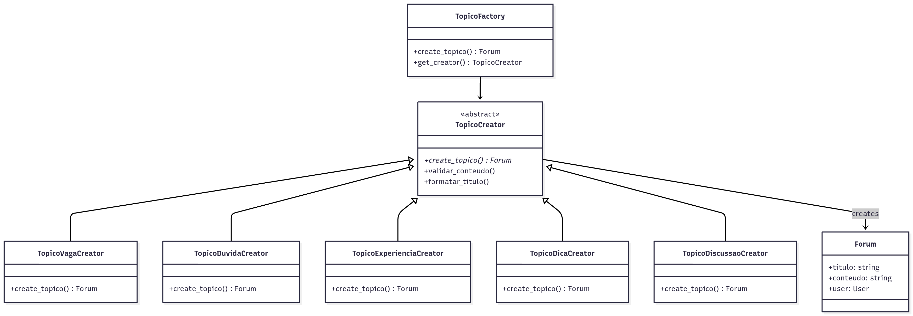

# 3.1. Factory Method - Fórum de Tópicos

## 1. Introdução

O padrão _Factory Method_ é um dos padrões de projeto criacionais propostos pela _Gang of Four_ (GoF). Seu principal objetivo é delegar a responsabilidade de criação de objetos às subclasses, promovendo baixo acoplamento e maior flexibilidade na arquitetura do sistema.

Conforme destacado por LARMAN (2007), o _Factory Method_ pode ser compreendido como um caso particular do _Template Method_, no qual a operação primitiva é responsável pela criação de instâncias de classes concretas. Essa abordagem é amplamente utilizada no desenvolvimento de _frameworks_, pois permite que superclasses definam métodos de criação e deixem que as subclasses concretas determinem qual tipo específico de objeto será instanciado. Tal característica reforça a extensibilidade e a reutilização de código, princípios centrais da engenharia de software orientada a objetos.

## 2. Metodologia

Neste projeto, o padrão _Factory Method_ foi implementado com o objetivo de gerenciar o processo de criação de diferentes tipos de tópicos no fórum da plataforma Dicas de Estágio. O sistema suporta cinco tipos distintos de tópicos: **Vagas**, **Dúvidas**, **Experiências**, **Dicas** e **Discussões**. Todos compartilham os atributos básicos definidos no modelo `Forum`, porém são instanciados de forma especializada por meio de fábricas específicas (`TopicoVagaCreator`, `TopicoDuvidaCreator`, `TopicoExperienciaCreator`, `TopicoDicaCreator` e `TopicoDiscussaoCreator`).

A aplicação do padrão foi conduzida a partir do estudo teórico do conceito e da análise das necessidades de criação de diferentes tipos de conteúdo no fórum. A partir disso, foi elaborada uma estrutura que permite a criação padronizada e extensível de tópicos com características específicas para cada tipo.

Após a definição da arquitetura, a implementação foi realizada em três etapas:

1. Definição das classes abstratas e fábricas concretas em `backend/Forum/factories/topico_factory.py`;
2. Integração com o modelo existente `Forum` em `backend/Forum/models.py`;
3. Criação de testes automatizados para validação das regras e consistência do padrão em `backend/Forum/tests.py`.

## 3. Participantes

Os participantes da implementação deste Padrão de Projeto estão descritos na tabela abaixo:

<p style="text-align: center;">Tabela 1: Participantes da implementação do Factory Method</p>

| Nome do Integrante | Artefato | Link Comprobatório |
|---|---|---|
| Daniel Ferreira Nunes | Factory Method | [PR #3](https://github.com/UnBArqDsw2025-2-Turma02/2025.2-T02_G5_DicasDeEstagio_Entrega03/pull/3) |
| Paulo Cerqueira | Factory Method | [PR #3](https://github.com/UnBArqDsw2025-2-Turma02/2025.2-T02_G5_DicasDeEstagio_Entrega03/pull/3) |
| Eduardo Ferreira de Aquino | Factory Method | [PR #3](https://github.com/UnBArqDsw2025-2-Turma02/2025.2-T02_G5_DicasDeEstagio_Entrega03/pull/3) |

## 4. Aplicação do _Factory Method_

### 4.1. Modelagem UML

<p style="text-align: center;">Figura 1: Diagrama de Classes do Factory Method para Tópicos do Fórum</p>



<p style="text-align: center;">Fonte: Elaboração própria</p>

A estrutura implementada demonstra a relação entre as classes, destacando a dependência das subclasses criadoras (`TopicoVagaCreator`, `TopicoDuvidaCreator`, `TopicoExperienciaCreator`, `TopicoDicaCreator`, `TopicoDiscussaoCreator`) em relação à superclasse abstrata `TopicoCreator`, bem como a associação entre os criadores e o produto concreto (`Forum`).

### 4.2. Implementação

A estrutura implementada pode ser resumida da seguinte forma:

```python
class TopicoCreator(ABC):
    @abstractmethod
    def create_topico(self, user, titulo, conteudo, **kwargs):
        pass

    def validar_conteudo(self, titulo, conteudo):
        # Validação comum para todos os tipos
        pass

    def formatar_titulo(self, titulo, prefixo):
        # Formatação padrão de títulos
        pass
```

A classe `TopicoCreator` define a interface do método-fábrica (`create_topico`), que será obrigatoriamente sobrescrito nas subclasses concretas. Cada criador é responsável por instanciar um tipo específico de tópico com suas características particulares:

```python
class TopicoVagaCreator(TopicoCreator):
    def create_topico(self, user, titulo, conteudo, salario=None, requisitos=None, 
                     empresa=None, tipo_vaga="Estágio", **kwargs):
        # Criação específica para tópicos de vaga
        return Forum.objects.create(...)
```

```python
class TopicoDuvidaCreator(TopicoCreator):
    def create_topico(self, user, titulo, conteudo, categoria="Geral", 
                     urgencia="Normal", tags=None, **kwargs):
        # Criação específica para tópicos de dúvida
        return Forum.objects.create(...)
```

Através dessa estrutura, o código cliente não precisa conhecer diretamente as classes específicas de cada tipo de tópico. Ele apenas interage com a factory apropriada:

```python
topico_factory = TopicoFactory()
vaga = topico_factory.create_topico('vaga', user, titulo, conteudo, ...)
```

Dessa forma, a instanciação é encapsulada dentro das fábricas concretas, permitindo a expansão do sistema para novos tipos de tópicos sem alterar o código existente.

### 4.3. Integração com o Sistema

A integração do padrão _Factory Method_ com o sistema existente foi realizada através da criação de uma camada de abstração que permite ao código cliente criar diferentes tipos de tópicos sem conhecer os detalhes de implementação específicos de cada tipo.

O sistema utiliza a classe `TopicoFactory` como ponto de entrada único, que internamente delega a criação para as fábricas específicas. Isso garante que novas funcionalidades possam ser adicionadas facilmente, respeitando o princípio Aberto/Fechado (OCP) do SOLID.

### 4.4. Códigos na Íntegra

A seguir, estão apresentados os códigos que implementam as classes relacionadas ao _Factory Method_ para tópicos do fórum.

*`Forum/factories/topico_factory.py`*

<details>
    <summary>Clique aqui para ver o código inteiro</summary>

```python
from abc import ABC, abstractmethod
from django.utils import timezone
from ..models import Forum

class TopicoCreator(ABC):

    @abstractmethod
    def create_topico(self, user, titulo, conteudo, **kwargs):
        pass

    def validar_conteudo(self, titulo, conteudo):
        if not titulo or len(titulo.strip()) < 5:
            raise ValueError("Título deve ter pelo menos 5 caracteres")

        if not conteudo or len(conteudo.strip()) < 10:
            raise ValueError("Conteúdo deve ter pelo menos 10 caracteres")

        return True

    def formatar_titulo(self, titulo, prefixo):
        titulo_limpo = titulo.strip()
        if not titulo_limpo.startswith(f"[{prefixo}]"):
            return f"[{prefixo}] {titulo_limpo}"
        return titulo_limpo


class TopicoVagaCreator(TopicoCreator):
    def create_topico(self, user, titulo, conteudo, salario=None, requisitos=None, 
                     empresa=None, tipo_vaga="Estágio", **kwargs):
        self.validar_conteudo(titulo, conteudo)

        titulo_formatado = self.formatar_titulo(titulo, f"VAGA - {tipo_vaga.upper()}")

        conteudo_enriquecido = conteudo

        if empresa:
            conteudo_enriquecido += f"\n\n**Empresa:** {empresa}"

        if salario:
            conteudo_enriquecido += f"\n**Salário:** {salario}"

        if requisitos:
            conteudo_enriquecido += f"\n**Requisitos:** {requisitos}"

        conteudo_enriquecido += f"\n\n**Tipo de Vaga:** {tipo_vaga}"
        conteudo_enriquecido += f"\n**Publicado em:** {timezone.now().strftime('%d/%m/%Y às %H:%M')}"

        topico = Forum.objects.create(
            user=user,
            titulo=titulo_formatado,
            conteudo=conteudo_enriquecido,
            visualizacoes=0,
            is_active=True
        )

        return topico


class TopicoDuvidaCreator(TopicoCreator):
    def create_topico(self, user, titulo, conteudo, categoria="Geral", 
                     urgencia="Normal", tags=None, **kwargs):
        self.validar_conteudo(titulo, conteudo)

        titulo_formatado = self.formatar_titulo(titulo, f"DÚVIDA - {categoria.upper()}")

        conteudo_enriquecido = conteudo
        conteudo_enriquecido += f"\n\n**Categoria:** {categoria}"
        conteudo_enriquecido += f"\n**Urgência:** {urgencia}"

        if tags:
            tags_str = ", ".join(tags) if isinstance(tags, list) else tags
            conteudo_enriquecido += f"\n**Tags:** {tags_str}"

        if urgencia.lower() == "alta":
            conteudo_enriquecido += f"\n\n**URGENTE:** Preciso de ajuda rapidamente!"

        conteudo_enriquecido += f"\n\n**Pergunta feita em:** {timezone.now().strftime('%d/%m/%Y às %H:%M')}"
        conteudo_enriquecido += f"\n**Aguardando respostas da comunidade...**"

        topico = Forum.objects.create(
            user=user,
            titulo=titulo_formatado,
            conteudo=conteudo_enriquecido,
            visualizacoes=0,
            is_active=True
        )

        return topico

class TopicoFactory:

    _creators = {
        'vaga': TopicoVagaCreator(),
        'duvida': TopicoDuvidaCreator(),
        'experiencia': TopicoExperienciaCreator(),
        'dica': TopicoDicaCreator(),
        'discussao': TopicoDiscussaoCreator(),
    }

    @classmethod
    def get_creator(cls, tipo_topico):
        creator = cls._creators.get(tipo_topico.lower())
        if not creator:
            raise ValueError(f"Tipo de tópico '{tipo_topico}' não suportado. "
                           f"Tipos disponíveis: {list(cls._creators.keys())}")
        return creator

    @classmethod
    def create_topico(cls, tipo_topico, user, titulo, conteudo, **kwargs):
        creator = cls.get_creator(tipo_topico)
        return creator.create_topico(user, titulo, conteudo, **kwargs)

    @classmethod
    def get_tipos_disponiveis(cls):
        return {
            'vaga': {
                'nome': 'Vaga de Estágio/Emprego',
                'descricao': 'Para publicar oportunidades de estágio ou emprego',
                'campos_extras': ['salario', 'requisitos', 'empresa', 'tipo_vaga'],
                'exemplo': 'Vaga para desenvolvedor Python júnior'
            },
            'duvida': {
                'nome': 'Dúvida sobre Estágios',
                'descricao': 'Para fazer perguntas sobre estágios e carreira',
                'campos_extras': ['categoria', 'urgencia', 'tags'],
                'exemplo': 'Como me preparar para entrevista técnica?'
            },
            'experiencia': {
                'nome': 'Compartilhar Experiência',
                'descricao': 'Para compartilhar experiências de estágio',
                'campos_extras': ['empresa', 'periodo', 'area', 'nota_experiencia'],
                'exemplo': 'Minha experiência como estagiário na empresa X'
            },
            'dica': {
                'nome': 'Dica de Carreira',
                'descricao': 'Para compartilhar dicas úteis sobre carreira',
                'campos_extras': ['categoria_dica', 'nivel', 'aplicabilidade'],
                'exemplo': 'Como criar um LinkedIn profissional'
            },
            'discussao': {
                'nome': 'Discussão Geral',
                'descricao': 'Para iniciar discussões sobre temas diversos',
                'campos_extras': ['tema', 'tipo_discussao'],
                'exemplo': 'O que vocês acham do home office para estagiários?'
            }
        }
```
</details>

## 5. Testes e Validação

### 5.1. Passo-a-passo de execução dos testes

**Navegar para o diretório do projeto**

```bash
cd backend
```

**Ativar o ambiente virtual (se necessário)**

```bash
source ../.venv/bin/activate
```

**Executar os testes do Factory Method**

```bash
python manage.py test Forum.tests.TopicoFactoryTestCase -v 2
```

**Executar comando de demonstração**

```bash
python manage.py test_topico_factory --criar-exemplos
```

Ao executar os testes, o Django cria um banco de dados temporário e verifica se as fábricas e validações funcionam conforme o esperado, garantindo que o padrão _Factory Method_ foi corretamente aplicado para os tópicos do fórum.

### 5.2. Resultados Esperados

Os testes validam os seguintes aspectos:

- **Criação correta de diferentes tipos de tópicos**: Verifica se cada factory cria o tipo correto de tópico com os atributos específicos
- **Validação de entrada**: Testa se as validações de título e conteúdo funcionam adequadamente
- **Formatação de títulos**: Confirma se os prefixos são aplicados corretamente
- **Integridade dos dados**: Garante que os tópicos são salvos no banco com todas as informações necessárias
- **Extensibilidade**: Verifica se novos tipos de tópicos podem ser adicionados sem quebrar funcionalidades existentes

## 6. Conclusão

A implementação do padrão _Factory Method_ para o sistema de tópicos do fórum garantiu uma estrutura organizacional robusta e extensível para a plataforma Dicas de Estágio. O padrão possibilitou a criação padronizada de diferentes tipos de conteúdo, cada um com suas características específicas, mantendo a consistência e facilitando futuras expansões.

A aplicação do padrão foi acompanhada de implementação completa em Python/Django, integração com API REST, testes automatizados abrangentes e documentação detalhada, assegurando sua correta funcionalidade e aderência aos princípios da engenharia de software orientada a objetos.

O sistema resultante oferece uma base sólida para o crescimento do fórum, permitindo a adição de novos tipos de tópicos de forma organizada e mantendo a qualidade e consistência do conteúdo publicado.
