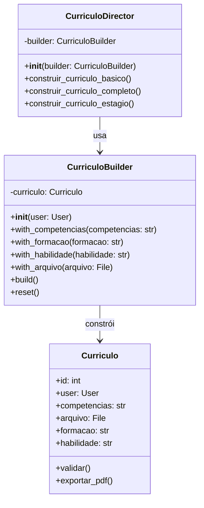

# Padrão Builder - Currículo

## 1. Introdução

Este documento descreve a implementação do padrão de projeto **Builder** (Construtor) para a construção de objetos Currículo no sistema DicasDeEstagio. O Builder é um padrão criacional que permite construir objetos complexos passo a passo, especialmente útil quando o objeto possui muitos atributos opcionais.

## 2. Objetivo

O padrão Builder foi escolhido para o Currículo devido à:

- **Complexidade**: Currículos possuem múltiplos campos opcionais (formação, habilidades, competências, etc.)


- **Flexibilidade**: Permite criar currículos com diferentes combinações de informações

- **Legibilidade**: Interface fluente torna o código mais legível e expressivo

## 3. Estrutura do Padrão

### 3.1 Diagrama de Classes


<details>
  <summary>Diagrama</summary>



</details>


## 4. Implementação em Django

### 4.1 Modelo Currículo (models.py)


<details>
  <summary>Código</summary>


```python
from django.db import models
from users.models import User

class Curriculo(models.Model):
    competencias = models.TextField()
    arquivo = models.FileField(upload_to='curriculos/')
    formacao = models.TextField()
    habilidade = models.TextField()
    user = models.ForeignKey('users.User', on_delete=models.CASCADE)

    def __str__(self):
        return f'Currículo de {self.user.email}'
```

</details>


### 4.2 Builder (builders.py)


<details>
  <summary>Código</summary>

```python
from typing import Optional
from django.core.files.uploadedfile import UploadedFile
from django.core.exceptions import ValidationError
from .models import Curriculo

class CurriculoBuilder:
    """
    Builder para construção de objetos Currículo.
    Permite construir currículos de forma incremental e fluente.
    """
    
    def __init__(self, user):
        """
        Inicializa o builder com o usuário obrigatório.
        
        Args:
            user: Usuário dono do currículo
        """
        self.user = user
        self._curriculo = None
        self.reset()
    
    def reset(self):
        """Reinicia o builder com um novo currículo vazio"""
        self._curriculo = Curriculo(user=self.user)
        return self
    
    def with_competencias(self, competencias: str):
        """
        Adiciona competências ao currículo.
        
        Args:
            competencias: String com as competências
            
        Returns:
            self: Para permitir encadeamento de métodos
        """
        self._curriculo.competencias = competencias
        return self
    
    def with_formacao(self, formacao: str):
        """
        Adiciona formação acadêmica ao currículo.
        
        Args:
            formacao: String com a formação
            
        Returns:
            self: Para permitir encadeamento de métodos
        """
        self._curriculo.formacao = formacao
        return self
    
    def with_habilidade(self, habilidade: str):
        """
        Adiciona habilidades ao currículo.
        
        Args:
            habilidade: String com as habilidades
            
        Returns:
            self: Para permitir encadeamento de métodos
        """
        self._curriculo.habilidade = habilidade
        return self
    
    def with_arquivo(self, arquivo: UploadedFile):
        """
        Adiciona arquivo PDF/DOC ao currículo.
        
        Args:
            arquivo: Arquivo enviado pelo usuário
            
        Returns:
            self: Para permitir encadeamento de métodos
        """
        self._curriculo.arquivo = arquivo
        return self
    
    def _validar(self):
        """Valida os dados do currículo antes de salvar"""
        if not self._curriculo.competencias:
            raise ValidationError("Competências é obrigatório")
        if not self._curriculo.formacao:
            raise ValidationError("Formação é obrigatório")
        if not self._curriculo.habilidade:
            raise ValidationError("Habilidade é obrigatório")
        if not self._curriculo.arquivo:
            raise ValidationError("Arquivo é obrigatório")
    
    def build(self) -> Curriculo:
        """
        Constrói e retorna o objeto Currículo final.
        
        Returns:
            Curriculo: Objeto currículo construído
            
        Raises:
            ValidationError: Se os dados forem inválidos
        """
        self._validar()
        curriculo = self._curriculo
        curriculo.save()
        self.reset()
        return curriculo
    
    def build_without_save(self) -> Curriculo:
        """
        Constrói o objeto sem salvar no banco.
        Útil para testes ou pré-visualização.
        
        Returns:
            Curriculo: Objeto currículo não salvo
        """
        self._validar()
        curriculo = self._curriculo
        self.reset()
        return curriculo
        
class CurriculoDirector:
    """
    Director que orquestra a construção de diferentes tipos de currículos.
    Encapsula a lógica de construção de currículos pré-definidos.
    """
    
    def __init__(self, builder: CurriculoBuilder):
        """
        Inicializa o director com um builder.
        
        Args:
            builder: Builder a ser usado na construção
        """
        self._builder = builder
    
    @property
    def builder(self) -> CurriculoBuilder:
        """Retorna o builder atual"""
        return self._builder
    
    @builder.setter
    def builder(self, builder: CurriculoBuilder):
        """Define um novo builder"""
        self._builder = builder
    
    def construir_curriculo_basico(self, arquivo: UploadedFile) -> Curriculo:
        """
        Constrói um currículo básico com informações mínimas.
        
        Args:
            arquivo: Arquivo do currículo (obrigatório)
            
        Returns:
            Curriculo: Currículo básico construído
        """
        return (self._builder
                .with_formacao("Formação a ser preenchida")
                .with_habilidade("Habilidades a serem preenchidas")
                .with_competencias("Competências a serem preenchidas")
                .with_arquivo(arquivo)
                .build())
    
    def construir_curriculo_completo(
        self,
        competencias: str,
        formacao: str,
        habilidade: str,
        arquivo: UploadedFile
    ) -> Curriculo:
        """
        Constrói um currículo completo com todas as informações.
        
        Args:
            competencias: Competências do candidato
            formacao: Formação acadêmica
            habilidade: Habilidades técnicas e comportamentais
            arquivo: Arquivo do currículo
            
        Returns:
            Curriculo: Currículo completo construído
        """
        return (self._builder
                .with_competencias(competencias)
                .with_formacao(formacao)
                .with_habilidade(habilidade)
                .with_arquivo(arquivo)
                .build())
    
    def construir_curriculo_estagio(
        self,
        formacao: str,
        habilidade: str,
        arquivo: UploadedFile
    ) -> Curriculo:
        """
        Constrói um currículo específico para candidatos a estágio.
        Foca em formação e habilidades.
        
        Args:
            formacao: Formação acadêmica em andamento
            habilidade: Habilidades relevantes para estágio
            arquivo: Arquivo do currículo
            
        Returns:
            Curriculo: Currículo para estágio construído
        """
        competencias_estagio = (
            "Proatividade, Vontade de aprender, "
            "Trabalho em equipe, Comunicação"
        )
        
        return (self._builder
                .with_competencias(competencias_estagio)
                .with_formacao(formacao)
                .with_habilidade(habilidade)
                .with_arquivo(arquivo)
                .build())
```

</details>


### 4.3 Serializers (serializers.py)


<details>
  <summary>Código</summary>

```python
from rest_framework import serializers
from .models import Curriculo
from .builders import CurriculoBuilder, CurriculoDirector

class CurriculoSerializer(serializers.ModelSerializer):
    """Serializer padrão para Currículo"""
    
    class Meta:
        model = Curriculo
        fields = ['id', 'user', 'competencias', 'arquivo', 'formacao', 'habilidade']

class CurriculoBuilderSerializer(serializers.Serializer):
    """
    Serializer que usa o Builder Pattern para criar currículos.
    """
    competencias = serializers.CharField(required=True)
    formacao = serializers.CharField(required=True)
    habilidade = serializers.CharField(required=True)
    arquivo = serializers.FileField(required=True)
    tipo_curriculo = serializers.ChoiceField(
        choices=['basico', 'completo', 'estagio'],
        default='completo',
        required=False
    )
    
    def create(self, validated_data):
        """
        Cria um currículo usando o Builder Pattern.
        """
        user = self.context['request'].user
        tipo = validated_data.pop('tipo_curriculo', 'completo')
        arquivo = validated_data['arquivo']
        
        builder = CurriculoBuilder(user)
        director = CurriculoDirector(builder)
        
        if tipo == 'basico':
            curriculo = director.construir_curriculo_basico(arquivo=arquivo)
        elif tipo == 'estagio':
            curriculo = director.construir_curriculo_estagio(
                formacao=validated_data['formacao'],
                habilidade=validated_data['habilidade'],
                arquivo=arquivo
            )
        else:  # completo
            curriculo = director.construir_curriculo_completo(
                competencias=validated_data['competencias'],
                formacao=validated_data['formacao'],
                habilidade=validated_data['habilidade'],
                arquivo=arquivo
            )
        
        return curriculo
    
    def to_representation(self, instance):
        """Usa o serializer padrão para representação"""
        return CurriculoSerializer(instance).data
```

</details>


### 4.4 Views (views.py)


<details>
  <summary>Código</summary>

```python
from rest_framework import viewsets, status
from rest_framework.decorators import action
from rest_framework.response import Response
from rest_framework.permissions import IsAuthenticated
from .models import Curriculo
from .serializers import CurriculoSerializer, CurriculoBuilderSerializer
from .builders import CurriculoBuilder, CurriculoDirector

class CurriculoViewSet(viewsets.ModelViewSet):
    """
    ViewSet para gerenciar currículos.
    Implementa o padrão Builder para criação.
    """
    queryset = Curriculo.objects.all()
    serializer_class = CurriculoSerializer
    permission_classes = [IsAuthenticated]
    
    def get_queryset(self):
        """Retorna apenas currículos do usuário logado"""
        return Curriculo.objects.filter(user=self.request.user)
    
    def get_serializer_class(self):
        """Usa BuilderSerializer na criação"""
        if self.action == 'create':
            return CurriculoBuilderSerializer
        return CurriculoSerializer
    
    def perform_create(self, serializer):
        """Criação usando Builder já está no serializer"""
        serializer.save()
    
    @action(detail=False, methods=['post'], url_path='criar-rapido')
    def criar_curriculo_rapido(self, request):
        """
        Endpoint para criar currículo básico rapidamente.
        
        POST /api/curriculos/criar-rapido/
        Body: {"arquivo": <file>}
        """
        arquivo = request.FILES.get('arquivo')
        
        if not arquivo:
            return Response(
                {'error': 'Arquivo é obrigatório'},
                status=status.HTTP_400_BAD_REQUEST
            )
        
        builder = CurriculoBuilder(request.user)
        director = CurriculoDirector(builder)
        
        try:
            curriculo = director.construir_curriculo_basico(arquivo=arquivo)
            serializer = CurriculoSerializer(curriculo)
            return Response(serializer.data, status=status.HTTP_201_CREATED)
        except Exception as e:
            return Response(
                {'error': str(e)},
                status=status.HTTP_400_BAD_REQUEST
            )
    
    @action(detail=False, methods=['post'], url_path='criar-estagio')
    def criar_curriculo_estagio(self, request):
        """
        Endpoint para criar currículo otimizado para estágio.
        
        POST /api/curriculos/criar-estagio/
        Body: {
            "formacao": "...",
            "habilidade": "...",
            "arquivo": <file>
        }
        """
        formacao = request.data.get('formacao')
        habilidade = request.data.get('habilidade')
        arquivo = request.FILES.get('arquivo')
        
        if not all([formacao, habilidade, arquivo]):
            return Response(
                {'error': 'Formação, habilidade e arquivo são obrigatórios'},
                status=status.HTTP_400_BAD_REQUEST
            )
        
        builder = CurriculoBuilder(request.user)
        director = CurriculoDirector(builder)
        
        try:
            curriculo = director.construir_curriculo_estagio(
                formacao=formacao,
                habilidade=habilidade,
                arquivo=arquivo
            )
            serializer = CurriculoSerializer(curriculo)
            return Response(serializer.data, status=status.HTTP_201_CREATED)
        except Exception as e:
            return Response(
                {'error': str(e)},
                status=status.HTTP_400_BAD_REQUEST
            )
```

</details>


## 5. Exemplo de Uso

### 5.1 Uso Direto do Builder


<details>
  <summary>Código</summary>

```python
from .builders import CurriculoBuilder

# Criar currículo passo a passo
builder = CurriculoBuilder(user=request.user)
curriculo = (builder
    .with_formacao("Engenharia de Software - UnB")
    .with_habilidade("Python, Django, React")
    .with_competencias("Trabalho em equipe, Comunicação")
    .build())
```


</details>

### 5.2 Uso com Director


<details>
  <summary>Código</summary>

```python
from .builders import CurriculoBuilder, CurriculoDirector

builder = CurriculoBuilder(user=request.user)
director = CurriculoDirector(builder)

# Currículo completo
curriculo = director.construir_curriculo_completo(
    competencias="Proatividade, Liderança",
    formacao="Engenharia de Software - UnB",
    habilidade="Python, Django, JavaScript",
    arquivo=arquivo_upload
)
```

</details>

### 5.3 Requisições API

<details>
  <summary>Código</summary>

```bash
# Criar currículo completo
POST /api/curriculos/
Content-Type: application/json

{
    "tipo_curriculo": "completo",
    "competencias": "Trabalho em equipe, Comunicação",
    "formacao": "Engenharia de Software - UnB",
    "habilidade": "Python, Django, React, Git",
    "arquivo": "<file>"
}

# Criar currículo rápido
POST /api/curriculos/criar-rapido/

# Criar currículo para estágio
POST /api/curriculos/criar-estagio/
{
    "formacao": "Engenharia de Software - 5º semestre",
    "habilidade": "Python, Java, Git, Scrum"
}
```

</details>


## 6. Vantagens da Implementação

-  **Flexibilidade**: Fácil adicionar novos campos ao currículo
-  **Legibilidade**: Interface fluente torna o código autoexplicativo
-  **Reusabilidade**: Director permite criar templates de currículos
-  **Testabilidade**: Fácil testar diferentes combinações
-  **Validação**: Validação centralizada no método build()

## 7. Testes

<details>
  <summary>Código</summary>

```python
from django.test import TestCase
from django.contrib.auth import get_user_model
from django.core.files.uploadedfile import SimpleUploadedFile
from .builders import CurriculoBuilder, CurriculoDirector

User = get_user_model()

class CurriculoBuilderTestCase(TestCase):
    
    def setUp(self):
        self.user = User.objects.create_user(
            email='teste@example.com',
            name='Teste User',
            password='senha123'
        )
        self.arquivo = SimpleUploadedFile(
            "test.pdf", 
            b"file_content", 
            content_type="application/pdf"
        )
    
    def test_construir_curriculo_completo(self):
        """Testa construção de currículo completo"""
        builder = CurriculoBuilder(self.user)
        curriculo = (builder
            .with_competencias("Competência 1")
            .with_formacao("Formação 1")
            .with_habilidade("Habilidade 1")
            .with_arquivo(self.arquivo)
            .build())
        
        self.assertIsNotNone(curriculo.id)
        self.assertEqual(curriculo.user, self.user)
        self.assertEqual(curriculo.competencias, "Competência 1")
        self.assertEqual(curriculo.formacao, "Formação 1")
        self.assertEqual(curriculo.habilidade, "Habilidade 1")
    
    def test_director_curriculo_basico(self):
        """Testa criação via director"""
        builder = CurriculoBuilder(self.user)
        director = CurriculoDirector(builder)
        
        curriculo = director.construir_curriculo_basico(arquivo=self.arquivo)
        self.assertIsNotNone(curriculo.id)
        self.assertEqual(curriculo.user, self.user)
    
    def test_validacao_campos_obrigatorios(self):
        """Testa que campos obrigatórios devem ser preenchidos"""
        builder = CurriculoBuilder(self.user)
        
        # Testa sem competencias
        with self.assertRaises(Exception):
            (builder
             .with_formacao("Formação 1")
             .with_habilidade("Habilidade 1")
             .with_arquivo(self.arquivo)
             .build())
        
        # Testa sem arquivo
        with self.assertRaises(Exception):
            (builder
             .with_competencias("Competência 1")
             .with_formacao("Formação 1")
             .with_habilidade("Habilidade 1")
             .build())
    
    def test_build_without_save(self):
        """Testa construção sem salvar no banco"""
        builder = CurriculoBuilder(self.user)
        curriculo = (builder
            .with_competencias("Competência 1")
            .with_formacao("Formação 1")
            .with_habilidade("Habilidade 1")
            .with_arquivo(self.arquivo)
            .build_without_save())
        
        self.assertIsNone(curriculo.id)
        self.assertEqual(curriculo.competencias, "Competência 1")
```

</details>

## 8. Referências

- Gamma, E. et al. (1994). Design Patterns: Elements of Reusable Object-Oriented Software
- Django Documentation: https://docs.djangoproject.com/
- Django REST Framework: https://www.django-rest-framework.org/

---

## Histórico de Versões

| Versão  | Data       | Descrição | Autor(es) | Revisor(es) |
|:-------:|:----------:|:----------|:----------|:------------|
| 1.0     | 24/10/2025 | Criação do documento | [Breno Alexandre](https://github.com/brenoalexandre0), [Víctor Moreira](https://github.com/aqela-batata-alt), [Felipe Nunes](https://github.com/FelipeNunesdM)| |
