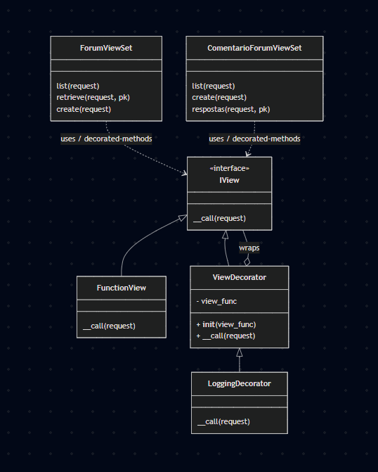

# Módulo: Padrões de Projeto GoFs Estruturais — Decorator

## 1\. Introdução ao Decorator (Padrão Estrutural)

O padrão Decorator é um padrão de projeto estrutural que, conforme definido por Gamma et al. (1995), permite *"anexar responsabilidades adicionais a um objeto dinamicamente. Os Decorators fornecem uma alternativa flexível à herança para estender funcionalidades."*

No contexto de aplicações web (Django/DRF), decorators são ideais para cross-cutting concerns (preocupações transversais) como logging, caching, autenticação/validação ou medição de performance. A implementação deste módulo foca no LoggingDecorator — uma implementação concreta que registra informações sobre requisições HTTP.

-----

## 2\. Diagrama de Implementação

*Interpretação (resumida e direta):*

- Diagrama de classes (papéis):
    - FunctionView — o callable original da view (implementa __call__(request)).
    - ViewDecorator — classe base que envolve um view_func (atributo _view_func) e delega a execução.
    - LoggingDecorator — concrete decorator que estende ViewDecorator e adiciona comportamento de logging antes e depois da execução.

- Diagrama de sequência (fluxo de execução):
    1. Cliente faz a requisição; o resolvedor de URL escolhe a view decorada.
    2. A requisição entra no LoggingDecorator que registra entrada (method, path, user).
    3. O LoggingDecorator chama _view_func(request, ...) — a view executa sua lógica e acessa o banco, se necessário.
    4. A view retorna um response para o decorator.
    5. O LoggingDecorator registra status e tempo de execução e devolve a resposta ao cliente.
    6. Em caso de exceção, o decorator registra o erro e re-lança a exceção.

Observação: os ViewSets do projeto (por exemplo ForumViewSet, ComentarioForumViewSet) usam métodos decorados (list, retrieve, create), o que permite aplicar o LoggingDecorator apenas onde desejado, sem alterar a lógica interna da view.

-----

## 3\. Estratégias Concretas (ConcreteComponent e ConcreteDecorators)

No repositório, a modelagem segue as convenções abaixo:

  - *Component* (conceitual): qualquer função ou callable que receba um request e retorne uma HttpResponse.

      - No projeto, os ViewSets do Django REST Framework atuam como ConcreteComponents quando recebem o decorator em seus métodos (ex.: list, retrieve).

  - *ConcreteComponent* (exemplos no projeto):

      - ForumViewSet.list — retorna a lista de tópicos.
      - ForumViewSet.retrieve — retorna os detalhes de um tópico.
      - ComentarioForumViewSet.create — cria um novo comentário.

  - *Decorator* (base): ViewDecorator (arquivo backend/core/decorators.py)

      - Mantém a referência a view_func e invoca view_func(request, *args, **kwargs).

  - *ConcreteDecorator* (implementado): LoggingDecorator

      - Antes de chamar a view_func, registra o método HTTP, o caminho da URL e o usuário.
      - Após a execução, registra o status code e o tempo de execução.
      - Em caso de exceção, registra o erro e o relança.

Exemplo de uso em código (trecho):

python
from core.decorators import log_request

class ForumViewSet(viewsets.ModelViewSet):
    @log_request
    def list(self, request, *args, **kwargs):
        return super().list(request, *args, **kwargs)

-----

## 4\. Metodologia

Abordagem para a implementação e para a apresentação:

1.  *Modelagem*

      - Criar diagramas UML (classe e sequência) que evidenciam a estrutura e o fluxo de execução.
      - Identificar os papéis de Component, Decorator e ConcreteDecorators.

2.  *Implementação*

      - Implementar ViewDecorator e LoggingDecorator em backend/core/decorators.py.
      - Fornecer log_request como um wrapper para uso simplificado via @log_request.
      - Escrever testes unitários para cobrir os casos de uso: execução bem-sucedida, usuário anônimo, métodos HTTP variados e tratamento de exceções.

3.  *Validação*

      - Executar o comando python manage.py test core.tests_decorators (8 testes) e garantir que todos passem.
      - Verificar os logs gerados ao executar o servidor e realizar requisições manuais com o navegador ou curl.

-----

## 5. Vídeo de apresentação

<iframe width="640" height="360" src="https://www.youtube.com/embed/VPRuDv5MTB8" title="Gofs Estruturais" frameborder="0" allow="accelerometer; autoplay; clipboard-write; encrypted-media; gyroscope; picture-in-picture; web-share" referrerpolicy="strict-origin-when-cross-origin" allowfullscreen></iframe>

## 6\. Referências

  - Gamma, E., Helm, R., Johnson, R., & Vlissides, J. (1995). Design Patterns: Elements of Reusable Object-Oriented Software. Addison-Wesley.
  - PlantUML — [https://plantuml.com](https://plantuml.com)
  - Django Docs — [https://docs.djangoproject.com](https://docs.djangoproject.com)

-----

## Tabela de Participação na Produção do Artefato

Tabela 1: Participantes da implementação do Factory Method

| Nome do Integrante | Artefato | Link Comprobatório |
|---|---|---|
| Daniel Ferreira Nunes | Decorator | [commit](https://github.com/UnBArqDsw2025-2-Turma02/2025.2-T02_G5_DicasDeEstagio_Entrega03/commit/8b8380f488a0ea6d51c404936ab46af3e50e876e) [commit](https://github.com/UnBArqDsw2025-2-Turma02/2025.2-T02_G5_DicasDeEstagio_Entrega03/commit/6d75ec0860b96519b079b95e48193241c3eea41d) [PR #7](https://github.com/UnBArqDsw2025-2-Turma02/2025.2-T02_G5_DicasDeEstagio_Entrega03/pull/7) |
| Paulo Cerqueira | Decorator | [commit](https://github.com/UnBArqDsw2025-2-Turma02/2025.2-T02_G5_DicasDeEstagio_Entrega03/commit/8b8380f488a0ea6d51c404936ab46af3e50e876e) [commit](https://github.com/UnBArqDsw2025-2-Turma02/2025.2-T02_G5_DicasDeEstagio_Entrega03/commit/6d75ec0860b96519b079b95e48193241c3eea41d) [PR #7](https://github.com/UnBArqDsw2025-2-Turma02/2025.2-T02_G5_DicasDeEstagio_Entrega03/pull/7) |
| Eduardo Ferreira de Aquino | Decorator | [commit](https://github.com/UnBArqDsw2025-2-Turma02/2025.2-T02_G5_DicasDeEstagio_Entrega03/commit/8b8380f488a0ea6d51c404936ab46af3e50e876e) [commit](https://github.com/UnBArqDsw2025-2-Turma02/2025.2-T02_G5_DicasDeEstagio_Entrega03/commit/6d75ec0860b96519b079b95e48193241c3eea41d) [PR #7](https://github.com/UnBArqDsw2025-2-Turma02/2025.2-T02_G5_DicasDeEstagio_Entrega03/pull/7) |