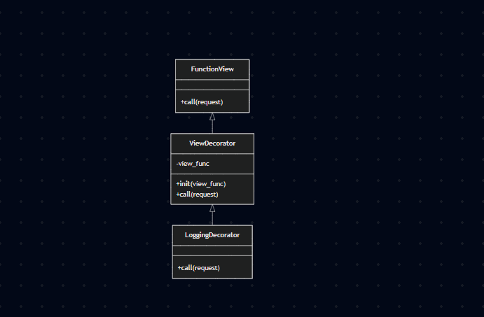

Com certeza\! Aqui está o texto completo em Markdown, com a citação e a referência devidamente integradas.

-----

# Módulo: Padrões de Projeto GoFs Estruturais — Decorator

## 1\. Introdução ao Decorator (Padrão Estrutural)

O padrão Decorator é um padrão de projeto estrutural que, conforme definido por Gamma et al. (1995), permite **"anexar responsabilidades adicionais a um objeto dinamicamente. Os Decorators fornecem uma alternativa flexível à herança para estender funcionalidades."**

No contexto de aplicações web (Django/DRF), decorators são ideais para *cross-cutting concerns* (preocupações transversais) como logging, caching, autenticação/validação ou medição de performance. A implementação deste módulo foca no `LoggingDecorator` — uma implementação concreta que registra informações sobre requisições HTTP.

-----

## 2\. Diagrama de Implementação

**Interpretação:**

  - O diagrama de classes mostra a relação estrutural:

      - `FunctionView` (Component) é o *callable* original da view.
      - `ViewDecorator` (Decorator) mantém referência a `view_func` e delega a execução.
      - `LoggingDecorator` (ConcreteDecorator) estende `ViewDecorator` e adiciona a funcionalidade de logging.

  - O diagrama de sequência mostra o fluxo em tempo de execução:

      - Cliente → Resolvedor de URL → `LoggingDecorator` → View → Banco de dados → View → `LoggingDecorator` → Cliente
      - O `LoggingDecorator` registra a entrada, delega a execução para a view e, ao final, registra a saída ou um possível erro.

-----

## 3\. Estratégias Concretas (ConcreteComponent e ConcreteDecorators)

No repositório, a modelagem segue as convenções abaixo:

  - **Component** (conceitual): qualquer função ou *callable* que receba um `request` e retorne uma `HttpResponse`.

      - No projeto, os `ViewSets` do Django REST Framework atuam como ConcreteComponents quando recebem o decorator em seus métodos (ex.: `list`, `retrieve`).

  - **ConcreteComponent** (exemplos no projeto):

      - `ForumViewSet.list` — retorna a lista de tópicos.
      - `ForumViewSet.retrieve` — retorna os detalhes de um tópico.
      - `ComentarioForumViewSet.create` — cria um novo comentário.

  - **Decorator** (base): `ViewDecorator` (arquivo `backend/core/decorators.py`)

      - Mantém a referência a `view_func` e invoca `view_func(request, *args, **kwargs)`.

  - **ConcreteDecorator** (implementado): `LoggingDecorator`

      - Antes de chamar a `view_func`, registra o método HTTP, o caminho da URL e o usuário.
      - Após a execução, registra o status code e o tempo de execução.
      - Em caso de exceção, registra o erro e o relança.

Exemplo de uso em código (trecho):

```python
from core.decorators import log_request

class ForumViewSet(viewsets.ModelViewSet):
    @log_request
    def list(self, request, *args, **kwargs):
        return super().list(request, *args, **kwargs)
```

-----

## 4\. Metodologia

Abordagem para a implementação e para a apresentação:

1.  **Modelagem**

      - Criar diagramas UML (classe e sequência) que evidenciam a estrutura e o fluxo de execução.
      - Identificar os papéis de Component, Decorator e ConcreteDecorators.

2.  **Implementação**

      - Implementar `ViewDecorator` e `LoggingDecorator` em `backend/core/decorators.py`.
      - Fornecer `log_request` como um *wrapper* para uso simplificado via `@log_request`.
      - Escrever testes unitários para cobrir os casos de uso: execução bem-sucedida, usuário anônimo, métodos HTTP variados e tratamento de exceções.

3.  **Validação**

      - Executar o comando `python manage.py test core.tests_decorators` (8 testes) e garantir que todos passem.
      - Verificar os logs gerados ao executar o servidor e realizar requisições manuais com o navegador ou `curl`.

-----

## 5. Vídeo de apresentação

<iframe width="640" height="360" src="https://www.youtube.com/embed/VPRuDv5MTB8" title="Gofs Estruturais" frameborder="0" allow="accelerometer; autoplay; clipboard-write; encrypted-media; gyroscope; picture-in-picture; web-share" referrerpolicy="strict-origin-when-cross-origin" allowfullscreen></iframe>


## 6\. Referências

  - Gamma, E., Helm, R., Johnson, R., & Vlissides, J. (1995). *Design Patterns: Elements of Reusable Object-Oriented Software*. Addison-Wesley.
  - PlantUML — [https://plantuml.com](https://plantuml.com)
  - Django Docs — [https://docs.djangoproject.com](https://docs.djangoproject.com)

-----

## Tabela de Participação na Produção do Artefato

<label><input type="checkbox" checked disabled> [ Paulo Henrique Virgilio Cerqueira ](https://github.com/paulocerqr)</label><br> Criação do diagrama de classes e sequência, implementação do LoggingDecorator, elaboração do roteiro e apresentação em vídeo.<br>
<label><input type="checkbox" checked disabled> [ Daniel Ferreira Nunes ](https://github.com/Mach1r0)</label><br>
    Análise do padrão Decorator, implementação do ViewDecorator, escrita dos testes unitários, elaboração do roteiro e apresentação em vídeo.<br>
<label><input type="checkbox" checked disabled> [ Eduardo Ferreira de Aquino ](https://github.com/fxred)</label><br>
    Pesquisa sobre o padrão Decorator, auxílio na modelagem UML, revisão do código e elaboração do roteiro e apresentação em vídeo.<br>