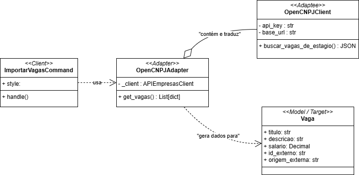

# Adapter - Avaliação

## Padrão GoF Estrutual: Adapter

O padrão *Adapter* permite que classes com interfaces incompatíveis colaborem ao “traduzir” a interface de um componente (adaptee) para uma interface esperada pelo cliente (target) [[1][2][3]](#ref-bib). Em outras palavras, ele desacopla o cliente dos detalhes de integração com serviços/formatos externos, mantendo o domínio coeso e estável[[1][2]](#ref-bib). Em uma perspectiva mais abrangente, o objetivo central é permitir que um objeto seja substituido por outro com proposito semelhante, mas possui uma interface diferente [[3]](#ref-bib). Por exemplo, na utilização de bibliotecas que estão vinculados a algum aspecto importante da regra de negócio de um determinado aplicativo, pode haver necessidade de, eventualmente, modificá-lo por uma questão de quebra disruptiva entre versões, ou mesmo, desuso de tal biblioteca; assim, caso não haja uma interface entre a biblioteca e o componente da regra de negócio, por tendência, novas mudanças acarretaram na potencial quebra do núcleo da aplicação (ou parte dele) [[1]](#ref-bib). Portanto, percebe-se que a motivação principal desse padrão surge no problema associado à manutenção de sistemas com alto grau de acoplamento, em que potenciais modificações em parte de seus compoentes pode desestruturar algum código existente que dependa dele [[1][2]](#ref-bib). 

### Problemática: Adapter no contexto da Funcionalidade de Avaliação 

A problemática em questão envolve a funcionalidade de avaliação de empresas/organizações, onde o usuário poderá fazer uma avaliação de uma determinada empresa em que tenha conhecimento. Nesse ínterim, a problemática que a cerca está vinculada à conexão com uma API pública de CNPJ, reponsável por retornar a existencia de uma determinada empresa e suas informações, evitando que empresas ficticias sejam avaliadas e, ao mesmo tempo, reduzindo os esforços adicionais de fazer a busca, seja manual, seja por mecanismos de raspagem de dados na Web (Web Scrapping). Caso optassemos por uma conexão direta, sem uma interfaçe intermediária, a consequência seria que, na necessidade de manutenção ou modificação da API utilizada, a funcionalidade de "avaliação" potencialmente quebraria, se não inteira, na parte que lhe concerne verificar a adição de novas empresas à aplicação.


## Modelagem

<font size="3"><p style="text-align: center"> **Figura 1** - Adapter Method </p>

 

<font size="3"><p style="text-align: center"> **Autores**: [Henrique Alencar](https://github.com/henryqma) e [Mateus Consorte](https://github.com/MVConsorte) </p>

## Implementação

```python

class OpenCNPJClient:

    BASE_URL = "https://publica.cnpj.ws/cnpj/"

    def _limpar_cnpj(self, cnpj: str) -> str:
        return re.sub(r'[^0-9]', '', cnpj)

    def buscar_por_cnpj(self, cnpj: str) -> Optional[Dict[str, Any]]:

        cnpj_limpo = self._limpar_cnpj(cnpj)
        url = f"{self.BASE_URL}{cnpj_limpo}"
        
        print(f"ADAPTEE: Buscando dados brutos em: {url}")
        
        try:

            response = requests.get(url, timeout=5)
            
            response.raise_for_status() 
            
            return response.json()
            
        except requests.exceptions.HTTPError as e:
            if e.response.status_code == 404:
                print(f"ADAPTEE: CNPJ {cnpj} não encontrado (404).")
                return None
            print(f"ADAPTEE: Erro HTTP: {e}")
            raise 
            
        except requests.exceptions.RequestException as e:
            print(f"ADAPTEE: Erro de conexão: {e}")
            raise

class OpenCNPJAdapter:
    def __init__(self, client: OpenCNPJClient):
        self._client = client

    def get_empresa_data(self, cnpj: str) -> Optional[Dict[str, Any]]:
        try:
            dados_brutos = self._client.buscar_por_cnpj(cnpj)
            
            if dados_brutos is None:
                return None

            print("ADAPTER: Traduzindo dados brutos para o formato interno...")

            estabelecimento = dados_brutos.get("estabelecimento", {})
            cidade = estabelecimento.get("cidade", {})
            estado = estabelecimento.get("estado", {})

            traduzido = {
                'cnpj': dados_brutos.get("cnpj"),
                'nome': dados_brutos.get("razao_social"),
                'nome_fantasia': dados_brutos.get("nome_fantasia"),
                'cidade': cidade.get("nome"),
                'uf': estado.get("sigla"),
                'logradouro': estabelecimento.get("logradouro"),
                'numero': estabelecimento.get("numero"),
                'bairro': estabelecimento.get("bairro"),
            }

            print(f"ADAPTER: Dados traduzidos com sucesso.")
            return traduzido

        except Exception as e:
            print(f"ADAPTER: Erro durante o processo de busca ou tradução: {e}")
            return None

```


Participantes mapeados no repositório:

- Cliente (Client): comando de gestão `backend/avaliacao/atualizar_empresa.py`.
- Adaptee: `OpenCNPJClient` em `backend/avaliacao/open_cnpj.py` (realiza a chamada HTTP e retorna o JSON bruto).
- Adapter: `OpenCNPJAdapter` em `backend/avaliacao/open_cnpj.py` (transforma o JSON bruto no formato esperado pelo domínio).
- Target (interface esperada): dicionário normalizado com chaves compatíveis com nosso modelo de dados de Empresa (ex.: `cnpj`, `nome`, `nome_fantasia`, `cidade`, `uf`, etc.). *Observação: o modelo `Empresa` atual está simplificado; a lista de campos alvo reflete a intenção da integração e deve evoluir.*

Fluxo resumido:

1) O cliente recebe um CNPJ e delega ao Adapter.
2) O Adapter invoca o Adaptee (cliente HTTP) para buscar os dados na API externa.
3) O Adapter traduz o JSON bruto para um dicionário com chaves internas padronizadas.
4) O cliente persiste os dados usando a interface do domínio (ex.: `update_or_create`).

---

## Execução

---

## Senso Crítico

Benefícios:

- Isolamento de dependência externa: mudanças na API pública impactam prioritariamente o Adapter, não o domínio nem o cliente.
- Testabilidade: é possível mockar `OpenCNPJClient` no teste do Adapter e validar a tradução de dados sem chamadas reais à rede.
- Evolução segura: adicionar ou renomear campos mapeados fica contido no Adapter, reduzindo regressões.

Trade-offs e cuidados:

- Complexidade: o Adapter concentra regras de mapeamento; mantenha-o pequeno, coeso e bem testado.
- Tipagem/contratos: definir um “target” explícito (ex.: dataclass/serializer) evita dicionários soltos e erros de chave.
- Erros e timeouts: a chamada externa deve ter timeout (já aplicado) e tratamento robusto para retornar None/erros controlados ao cliente.

Relação direta com o código:

- `OpenCNPJClient.buscar_por_cnpj(cnpj)`: acessa `https://publica.cnpj.ws/cnpj/{cnpj}` e retorna o JSON bruto.
- `OpenCNPJAdapter.get_empresa_data(cnpj)`: extrai e renomeia campos como `razao_social` → `nome`, além de planificar dados de cidade/estado.
- `Command.handle(...)` em `atualizar_empresa.py`: consome o Adapter e tenta persistir via `update_or_create`.

---

## Conclusão

A implementação do padrão Adapter, através da classe OpenCNPJAdapter, demonstrou-se uma solução robusta para o desafio de integrar a funcionalidade de avaliação com a API pública de CNPJ. Ao atuar como um "tradutor" entre o cliente HTTP (OpenCNPJClient) e o domínio da aplicação, o adapter efetivamente isola o núcleo do sistema de detalhes de implementação e da estrutura de dados de um serviço externo. Isso não apenas protege a funcionalidade de avaliação contra futuras mudanças na API, mas também melhora significativamente a testabilidade do código, permitindo que a dependência externa seja facilmente simulada (mockada), garantindo assim maior manutenibilidade e resiliência ao projeto.

## Referência Bibliográfica {#ref-bib}

- [1] Adapter – Padrões de Projeto. Refactoring Guru, 2014–2025. Disponível em: https://refactoring.guru/pt-br/design-patterns/adapter. Acesso em: 23 out. 2025.
- [2] Serrano, Milene. Arquitetura e Desenho de Software – Aula GoFs Estruturais. Universidade de Brasília, [s.d.]. Disponível em: https://aprender3.unb.br/pluginfile.php/3178543/mod_page/content/1/Arquitetura%20e%20Desenho%20de%20Software%20-%20Aula%20GoFs%20Estruturais%20-%20Profa.%20Milene.pdf. Acesso em: 23 out. 2025.
- [3] WIKIPEDIA. Adapter pattern. Disponível em: https://en.wikipedia.org/wiki/Adapter_pattern. Acesso em: 23 out. 2025.

---

## Histórico de Versões

| Versão | Data       | Descrição                                | Autor(es)                             | Revisor(es) | Detalhes da Revisão                                                |
| ------ | ---------- | ---------------------------------------- | ------------------------------------- | ----------- | ------------------------------------------------------------------ |
| 1.0    | 23/10/2025 |    Abertura do arquivo     | [Consorte](https://github.com/MVConsorte) | -    | - |
| 1.1    | 23/10/2025 | Preenchida a seção "Padrão GoF Estrutual: Adapter" e problemática com definição, participantes e mapeamento de código. Referenciada | [Consorte](https://github.com/MVConsorte) | - | - |
| 1.2    | 23/10/2025 |    Adicionando modelagem     | [Henrique](https://github.com/henryqma) | -    | - |
