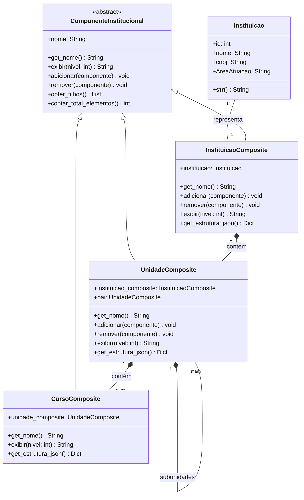

# Padrão Composite - Instituição

## 1. Introdução

Este documento descreve a implementação do padrão de projeto **Composite** para representar a estrutura hierárquica de instituições de ensino no sistema DicasDeEstagio. O Composite é um padrão estrutural que permite compor objetos em estruturas de árvore para representar hierarquias parte-todo.

## 2. Objetivo

O padrão Composite foi escolhido para Instituições devido à:

- **Hierarquia natural**: Instituição → Departamento/Faculdade → Curso

- **Tratamento uniforme**: Operações aplicáveis a toda hierarquia

- **Flexibilidade**: Facilita adicionar novos níveis hierárquicos

## 3. Estrutura do Padrão

### 3.1 Diagrama de Classes


<details>
    <summary>Diagrama</summary>


</details>

## 4. Implementação em Django

### 4.1 Models (models.py)

<details> 
    <summary>Ver código</summary>

```python

from django.db import models


class Instituicao(models.Model):
    nome = models.CharField(max_length=255)
    cnpj = models.CharField(max_length=14)
    AreaAtuacao = models.CharField(max_length=255)

    def __str__(self):
        return self.nome

    class Meta:
        verbose_name = 'Instituição'
        verbose_name_plural = 'Instituições'


class ComponenteInstitucional(models.Model):
    nome = models.CharField(max_length=255)
    
    class Meta:
        abstract = True
    
    def get_nome(self):
        return self.nome
    
    def exibir(self, nivel=0):
        raise NotImplementedError("Método abstrato")
    
    def adicionar(self, componente):
        raise NotImplementedError("Este componente não pode ter filhos")
    
    def remover(self, componente):
        raise NotImplementedError("Este componente não pode ter filhos")
    
    def obter_filhos(self):
        return []
    
    def contar_total_elementos(self):
        total = 1
        for filho in self.obter_filhos():
            total += filho.contar_total_elementos()
        return total


class InstituicaoComposite(ComponenteInstitucional):
    instituicao = models.OneToOneField(
        Instituicao,
        on_delete=models.CASCADE,
        related_name='composite'
    )
    
    class Meta:
        verbose_name = 'Instituição (Composite)'
        verbose_name_plural = 'Instituições (Composite)'
    
    def get_nome(self):
        return self.instituicao.nome
    
    def adicionar(self, componente):
        if isinstance(componente, UnidadeComposite):
            componente.instituicao_composite = self
            componente.save()
        else:
            raise TypeError("Instituição só pode conter Unidades")
    
    def remover(self, componente):
        if isinstance(componente, UnidadeComposite):
            componente.instituicao_composite = None
            componente.save()
    
    def obter_filhos(self):
        return list(self.unidades.filter(pai__isnull=True))
    
    def exibir(self, nivel=0):
        indentacao = "  " * nivel
        instituicao = self.instituicao
        resultado = f"{indentacao} {instituicao.nome} (CNPJ: {instituicao.cnpj}, Área: {instituicao.AreaAtuacao})\n"
        
        for unidade in self.obter_filhos():
            resultado += unidade.exibir(nivel + 1)
        
        return resultado


class UnidadeComposite(ComponenteInstitucional):
    instituicao_composite = models.ForeignKey(
        InstituicaoComposite,
        on_delete=models.CASCADE,
        related_name='unidades',
        null=True,
        blank=True
    )
    pai = models.ForeignKey(
        'self',
        on_delete=models.CASCADE,
        related_name='subunidades',
        null=True,
        blank=True
    )
    
    class Meta:
        verbose_name = 'Unidade (Composite)'
        verbose_name_plural = 'Unidades (Composite)'
    
    def adicionar(self, componente):
        if isinstance(componente, CursoComposite):
            componente.unidade_composite = self
            componente.save()
        elif isinstance(componente, UnidadeComposite):
            componente.pai = self
            componente.save()
        else:
            raise TypeError("Unidade só pode conter Cursos ou Subunidades")
    
    def remover(self, componente):
        if isinstance(componente, CursoComposite):
            componente.unidade_composite = None
            componente.save()
        elif isinstance(componente, UnidadeComposite):
            componente.pai = None
            componente.save()
    
    def obter_filhos(self):
        cursos = list(self.cursos.all())
        subunidades = list(self.subunidades.all())
        return subunidades + cursos
    
    def exibir(self, nivel=0):
        indentacao = "  " * nivel
        resultado = f"{indentacao} {self.nome}\n"
        
        for filho in self.obter_filhos():
            resultado += filho.exibir(nivel + 1)
        
        return resultado


class CursoComposite(ComponenteInstitucional):
    unidade_composite = models.ForeignKey(
        UnidadeComposite,
        on_delete=models.CASCADE,
        related_name='cursos'
    )
    
    class Meta:
        verbose_name = 'Curso (Composite)'
        verbose_name_plural = 'Cursos (Composite)'
    
    def exibir(self, nivel=0):
        indentacao = "  " * nivel
        return f"{indentacao} {self.nome}\n"
    
    def obter_filhos(self):
        return []
```


</details>


### 4.2 Serializers (serializers.py)

<details> 
    <summary>Código</summary>

```python

from rest_framework import serializers
from .models import Instituicao, Unidade, Curso

class CursoSerializer(serializers.ModelSerializer):
    """Serializer para Curso (Leaf)"""
    
    class Meta:
        model = Curso
        fields = ['id', 'nome', 'unidade']


class UnidadeSerializer(serializers.ModelSerializer):
    """Serializer para Unidade (Composite)"""
    cursos = CursoSerializer(many=True, read_only=True)
    subunidades = serializers.SerializerMethodField()
    
    class Meta:
        model = Unidade
        fields = ['id', 'nome', 'instituicao', 'pai', 'cursos', 'subunidades']
    
    def get_subunidades(self, obj):
        """Serializa subunidades recursivamente"""
        subunidades = obj.subunidades.all()
        return UnidadeSerializer(subunidades, many=True).data


class InstituicaoSerializer(serializers.ModelSerializer):
    """Serializer para Instituição (Root Composite)"""
    unidades = UnidadeSerializer(many=True, read_only=True)
    total_elementos = serializers.SerializerMethodField()
    
    class Meta:
        model = Instituicao
        fields = ['id', 'nome', 'cnpj', 'AreaAtuacao', 'unidades', 'total_elementos']
    
    def get_total_elementos(self, obj):
        """Conta total de elementos na hierarquia"""
        return obj.contar_total_elementos()


class InstituicaoHierarquiaSerializer(serializers.ModelSerializer):
    """
    Serializer especializado para exibir hierarquia completa.
    Usa o método get_estrutura_json do padrão Composite.
    """
    estrutura = serializers.SerializerMethodField()
    
    class Meta:
        model = Instituicao
        fields = ['id', 'nome', 'cnpj', 'AreaAtuacao', 'estrutura']
    
    def get_estrutura(self, obj):
        """Retorna estrutura hierárquica completa"""
        return obj.get_estrutura_json()

```


</details>


### 4.3 Views (views.py)


<details> 
    <summary>Código</summary>

```python
    
from rest_framework import viewsets, status
from rest_framework.decorators import action
from rest_framework.response import Response
from rest_framework.permissions import IsAuthenticatedOrReadOnly
from django.db.models import Prefetch
from .models import Instituicao, Unidade, Curso
from .serializers import (
    InstituicaoSerializer,
    InstituicaoHierarquiaSerializer,
    UnidadeSerializer,
    CursoSerializer
)

class InstituicaoViewSet(viewsets.ModelViewSet):
    """
    ViewSet para gerenciar instituições.
    Implementa operações do padrão Composite.
    """
    queryset = Instituicao.objects.all()
    serializer_class = InstituicaoSerializer
    permission_classes = [IsAuthenticatedOrReadOnly]
    
    def get_queryset(self):
        """Otimiza queries com prefetch"""
        return Instituicao.objects.prefetch_related(
            'unidades',
            'unidades__cursos'
        )
    
    @action(detail=True, methods=['get'], url_path='hierarquia')
    def hierarquia(self, request, pk=None):
        """
        Retorna estrutura hierárquica completa da instituição.
        """
        instituicao = self.get_object()
        serializer = InstituicaoHierarquiaSerializer(instituicao)
        return Response(serializer.data)
    
    @action(detail=True, methods=['get'], url_path='exibir')
    def exibir_estrutura(self, request, pk=None):
        """
        Retorna representação textual da hierarquia.
        """
        instituicao = self.get_object()
        estrutura_texto = instituicao.exibir()
        
        return Response({
            'instituicao': instituicao.nome,
            'estrutura': estrutura_texto
        })
    
    @action(detail=True, methods=['post'], url_path='adicionar-unidade')
    def adicionar_unidade(self, request, pk=None):
        """
        Adiciona uma unidade à instituição usando método do Composite.
        """
        instituicao = self.get_object()
        
        serializer = UnidadeSerializer(data=request.data)
        serializer.is_valid(raise_exception=True)
        
        # Criar unidade
        unidade = Unidade(**serializer.validated_data)
        
        # Usar método adicionar do Composite
        instituicao.adicionar(unidade)
        
        return Response(
            UnidadeSerializer(unidade).data,
            status=status.HTTP_201_CREATED
        )


class UnidadeViewSet(viewsets.ModelViewSet):
    """
    ViewSet para gerenciar unidades.
    Suporta operações de composição.
    """
    queryset = Unidade.objects.all()
    serializer_class = UnidadeSerializer
    permission_classes = [IsAuthenticatedOrReadOnly]
    
    def get_queryset(self):
        """Otimiza queries"""
        return Unidade.objects.prefetch_related(
            'cursos',
            'subunidades'
        ).select_related('instituicao', 'pai')
    
    @action(detail=True, methods=['post'], url_path='adicionar-curso')
    def adicionar_curso(self, request, pk=None):
        """
        Adiciona um curso à unidade.
        """
        unidade = self.get_object()
        
        serializer = CursoSerializer(data=request.data)
        serializer.is_valid(raise_exception=True)
        
        # Criar curso
        curso = Curso(**serializer.validated_data)
        
        # Usar método adicionar do Composite
        unidade.adicionar(curso)
        
        return Response(
            CursoSerializer(curso).data,
            status=status.HTTP_201_CREATED
        )
    
    @action(detail=True, methods=['post'], url_path='adicionar-subunidade')
    def adicionar_subunidade(self, request, pk=None):
        """
        Adiciona uma subunidade.
        """
        unidade_pai = self.get_object()
        
        serializer = UnidadeSerializer(data=request.data)
        serializer.is_valid(raise_exception=True)
        
        subunidade = Unidade(**serializer.validated_data)
        unidade_pai.adicionar(subunidade)
        
        return Response(
            UnidadeSerializer(subunidade).data,
            status=status.HTTP_201_CREATED
        )


class CursoViewSet(viewsets.ModelViewSet):
    """
    ViewSet para gerenciar cursos.
    Cursos são folhas na hierarquia (não têm filhos).
    """
    queryset = Curso.objects.all()
    serializer_class = CursoSerializer
    permission_classes = [IsAuthenticatedOrReadOnly]
    
    def get_queryset(self):
        """Otimiza queries"""
        return Curso.objects.select_related(
            'unidade',
            'unidade__instituicao'
        )

```


</details>

## 5. Exemplo de Uso

### 5.1 Construindo a Hierarquia

<details> 
    <summary>Hierarquia</summary>


```python
from .models import Instituicao, InstituicaoComposite, UnidadeComposite, CursoComposite

unb_original = Instituicao.objects.create(
    nome='Universidade de Brasília',
    cnpj='12345678000195',
    AreaAtuacao='Ensino Superior'
)

unb_composite = InstituicaoComposite.objects.create(
    instituicao=unb_original,
    nome=unb_original.nome 
)


fga = UnidadeComposite.objects.create(
    nome='Faculdade do Gama',
    instituicao_composite=unb_composite
)


unb_composite.adicionar(fga)

eng_soft = CursoComposite.objects.create(
    nome='Engenharia de Software',
    unidade_composite=fga
)


fga.adicionar(eng_soft)


print("=== HIERARQUIA COMPLETA ===")
print(unb_composite.exibir())


print("\n=== INSTITUIÇÃO ORIGINAL ===")
print(f"Nome: {unb_original.nome}")
print(f"CNPJ: {unb_original.cnpj}")
print(f"Área: {unb_original.AreaAtuacao}")


print(f"\n=== ESTATÍSTICAS ===")
print(f"Total de elementos: {unb_composite.contar_total_elementos()}")
```

</details>

### 5.2 Requisições API


<details> 
    <summary>Requisições</summary>

```bash
# Listar instituições
    GET /api/instituicoes/
    
# Ver hierarquia completa
    GET /api/instituicoes/1/hierarquia/
    
# Exibir estrutura textual
    GET /api/instituicoes/1/exibir/
    
    # Adicionar departamento
         /api/instituicoes/1/adicionar-departamento/
                "nome": "Faculdade de Tecnologia",
        "codigo": "FT",
    "descricao": "Faculdade de cursos tecnológicos"
    }
    
    # Adicionar curso a departamento
         /api/departamentos/1/adicionar-curso/
                "nome": "Engenharia de Software",
        "codigo": "ES",
        "nivel": "graduacao",
    "duracao": 10
    }
    
    # Ver caminho completo do curso
GET /api/cursos/1/caminho-completo/
```

</details>

## 6. Vantagens da Implementação

-  **Uniformidade**: Trata objetos individuais e composições de forma uniforme
-  **Recursividade**: Operações funcionam recursivamente na hierarquia
-  **Flexibilidade**: Fácil adicionar novos níveis hierárquicos
-  **Manutenibilidade**: Estrutura clara e organizada
-  **Navegação**: Facilita navegação na árvore de componentes

    ## 7. Testes

<details> 
    <summary>Código</summary>

```python

from django.test import TestCase
from .models import Instituicao, InstituicaoComposite, UnidadeComposite, CursoComposite

class CompositeTestCase(TestCase):
    
    def setUp(self):
        # Criar instituição ORIGINAL
        self.instituicao = Instituicao.objects.create(
            nome='Universidade de Brasília',
            cnpj='12345678000195',
            AreaAtuacao='Ensino Superior'
        )
        
        # Criar composite
        self.composite = InstituicaoComposite.objects.create(
            instituicao=self.instituicao,
            nome='Universidade de Brasília'
        )
        
        # Criar unidade
        self.unidade = UnidadeComposite.objects.create(
            nome='Faculdade do Gama',
            instituicao_composite=self.composite
        )
        
        # Criar curso
        self.curso = CursoComposite.objects.create(
            nome='Engenharia de Software',
            unidade_composite=self.unidade
        )
    
    def test_instituicao_original_intacta(self):
        """Testa que a instituição original não foi modificada"""
        self.assertEqual(self.instituicao.nome, 'Universidade de Brasília')
        self.assertEqual(self.instituicao.cnpj, '12345678000195')
        self.assertEqual(self.instituicao.AreaAtuacao, 'Ensino Superior')
    
    def test_composite_hierarchy(self):
        """Testa a hierarquia do composite"""
        self.assertEqual(self.composite.instituicao, self.instituicao)
        self.assertEqual(self.unidade.instituicao_composite, self.composite)
        self.assertEqual(self.curso.unidade_composite, self.unidade)
    
    def test_exibir_hierarquia(self):
        """Testa a exibição da hierarquia"""
        resultado = self.composite.exibir()
        self.assertIn('Universidade de Brasília', resultado)
        self.assertIn('Faculdade do Gama', resultado)
        self.assertIn('Engenharia de Software', resultado)
    
    def test_contar_elementos(self):
        """Testa a contagem de elementos"""
        total = self.composite.contar_total_elementos()
        self.assertEqual(total, 3)  # Instituição + Unidade + Curso

```

</details>

## 8. Referências

- Gamma, E. et al. (1994). Design Patterns: Elements of Reusable Object-Oriented Software
- Django Documentation: https://docs.djangoproject.com/
- Django REST Framework: https://www.django-rest-framework.org/

---

## Histórico de Versões

| Versão  | Data       | Descrição | Autor(es) | Revisor(es) |
|:-------:|:----------:|:----------|:----------|:------------|
| 1.0     | 24/10/2025 | Criação do documento | [Breno Alexandre](https://github.com/brenoalexandre0), [Víctor Moreira](https://github.com/aqela-batata-alt), [Felipe Nunes](https://github.com/FelipeNunesdM)| |
