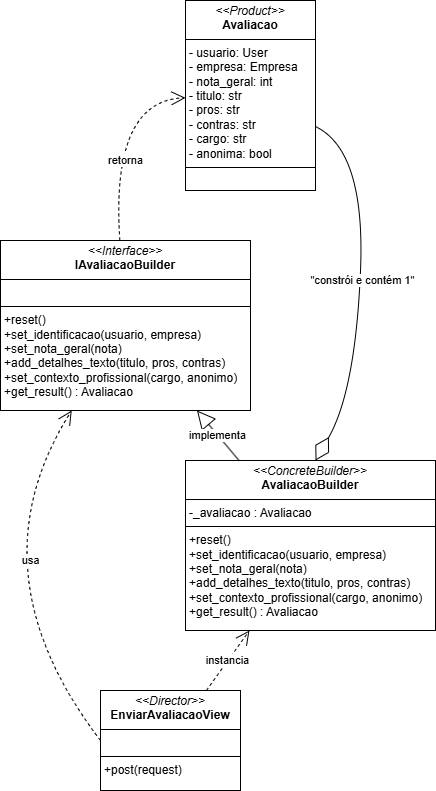

# Builder - Avaliação

## Padrão GoF Criacional: Builder

O padrão Builder separa a construção de um objeto complexo da sua representação final, permitindo montar a instância passo a passo [[1][2]](#ref-bib). Em vez de um construtor com muitos parâmetros, o Builder organiza a criação em etapas, favorecendo legibilidade e evitando objetos parcialmente válidos [[1]](#ref-bib). Assim, ao encapsular a lógica de montagem de uma "Avaliação" em etapas encadeadas, garante-se que, ao final, o objeto esteja consistente antes de ser usado ou salvo [[1][2][3]](#ref-bib). Logo, a problematica principal que o Construtor visa atacar é de reduzir construtores "monstruosos", que possuem muitos parâmetros e que, inclusive, tende a se enraizar por todo o código cliente; e, também, na maioria dos casos, boa parte dos parâmetros não será utilizada, não havendo necessidade de declarar uma quantidade demasiada de parâmetros [[1]](#ref-bib). Enfim , o cliente coordena os passos e, para o resultado final, o Construtor garante as regras e só libera o "produto final" quando pronto.

### Problemática: Builder no contexto da Funcionalidade de Avaliação 

Na abordagem em questão, a avaliação trata-se de um das funcionalidades cernes da aplicação, mesmo que em um primeiro momento não seja grande, eventualmente, escalando-o, certamente haverá problemas no processo de inicalização e construção de objetos. Assim, para mitigar tal aspectos, foi planjado a adição do builder para gerenciar o processo de criação de objetos.

Concretamente, a montagem de uma `Avaliacao` envolve:
- Campos obrigatórios e opcionais heterogêneos: obrigatórios (usuário, empresa, nota_geral) e opcionais (título, prós, contras, cargo, anonima), que nem sempre chegam juntos e podem depender do contexto de uso (formulário web hoje; importações/integrações amanhã).
- Regras condicionais de domínio: quando a avaliação é anônima, o cargo exibido deve ser derivado (ex.: “Ex-funcionário(a) (slug-do-cargo)”), enquanto avaliações não anônimas exibem o cargo informado. Essa política aparece em `set_contexto_profissional`.
- Validações de faixa e consistência: por exemplo, `nota_geral` limitada entre 1 e 5 (verificada em `set_nota_geral`), além do mínimo necessário antes de liberar o resultado (`usuario`, `empresa`, `nota_geral` em `get_result`).
- Ordem e atomicidade da construção: sem uma sequência clara, o código cliente corre risco de produzir objetos parcialmente válidos ou de “esquecer” etapas, especialmente à medida que o formulário evoluir com novos campos.

## Modelagem

**Figura 1** - Builder method

_Autores: [Henrique Alencar](https://github.com/henryqma) e [Mateus Consorte](https://github.com/MVConsorte)_

## Implementação

'''python
class IAvaliacaoBuilder(ABC):
    @abstract_method
    def reset(self):
        pass

    @abstract_method
    def set_identificacao(self, usuario: User, empresa: Empresa):
        pass

    @abstract_method
    def set_nota_geral(self, nota: int):
        pass
    
    @abstract_method
    def add_detalhes_texto(self, titulo: str, pros: str, contras: str):
        pass
        
    @abstract_method
    def set_contexto_profissional(self, cargo: str, anonimo: bool):
        pass

    @abstract_method
    def get_result(self) -> Avaliacao:
        pass

class AvaliacaoBuilder(IAvaliacaoBuilder):

    _avaliacao: Avaliacao = None

    def __init__(self):
        self.reset()

    def reset(self):
        self._avaliacao = Avaliacao()

    def set_identificacao(self, usuario: User, empresa: Empresa) -> 'AvaliacaoBuilder':
        self._avaliacao.usuario = usuario
        self._avaliacao.empresa = empresa
        return self 
    
    def set_nota_geral(self, nota: int) -> 'AvaliacaoBuilder':
        if not 1 <= nota <= 5:
            raise ValueError("Nota deve estar entre 1 e 5")
        self._avaliacao.nota_geral = nota
        return self

    def add_detalhes_texto(self, titulo: str, pros: str, contras: str) -> 'AvaliacaoBuilder':
        self._avaliacao.titulo = titulo
        self._avaliacao.pros = pros
        self._avaliacao.contras = contras
        return self
    
    def set_contexto_profissional(self, cargo: str, anonimo: bool) -> 'AvaliacaoBuilder':
        self._avaliacao.anonima = anonimo
        if not anonimo:
            self._avaliacao.cargo = cargo
        else:
            self._avaliacao.cargo = f"Ex-funcionário(a) ({slugify(cargo)})"
            
        return self

    def get_result(self) -> Avaliacao:
        if not all([self._avaliacao.usuario, self._avaliacao.empresa, self._avaliacao.nota_geral]):
            raise ValueError("Uma avaliação deve ter no mínimo usuário, empresa e nota.")
            
        produto_final = self._avaliacao
        self.reset() 
        return produto_final

'''

Participantes mapeados no repositório:
- Builder (concreto): `AvaliacaoBuilder` em `backend/avaliacao/builders.py`.
- Builder (interface): `IAvaliacaoBuilder` em `backend/avaliacao/builders.py`.
- Produto: `Avaliacao` em `backend/avaliacao/models.py`.
- Cliente/Diretor: `EnviarAvaliacaoView` em `backend/avaliacao/views.py` (orquestra a sequência de chamadas do Builder conforme os dados do formulário).

Principais responsabilidades no código:
- `set_identificacao(usuario, empresa)`: associa usuário e empresa.
- `set_nota_geral(nota)`: valida a faixa (1 a 5) e define o valor.
- `add_detalhes_texto(titulo, pros, contras)`: popula detalhes textuais.
- `set_contexto_profissional(cargo, anonimo)`: define anonimato e ajusta o cargo; quando anônima, gera um valor derivado via `slugify`.
- `get_result()`: verifica invariantes mínimas (usuário, empresa, nota) e retorna o objeto pronto, executando `reset()` para permitir reuso do Builder.

Exemplo de fluxo (View `EnviarAvaliacaoView.post`):
1) Instancia o `AvaliacaoBuilder`.
2) Encadeia as etapas com `cleaned_data` do formulário.
3) Chama `get_result()` e salva a avaliação resultante.

---

## Senso Crítico

Quando usar Builder aqui faz sentido:
- O objeto possui campos obrigatórios e opcionais montados em etapas.
- Regras de negócio interferem na montagem (ex.: anonimato altera cargo exibido).
- Deseja-se manter a View enxuta e expressiva, delegando regras ao Builder.

Quando talvez não valha a pena:
- Objetos simples, com poucos campos e sem validações encadeadas.
- Se toda validação migrar para serializers/forms, duplicando lógica com o Builder.

No entanto, no geral, sem um Builder, as problemáticas nas etapas de construção do objeto tendem a se espalhar por controllers/views, levando a:
- Código cliente inchado e duplicado, difícil de manter e testar.
- Invariantes de domínio implementadas de maneira inconsistente em lugares diferentes.
- Maior chance de salvar objetos em estado inválido, devido à criação “em fatias”.

O uso do Builder endereça diretamente esses riscos [[1][2][3]](#ref-bib):
- Centraliza as regras de montagem e validações, expondo uma interface que guia a ordem dos passos.
- Garante invariantes mínimas antes de liberar o produto via `get_result()` e faz `reset()` para evitar reuso indevido do mesmo objeto.
- Reduz o acoplamento da View com detalhes de construção, mantendo o código cliente mais expressivo e focado no fluxo da funcionalidade.

---

## Conclusão

O Builder adotado para `Avaliacao` melhora a legibilidade do fluxo de criação, concentra validações e protege invariantes do domínio. A View atua como diretora e o `AvaliacaoBuilder` entrega um objeto pronto para persistência. Manter o Builder coeso, coberto por testes e ajustar pequenos detalhes (por exemplo, decoradores abstratos) sustentará a evolução segura dessa funcionalidade.

---

## Referência Bibliográfica {#ref-bib}

[1] Builder – Padrões de Projeto. Refactoring Guru, 2014–2025. Disponível em: https://refactoring.guru/pt-br/design-patterns/builder. Acesso em: 23 out. 2025.
[2] Serrano, Milene. Arquitetura e Desenho de Software – Aula GoFs Criacionais. Universidade de Brasília, [s.d.].
[3] Wikipedia. Builder pattern. Disponível em: https://en.wikipedia.org/wiki/Builder_pattern. Acesso em: 23 out. 2025.

## Bibliografia

SOURCEMAKING. Builder Design Pattern in Python. SourceMaking.com, 2007–2025. Disponível em: https://sourcemaking.com/design_patterns/builder/python/1.

---

## Histórico de Versões

| Versão | Data       | Descrição                                | Autor(es)                             | Revisor(es) | Detalhes da Revisão                                                |
| ------ | ---------- | ---------------------------------------- | ------------------------------------- | ----------- | ------------------------------------------------------------------ |
| 1.0    | 23/10/2025 |    Abertura do arquivo     | [Consorte](https://github.com/MVConsorte) | -    | - |
| 1.1    | 23/10/2025 | seção "Padrão GoF Criacional: Builder" com definição, mapeamento ao código e recomendações | [Consorte](https://github.com/MVConsorte) | - | - |
| 1.2    | 23/10/2025 |    Adicionando modelagem     | [Henrique](https://github.com/henryqma) | -    | - |
