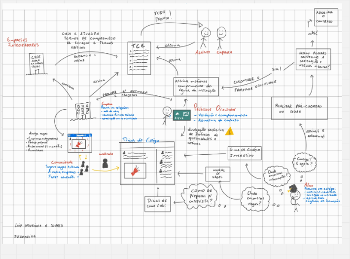
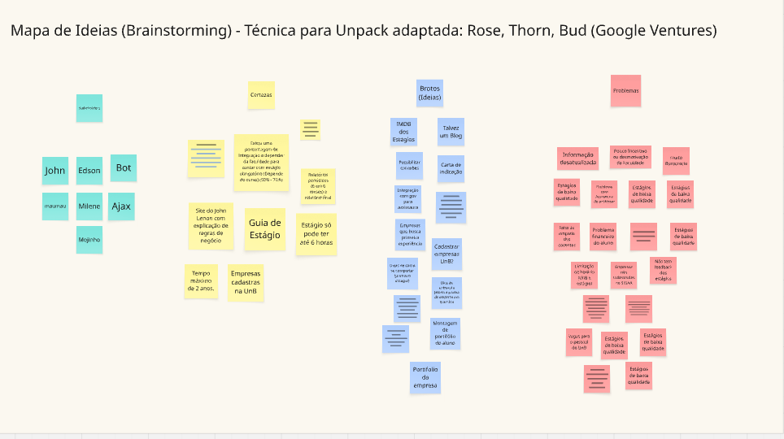

## 1 - Requisitos Funcionais

| ID  | Código                                                                  | Descrição                       |
| --- | ----------------------------------------------------------------------- | ------------------------------- |
| RF1 | Centralizar informações em um portal.                        | O sistema deve disponibilizar todas as informações relevantes em um único portal. |
| RF2 | Visualizar guia de estágio.                                       | O sistema deve permitir que os usuários visualizem o guia de estágio. |
| RF3 | Visualizar dicas e artigos.                                 | O sistema deve permitir que os usuários visualizem dicas e artigos relacionados ao estágio. |
| RF4 | Publicar dicas e artigos.                                 | O sistema deve permitir que os administradores publiquem dicas e artigos. |
| RF5 | Cadastrar administrador do sistema.                                 | O sistema deve permitir que um administrador seja cadastrado no sistema. |
| RF6 | Visualizar empresas cadastradas.                                 | O sistema deve permitir que um estudante visualize as empresas cadastradas. |
| RF7 | Cadastrar empresas.                                 | O sistema deve permitir que um administrador cadastre empresas no sistema. |
| RF8 | Cadastrar vagas de estágio.                                 | O sistema deve permitir que uma empresa cadastre vagas de estágio no sistema. |
| RF9 | Visualizar vagas de estágio.                                 | O sistema deve permitir que um estudante visualize as vagas de estágio disponíveis. |
| RF10 | Candidatar-se a vagas de estágio.                                 | O sistema deve permitir que um estudante se candidate a vagas de estágio. |
| RF11 | Avaliação de empresas.                                 | O sistema deve permitir que os usuários avaliem as empresas onde estagiaram. |
| RF12 | Publicar vaga de estágio.                                 | O sistema deve permitir que os usuários publiquem vagas de estágio. |
| RF13 | Realizar login.                                 | O sistema deve permitir que um usuário realize login no sistema. |
| RF14 | Cadastrar usuário.                                 | O sistema deve permitir que um usuário se cadastre no sistema. |

## 2 - Requisitos Não Funcionais

| ID     | Descrição                                                                                                                                                                                                                                                               |
|--------|-------------------------------------------------------------------------------------------------------------------------------------------------------------------------------------------------------------------------------------------------------------------------|
| RNF01  | O sistema deve responder a ações do usuário (como cliques em botões, navegação entre telas ou envio de formulários) em até 2 segundos, em rede estável (ping ≤ 200ms, banda ≥ 10 Mbps), medido no navegador do cliente.           |
| RNF02  | O sistema deve persistir informações em um banco de dados relacional (como MySQL, PostgreSQL ou SQL Server).                                                                              |
| RNF03  | Toda a interface textual do sistema (rótulos, mensagens de erro, botões e descrições) deve ser escrita em português correto e estar livre de erros gramaticais e ortográficos, além de evitar termos técnicos de TI como “API”, “payload”, “token” e similares. |
| RNF04  | O sistema deve ser compatível com os navegadores Google Chrome, Mozilla Firefox, Microsoft Edge e Safari, em suas versões mais recentes.                                                   |

## EVIDENCIA 

os requistos foram elicitados atraves do quadro no miro e figma. 

[Quadro no Miro utilizado para elicitação dos requisitos](https://miro.com/app/board/uXjVJNoiQ50=/)

[Link para o Figma](http://figma.com/design/lB8oMh7D1uVZTKp1AudwF0/GRUPO-5--ARQUITETURA?node-id=0-1&p=f&t=5j38GKQFlchXzybQ-0)

## Histórias de Usuário

Todas as histórias do usuários foram escritas no github projects e podem ser acessados através do link abaixo:

[Link para o GitHub Projects](https://github.com/orgs/UnBArqDsw2025-2-Turma02/projects/3/views/1)

## Priorização do Backlog

A priorização do backlog foi feita utilizando a técnica MoSCoW, que classifica os requisitos em quatro categorias: Must have (Deve ter), Should have (Deveria ter), Could have (Poderia ter). Won't have (Não terá) decidimos não implementar nesta versão do projeto. 

- **Must have**  
  Funcionalidades essenciais, indispensáveis para o funcionamento mínimo do produto. Sua entrega é obrigatória, pois sem elas o produto não atende aos requisitos básicos de uso ou de negócio.

- **Should have**  
  Funcionalidades importantes, que agregam valor significativo ao produto, mas que podem ser implementadas após os itens críticos. Embora não sejam vitais para o funcionamento imediato, sua ausência pode impactar a experiência do usuário ou a eficiência do sistema.

- **Could have**  
  Funcionalidades desejáveis, que aumentam a atratividade ou conveniência do produto, mas que não são essenciais no escopo inicial. Podem ser consideradas caso haja tempo ou recursos disponíveis.

| Código US | Descrição                                      | Prioridade |  
| --------- | ---------------------------------------------- | ---------- | 
| US-01     | Centralizar todas as informações em só um portal | Must       | 
| US-02     | Visualização do guia de estágios               | Must       |
| US-14     | Publicar Dicas e Artigos                       | Must       |
| US-15     | Visualizar dicas e artigos                     | Must       | 
| US-16     | Cadastrar administrador do sistema             | Must       | 
| US-03     | Visualizar empresas cadastradas                | Should     |
| US-04     | Cadastrar empresas                             | Should     | 
| US-05     | Cadastrar aluno                                | Should     | 
| US-07     | Excluir empresas                               | Should     |
| US-08     | Realizar login                                 | Should     | 
| US-11     | Buscar e Filtrar Vagas                         | Should     | 
| US-06     | Editar empresas                                | Could      | 
| US-09     | Avaliação da empresa                           | Could      | 
| US-10     | Publicar Vaga de Estágio                       | Could      | 
| US-12     | Visualizar Detalhes da Vaga                    | Could      | 
| US-13     | Candidatar-se a uma Vaga                       | Could      | 

## Histórico de Versões

| Versão | Descrição                                         | Autor                                                                 | Revisor                                              | Data       |
|--------|---------------------------------------------------|-----------------------------------------------------------------------|------------------------------------------------------|------------|
| 1.0    | Criação do documento e organização de todo o conteúdo | [Daniel Ferreira](https://github.com/Mach1r0), [Eduardo Ferreira](https://github.com/fxred) | [Eduardo Ferreira](https://github.com/fxred)         | 14/09/2025 |
