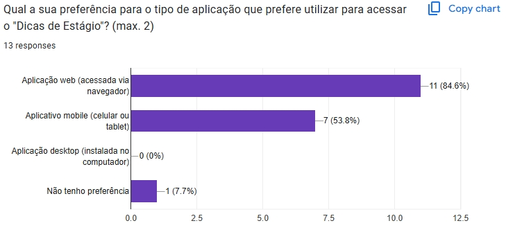

# Questionário – Projeto Dicas de Estágio

## Introdução

Um dos mecanismos mais versáteis para elicitação de requisitos, visando entender as necessidades e dores de um grande grupo de usuários, trata-se da técnica de Questionários [[1, p.125]](#ref-bib). Nessa técnica, um dos objetivos centrais é a coleta rápida de dados, principalmente quantitativos, de muitos usuários; esse fato também se traduz como uma de suas vantagens, além de ser relativamente barato, ainda mais em questionários associados à pesquisas digitais, isto é, que não se traduzir em divulgação impressa [[2, p. 144, Tabela 5.1]](#ref-bib). Contudo, uma das premissas do questionário, é o avaliador ser experiente para evitar perguntas inadequadas ao contexto ou que induzem certas respostas [[2, p. 144, Tabela 5.1; 1, p.125]](#ref-bib). Enfim, diferentemente de entrevistas e grupos focais, questionários se privilegiam de amostras de dados realmente grandes, alcançando até mesmo pessoas dispersas geograficamente [[2, p. 150, cap. 5.5.2]](#ref-bib).

Outro ponto a ressaltar é que questionários, assim como entrevistas, podem conter perguntas fechadas e perguntas abertas, mas com preferência às fechadas, de preenchimento rápido e fácil análise [[2, p.150, 5.5.2]](#ref-bib). Isto, pois, em questionários não se deve fazer muitas perguntas abertas, pois tende a desmotivar os respondentes à completá-los, o que reduz a taxa de respostas. Logo, perguntas fechadas, sendo mais comumente usado, quando temos uma boa noção das respostas mais prováveis e, assim, desejamos conhecer a proporção numa amostra mais ampla [[2, p. 151, 5.5.2]](#ref-bib). Além disso, por vezes, os questionários são utilizados em conjunto com entrevistas ou técnicas com premissas semelhantes, onde, após entrevistas exploratórias,questionários podem ser utilizados para corroborar a entrevista e validar se as mesmas traduzem a relevância do público-alvo maior. Caso os questionários evidenciem estatísticas inesperadas, novas entrevistas podem ser conduzidas para descobrir os motivos dessa surpresa [[2, p. 151 e p. 154, 5.5.2]](#ref-bib). Portanto, depreende-se que o questionário é, de fato, uma técnica de grande relevância, trazendo uma versatilidade e abrangência maior que em outras técnicas, como entrevistas. Assim, dado suas considerações e ressalvas, pode auxiliar substancialmente no processo de elicitação de requisitos, seja por disponibilizar um meio fácil de comprovar a relevância de elicitações anteriores, seja por possibilitar, também, a elicitação de novos, sendo esse último, de grande interesse para presente projeto.

## Metodologia

Com o intuito de refinar a elicitação da entrega 1 (módulo base), a equipe optou por utilizar a técnica de questionário, principalmente por seu baixo custo e rapidez. Nesse sentido, foi elaborado dois fluxo principais: respondentes no contexto de alunos da UnB/FCTE (Faculdade de Ciência e Tecnologia em Engenharia) e outro para pessoas externas a esse contexto, mas que queiram contribuir. Para o primeiro fluxo, 20 perguntas foram propostas, das quais 3 são perguntas abertas e 17 fechadas. Para o segundo fluxo, foram 12 perguntas, sendo 4 abertas e 8 fechadas. Ademais, antes de tais perguntas, há uma pergunta prévia, explicando acerca da pesquisa e, em seguida, o termo de consentimento segundo a Lei Geral de Proteção de Dados, o qual direciona para as questões propriamente da pesquisa ou, se recusado, para o término do mesmo. 

O presente formulário foi divulgado em grupos de *Telegram* de alunos e interessados da UnB - FCTE e grupos de *WhatsApp* também associados à UnB. O periodo de abertura do formulário foi de 12/09/2025 até 14/09/2025, o que se traduz na duração de 3 dias. Além disso, a ferramenta utilizada foi o *Google Forms*, disponibilizadda gratuitamente pela google, possibilitando a confeção do artefato e disponibilização via URL aos participantes.

Ainda nesse contexto, segue abaixo as perguntas do questionário, o qual na tabela 1 (Fluxo Base) trata do fluxo inicial, que é desemembrado em dois outros fluxos: Fluxo principal (Tabela 2) - referente aos alunos UnB-FCTE - e Fluxo alternativo (Tabela 3) - Aqueles que não estão no fluxo anterior -, trazendo uma pespectiva externa.

??? summary "Tabela 1: Fluxo Base"
    | N° da questão | Pergunta                                                                                          | Tipo     |
    |---------------|---------------------------------------------------------------------------------------------------|----------|
    | 1             | Você autoriza que as informações fornecidas neste formulário sejam utilizadas para fins acadêmicos? | Fechada  |
    | 2             | Qual sua faixa etária?                                                                             | Fechada  |
    | 3             | Com que gênero você se identifica?                                                                 | Fechada  |
    | 4             | Qual seu nível de familiaridade com aplicativos de emprego/estágio similares?                      | Fechada  |
    | 5             | Qual a sua preferência para o tipo de aplicação que prefere utilizar para acessar o "DicasDeEstágio"? | Fechada  |
    | 6             | Situação de estágio atual                                                                          | Fechada  |
    | 7             | Onde você busca ou buscava vagas?                                                                  | Fechada  |
    | 8             | Você é aluno da FCTE-UnB?                                                                          | Fechada  |

    Fonte: Formulário de elicitação. Autores: [Mateus](https://github.com/MVConsorte), [Paulo](https://github.com/paulocerqr).

??? summary "Tabela 2: Fluxo Principal (Alunos UnB-FCTE)"
    | N° da questão | Pergunta                                                                                                         | Tipo     |
    |---------------|------------------------------------------------------------------------------------------------------------------|----------|
    | 14            | Você é aluno(a) de qual curso da UnB?                                                                            | Fechada  |
    | 15            | Em qual período/semestre você está?                                                                              | Fechada  |
    | 16            | Sua(s) maior(es) dificuldade(s) para conseguir estágio é:                                                        | Fechada  |
    | 17            | Que tipo de suporte você espera da sua faculdade/coordenação no processo de estágio?                             | Aberta   |
    | 18            | O quanto você se sente preparado(a) para processos seletivos (currículo, entrevista, testes)?                    | Fechada  |
    | 19            | O quanto as oportunidades divulgadas pela sua faculdade/coordenação de curso atendem seu curso/interesse?        | Fechada  |
    | 20            | O fluxo apresentado no protótipo foi claro e fácil de entender.                                                  | Fechada  |
    | 21            | Qual(is) parte(s) do protótipo você achou mais útil?                                                             | Fechada  |
    | 22            | Quais das funcionalidades você achou mais importante?                                                            | Fechada  |
    | 23            | Qual(is) das funcionalidades abaixo você gostaria que existisse no protótipo/aplicação?                         | Fechada  |
    | 24            | Há alguma funcionalidade no protótipo que você considera desnecessária, pouco útil ou que deveria ser repensada? | Aberta   |
    | 25            | Em uma escala de 1 a 5, quão satisfeito você ficou com o protótipo?                                              | Fechada  |
    | 26            | Existe alguma informação, sugestão ou experiência que você considera relevante e que ainda não foi abordada?     | Aberta   |

    Fonte: Formulário de elicitação. Autores: [Mateus](https://github.com/MVConsorte), [Paulo](https://github.com/paulocerqr).

??? summary "Tabela 3: Fluxo Alternativo (Não alunos UnB-FCTE)"
    | N° da questão | Pergunta                                                                                                         | Tipo    |
    |---------------|------------------------------------------------------------------------------------------------------------------|---------|
    | 9             | Na sua visão, qual seria o papel de um sistema como o "DicasDeEstágio" dentro da universidade ou no mercado?     | Aberta  |
    | 10            | Que tipo de impacto essa aplicação poderia gerar para estudantes, docentes ou empregadores?                      | Aberta  |
    | 11            | Você enxerga algum risco, limitação ou desafio na implementação de um sistema como este?                         | Aberta  |
    | 12            | Qual(is) das funcionalidades abaixo você gostaria que existisse no protótipo/aplicação?                          | Fechada |
    | 13            | Você gostaria de sugerir alguma funcionalidade, abordagem ou parceria que poderia fortalecer o "DicasDeEstágio"? | Aberta  |

    Fonte: Formulário de elicitação. Autores: [Mateus](https://github.com/MVConsorte), [Paulo](https://github.com/paulocerqr).

Para mais detalhes do formulário, acesse: [estrutura base do formulário](../../assets/pdfs/questionario-estrutura-base.pdf)

Antes dos resultados, é importante ressaltar que a data de disponibilização do formulário (tabela 1) é bem curta para os padrões de questionário convencional, o que, por consequência, implica em um número menor de respostas, ainda mais associado ao contexto da aplicação. Mesmo assim, espera-se alcançar algumas validações de protótipo, tal como novas ideias e possíveis novos requisitos, alinhados à análise de necessidades e dores dos respondentes.

## Resultados

A seguir, são apresentados os principais resultados obtidos a partir das respostas ao questionário, ilustrados por gráficos e acompanhados de análises qualitativas. Os dados refletem o perfil dos participantes, suas dificuldades, expectativas em relação ao processo de estágio e percepções sobre o protótipo desenvolvido. Essa análise visa identificar pontos de melhoria e validar requisitos para o aprimoramento do sistema "Dicas de Estágio".

### Perfil do Usuário

**Faixa etária**

Figura 1: Faixa etária dos participantes  
  
<i>Fonte: Formulário de elicitação.</i>

**Gênero**

Figura 2: Gênero dos participantes  
  
<i>Fonte: Formulário de elicitação.</i>

**Familiaridade com aplicativos de estágio/emprego**

Figura 3: Familiaridade com aplicativos de estágio/emprego  
  
<i>Fonte: Formulário de elicitação.</i>

**Preferência de tipo de aplicação (web, mobile, desktop)**

Figura 4: Preferência de tipo de aplicação  
  
<i>Fonte: Formulário de elicitação.</i>

---

**Situação atual (nunca estagiou, já estagiou, etc.)**

Figura 5: Situação atual de estágio  
  
<i>Fonte: Formulário de elicitação.</i>

**Onde você busca ou buscava vagas?**

Figura 6: Locais onde os participantes buscam vagas  
  
<i>Fonte: Formulário de elicitação.</i>

**Você é aluno da FCTE-UnB?**

Figura 7: Respostas sobre ser aluno da FCTE-UnB  
  
<i>Fonte: Formulário de elicitação.</i>

**Curso**

Figura 8: Distribuição dos cursos dos participantes  
  
<i>Fonte: Formulário de elicitação.</i>

**Período/Semestre**

Figura 9: Distribuição dos períodos/semestres dos participantes  
  
<i>Fonte: Formulário de elicitação.</i>

---

### Dificuldades e Expectativas

**Maiores dificuldades para conseguir estágio**

Figura 10: Principais dificuldades para conseguir estágio  
  
<i>Fonte: Formulário de elicitação.</i>

**Que tipo de suporte espera da faculdade/coordenação?**

- Guia claro sobre o processo de estágio, incluindo orientações para preenchimento no SIGAA, regras e procedimentos.
- Mural de vagas exclusivo para alunos em estágio obrigatório.
- Maior apoio institucional para conectar estudantes a empresas.
- Suporte contínuo para esclarecimento de dúvidas em todas as etapas do estágio, desde a busca por vagas até a conclusão do processo.

**O quanto você se sente preparado para processos seletivos**

Figura 11: Nível de preparo para processos seletivos  
  
<i>Fonte: Formulário de elicitação.</i>

**O quanto as oportunidades divulgadas pela faculdade atendem ao seu interesse?**

Figura 12: Avaliação das oportunidades divulgadas pela faculdade  
  
<i>Fonte: Formulário de elicitação.</i>

---

### Validação do Protótipo

Para as questões associadas à validação do protótipo, [clique aqui](../../assets/pdfs/fragmento_prototipos_site.pdf) para pode ter acesso a eles.

**Clareza do fluxo do protótipo**

Figura 13: Clareza do fluxo do protótipo  
  
<i>Fonte: Formulário de elicitação.</i>

**Partes do protótipo mais úteis**

Figura 14: Partes do protótipo consideradas mais úteis  
  
<i>Fonte: Formulário de elicitação.</i>

**Funcionalidades mais importantes**

Figura 15: Funcionalidades consideradas mais importantes  
  
<i>Fonte: Formulário de elicitação.</i>

**Funcionalidades desejadas no protótipo**

Figura 16: Funcionalidades desejadas no protótipo  
  
<i>Fonte: Formulário de elicitação.</i>

**Funcionalidades consideradas desnecessárias**

- Dúvidas sobre quais funcionalidades, além das avaliações, estão propostas no protótipo.
- Percepção de semelhança com o Glassdoor, questionando a confiabilidade e o diferencial do sistema.
- Questionamento sobre o motivo para utilizar o DicasDeEstágio em vez de outras plataformas.

**Nível de satisfação com o protótipo**

Figura 17: Nível de satisfação com o protótipo  
  
<i>Fonte: Formulário de elicitação.</i>

**Considerações adicionais**

- Sugerida inclusão de um passo a passo detalhado sobre o processo de homologação de estágio na UnB, para sanar dúvidas frequentes dos alunos.
- Recomendada a criação de fluxograma ou instruções claras sobre formalização do estágio: assinatura de contrato, itens obrigatórios e proibidos, contatos importantes e como identificar o professor orientador.
- Na tela 4 do protótipo, sugerida:
    - Opção para tornar avaliações anônimas.
    - Campo opcional para informar salário.
    - Campo para dicas sobre a empresa (ex: período de seleção, canais de obtenção da vaga, contatos internos).

## Conclusão

A pesquisa, com 12 participantes, confirmou a importância do Dicas de Estágio como ferramenta de apoio aos estudantes. Os resultados evidenciaram um forte interesse por versões web e mobile, além de apontarem como principais dificuldades a falta de experiência, a busca por vagas alinhadas ao perfil e a preparação de currículo. Os respondentes também expressaram a necessidade de um suporte institucional mais ativo, incluindo mural de vagas, orientações claras e guias detalhados.

Apesar do número reduzido de respostas, o que limita a generalização dos resultados, foi possível extrair requisitos-chave e obter feedbacks qualitativos relevantes dos participantes. As contribuições recebidas permitiram identificar pontos de melhoria no protótipo e sugerir funcionalidades alinhadas às reais necessidades dos usuários. Assim, mesmo com uma amostra pequena, o questionário cumpriu seu papel, mesmo que com ressalvas, de validar hipóteses, levantar novas demandas e direcionar os próximos passos do desenvolvimento do sistema.

O protótipo foi bem recebido, mas surgiram sugestões relevantes, como o aprimoramento do fluxo de homologação de estágio e a inclusão de funcionalidades adicionais, como avaliações anônimas e campos para dicas sobre empresas. Esses insights serão fundamentais para orientar os próximos ajustes no desenvolvimento do sistema e na priorização das funcionalidades, visando atender de forma mais efetiva às necessidades dos usuários.

??? summary "Tabela de Requisitos Elicitados – Questionário"
    | ID   | Descrição                                                                                                   | Funcional ou Não Funcional |
    |------|-------------------------------------------------------------------------------------------------------------|---------------------------|
    | Q01  | O sistema deve permitir avaliações anônimas de empresas.                                                    | Funcional                 |
    | Q02  | O sistema deve possuir campo opcional para informar salário na avaliação.                                   | Funcional                 |
    | Q03  | O sistema deve permitir campo para dicas sobre empresas (ex: período de seleção, contatos internos).        | Funcional                 |
    | Q04  | O sistema deve fornecer passo a passo detalhado sobre homologação de estágio na UnB.                        | Funcional                 |
    | Q05  | O sistema deve apresentar fluxograma ou instruções claras sobre formalização do estágio.                    | Funcional                 |
    | Q06  | O sistema deve disponibilizar mural de vagas exclusivo para alunos em estágio obrigatório.                  | Funcional                 |
    | Q07  | O sistema deve oferecer suporte institucional para dúvidas em todas as etapas do estágio.                   | Funcional                 |
    | Q08  | O sistema deve ser acessível via web e mobile.                                                              | Não funcional             |
    | Q09  | O sistema deve ser fácil de usar e ter fluxo claro.                                                         | Não funcional             |
    | Q10  | O sistema deve permitir busca de vagas alinhadas ao perfil do usuário.                                      | Funcional                 |
    | Q11  | O sistema deve apoiar na preparação de currículo e processos seletivos.                                     | Funcional                 |
    | Q12  | O sistema deve permitir sugestões de funcionalidades por parte dos usuários.                                | Funcional                 |

    <i>Fonte: Resultados do questionário de elicitação. Autores: [Mateus](https://github.com/MVConsorte), [Paulo](https://github.com/paulocerqr).</i>

## Referência Bibliográfica {#ref-bib}

> [1] [WIEGERS, Karl E.; BEATTY, Joy. *Software Requirements*. 3. ed. Redmond: Microsoft Press, 2013.](../../assets/imgs/outros/questionario/requirements_questionario.jpeg)

> [2] [BARBOSA, Simone; SILVA, Bruno. *Interação humano-computador*. Elsevier Brasil, 2010.](../../assets/pdfs/fragmentos_questionario_ihc_barbosa.pdf)

## Histórico de Versões

| Versão | Data       | Descrição                          | Autor                        | Revisor |
|--------|------------|------------------------------------|------------------------------|---------|
| 1.0    | 14/09/2025 | Criação do questionário e documentação | [Mateus](https://github.com/MVConsorte), [Paulo](https://github.com/paulocerqr) |   [Mateus](https://github.com/MVConsorte) |
| 1.1    | 22/09/2025 | Refinamento e Finalização do documento | [Mateus](https://github.com/MVConsorte) |   [Paulo](https://github.com/paulocerqr)|